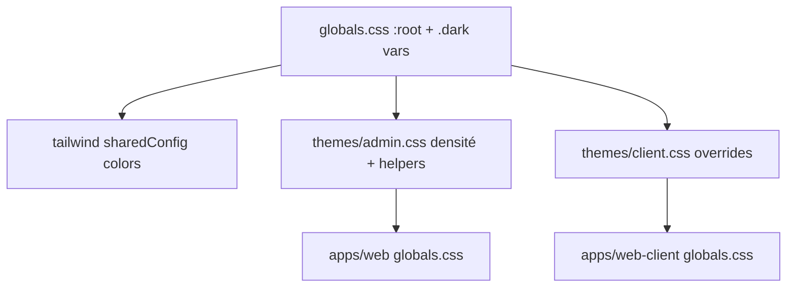

# Rapport d’analyse comparatif (apps/web-client, apps/web, packages/core)

## 1) Constat global (ce qui existe déjà)
- Il y a déjà une **base UI partagée** dans [core/ui](file:///Users/bartoszkrynski/Downloads/Development/make-the-change/packages/core/src/shared/ui) exposée via `@make-the-change/core/ui` (et `@make-the-change/core/ui/next`, `@make-the-change/core/ui/rhf`).
- Les deux apps consomment déjà le **même socle de tokens CSS** via `@import "@make-the-change/core/css"` et un **thème contextuel** (`admin` vs `client`).
  - web : [apps/web/src/app/globals.css](file:///Users/bartoszkrynski/Downloads/Development/make-the-change/apps/web/src/app/globals.css)
  - web-client : [apps/web-client/src/app/globals.css](file:///Users/bartoszkrynski/Downloads/Development/make-the-change/apps/web-client/src/app/globals.css)
- Une stratégie de **“UI boundaries”** est déjà en place pour éviter les imports `next/*` et `react-hook-form` au mauvais endroit : [check-ui-boundaries.mjs](file:///Users/bartoszkrynski/Downloads/Development/make-the-change/scripts/check-ui-boundaries.mjs)

Conclusion : vous n’êtes pas au début. Le « point de bascule » consiste surtout à **(a) supprimer les doublons**, **(b) étendre la bibliothèque partagée à des composants réellement réutilisés**, **(c) rendre le theming et les conventions plus stricts**, sans créer une explosion de packages.

---

## 2) Inventaire complet des composants UI existants

### A. `packages/core` (base UI partagée existante)
**Localisation** : [packages/core/src/shared/ui](file:///Users/bartoszkrynski/Downloads/Development/make-the-change/packages/core/src/shared/ui)

**Primitives (base/)**
- Badge : [badge.tsx](file:///Users/bartoszkrynski/Downloads/Development/make-the-change/packages/core/src/shared/ui/base/badge.tsx)
- Button : [button.tsx](file:///Users/bartoszkrynski/Downloads/Development/make-the-change/packages/core/src/shared/ui/base/button.tsx)
- Checkbox : [checkbox.tsx](file:///Users/bartoszkrynski/Downloads/Development/make-the-change/packages/core/src/shared/ui/base/checkbox.tsx)
- Dialog : [dialog.tsx](file:///Users/bartoszkrynski/Downloads/Development/make-the-change/packages/core/src/shared/ui/base/dialog.tsx)
- Input (+ PasswordInput) : [input.tsx](file:///Users/bartoszkrynski/Downloads/Development/make-the-change/packages/core/src/shared/ui/base/input.tsx)
- Select (+ SimpleSelect et sous-composants) : [select.tsx](file:///Users/bartoszkrynski/Downloads/Development/make-the-change/packages/core/src/shared/ui/base/select.tsx)
- TextArea : [textarea.tsx](file:///Users/bartoszkrynski/Downloads/Development/make-the-change/packages/core/src/shared/ui/base/textarea.tsx)

**Composants partagés (root ui/)**
- BottomSheet : [bottom-sheet.tsx](file:///Users/bartoszkrynski/Downloads/Development/make-the-change/packages/core/src/shared/ui/bottom-sheet.tsx)
- Card : [card.tsx](file:///Users/bartoszkrynski/Downloads/Development/make-the-change/packages/core/src/shared/ui/card.tsx)
- DataList : [data-list.tsx](file:///Users/bartoszkrynski/Downloads/Development/make-the-change/packages/core/src/shared/ui/data-list.tsx)
- DetailView : [detail-view.tsx](file:///Users/bartoszkrynski/Downloads/Development/make-the-change/packages/core/src/shared/ui/detail-view.tsx)
- EmptyState : [empty-state.tsx](file:///Users/bartoszkrynski/Downloads/Development/make-the-change/packages/core/src/shared/ui/empty-state.tsx)
- ListContainer : [list-container.tsx](file:///Users/bartoszkrynski/Downloads/Development/make-the-change/packages/core/src/shared/ui/list-container.tsx)
- Pagination : [pagination.tsx](file:///Users/bartoszkrynski/Downloads/Development/make-the-change/packages/core/src/shared/ui/pagination.tsx)
- Progress : [progress.tsx](file:///Users/bartoszkrynski/Downloads/Development/make-the-change/packages/core/src/shared/ui/progress.tsx)
- Skeleton : [skeleton.tsx](file:///Users/bartoszkrynski/Downloads/Development/make-the-change/packages/core/src/shared/ui/skeleton.tsx)

**Forms (forms/)**
- FieldShell : [field-shell.tsx](file:///Users/bartoszkrynski/Downloads/Development/make-the-change/packages/core/src/shared/ui/forms/field-shell.tsx)
- FormCheckbox : [form-checkbox.tsx](file:///Users/bartoszkrynski/Downloads/Development/make-the-change/packages/core/src/shared/ui/forms/form-checkbox.tsx)
- FormField : [form-field.tsx](file:///Users/bartoszkrynski/Downloads/Development/make-the-change/packages/core/src/shared/ui/forms/form-field.tsx)
- FormInput : [form-input.tsx](file:///Users/bartoszkrynski/Downloads/Development/make-the-change/packages/core/src/shared/ui/forms/form-input.tsx)
- FormSelect : [form-select.tsx](file:///Users/bartoszkrynski/Downloads/Development/make-the-change/packages/core/src/shared/ui/forms/form-select.tsx)
- FormSubmitButton : [form-submit-button.tsx](file:///Users/bartoszkrynski/Downloads/Development/make-the-change/packages/core/src/shared/ui/forms/form-submit-button.tsx)
- FormTextArea : [form-textarea.tsx](file:///Users/bartoszkrynski/Downloads/Development/make-the-change/packages/core/src/shared/ui/forms/form-textarea.tsx)

**Next adapters (ui/next/)**
- DataCard : [data-card.tsx](file:///Users/bartoszkrynski/Downloads/Development/make-the-change/packages/core/src/shared/ui/next/data-card.tsx)
- DataListItem : [data-list-item.tsx](file:///Users/bartoszkrynski/Downloads/Development/make-the-change/packages/core/src/shared/ui/next/data-list-item.tsx)
- Pagination (Next-friendly) : [pagination.tsx](file:///Users/bartoszkrynski/Downloads/Development/make-the-change/packages/core/src/shared/ui/next/pagination.tsx)

**Theming & tokens**
- Tokens TS : [tokens.ts](file:///Users/bartoszkrynski/Downloads/Development/make-the-change/packages/core/src/shared/ui/tokens.ts)
- Tokens CSS (variables + classes sémantiques) : [globals.css](file:///Users/bartoszkrynski/Downloads/Development/make-the-change/packages/core/src/shared/ui/globals.css)
- Thème admin (overrides densité + helpers) : [themes/admin.css](file:///Users/bartoszkrynski/Downloads/Development/make-the-change/packages/core/src/shared/ui/themes/admin.css)
- Thème client (actuellement vide) : [themes/client.css](file:///Users/bartoszkrynski/Downloads/Development/make-the-change/packages/core/src/shared/ui/themes/client.css)

Note : la doc [README.md](file:///Users/bartoszkrynski/Downloads/Development/make-the-change/packages/core/src/shared/ui/README.md) mentionne des composants/dossiers non présents (ex: `composites/`, date-picker, map…) : **décalage doc/réalité** à corriger pour éviter les divergences.

---

### B. `apps/web-client` (UI spécifique client)
**Localisation** : [apps/web-client/src/components](file:///Users/bartoszkrynski/Downloads/Development/make-the-change/apps/web-client/src/components)

**components/dashboard/**
- [activity-timeline.tsx](file:///Users/bartoszkrynski/Downloads/Development/make-the-change/apps/web-client/src/components/dashboard/activity-timeline.tsx)
- [dashboard-welcome.tsx](file:///Users/bartoszkrynski/Downloads/Development/make-the-change/apps/web-client/src/components/dashboard/dashboard-welcome.tsx)
- [stat-card.tsx](file:///Users/bartoszkrynski/Downloads/Development/make-the-change/apps/web-client/src/components/dashboard/stat-card.tsx)

**components/layout/**
- [dashboard-mobile-header.tsx](file:///Users/bartoszkrynski/Downloads/Development/make-the-change/apps/web-client/src/components/layout/dashboard-mobile-header.tsx)
- [dashboard-page-layout.tsx](file:///Users/bartoszkrynski/Downloads/Development/make-the-change/apps/web-client/src/components/layout/dashboard-page-layout.tsx)
- [dashboard-sidebar-context.tsx](file:///Users/bartoszkrynski/Downloads/Development/make-the-change/apps/web-client/src/components/layout/dashboard-sidebar-context.tsx)
- [footer.tsx](file:///Users/bartoszkrynski/Downloads/Development/make-the-change/apps/web-client/src/components/layout/footer.tsx)
- [header.tsx](file:///Users/bartoszkrynski/Downloads/Development/make-the-change/apps/web-client/src/components/layout/header.tsx)
- [main-content.tsx](file:///Users/bartoszkrynski/Downloads/Development/make-the-change/apps/web-client/src/components/layout/main-content.tsx)
- [mega-menu.tsx](file:///Users/bartoszkrynski/Downloads/Development/make-the-change/apps/web-client/src/components/layout/mega-menu.tsx)
- [mobile-bottom-nav.tsx](file:///Users/bartoszkrynski/Downloads/Development/make-the-change/apps/web-client/src/components/layout/mobile-bottom-nav.tsx)
- [theme-toggle.tsx](file:///Users/bartoszkrynski/Downloads/Development/make-the-change/apps/web-client/src/components/layout/theme-toggle.tsx)

**components/profile/**
- [profile-header.tsx](file:///Users/bartoszkrynski/Downloads/Development/make-the-change/apps/web-client/src/components/profile/profile-header.tsx)

**components/ui/** (petites briques marketing/client)
- [category-card.tsx](file:///Users/bartoszkrynski/Downloads/Development/make-the-change/apps/web-client/src/components/ui/category-card.tsx)
- [localized-link.tsx](file:///Users/bartoszkrynski/Downloads/Development/make-the-change/apps/web-client/src/components/ui/localized-link.tsx)
- [page-hero.tsx](file:///Users/bartoszkrynski/Downloads/Development/make-the-change/apps/web-client/src/components/ui/page-hero.tsx)
- [section-container.tsx](file:///Users/bartoszkrynski/Downloads/Development/make-the-change/apps/web-client/src/components/ui/section-container.tsx)
- [stats-section.tsx](file:///Users/bartoszkrynski/Downloads/Development/make-the-change/apps/web-client/src/components/ui/stats-section.tsx)

**Theming provider**
- Wrapper : [theme-provider.tsx](file:///Users/bartoszkrynski/Downloads/Development/make-the-change/apps/web-client/src/components/theme-provider.tsx)

**UI dans les features** (souvent réutilisable intra-app, parfois mutualisable)
- Cart : [apps/web-client/src/features/commerce/cart](file:///Users/bartoszkrynski/Downloads/Development/make-the-change/apps/web-client/src/features/commerce/cart)
  - cart-button.tsx, cart-dock.tsx, cart-line-item.tsx, cart-sheet.tsx, cart-snackbar.tsx, quantity-stepper.tsx, quick-add-button.tsx, etc.
- Checkout : [checkout-client.tsx](file:///Users/bartoszkrynski/Downloads/Development/make-the-change/apps/web-client/src/features/commerce/checkout/checkout-client.tsx)
- Invest : [invest-client.tsx](file:///Users/bartoszkrynski/Downloads/Development/make-the-change/apps/web-client/src/features/investment/invest-client.tsx)
- Leaderboard : [leaderboard-view.tsx](file:///Users/bartoszkrynski/Downloads/Development/make-the-change/apps/web-client/src/features/leaderboard/leaderboard-view.tsx)

---

### C. `apps/web` (site + dashboards admin/partner)
**Composants “site”** : [apps/web/src/components](file:///Users/bartoszkrynski/Downloads/Development/make-the-change/apps/web/src/components)
- Home : featured-projects-section.tsx, hero-section.tsx, impact-metrics-section.tsx, kpi-metrics-section.tsx
- Images (modules riches) : image-gallery/*, image-manager/*, image-masonry/*, image-uploader/*, product-image/*
- UI (misc) : date-picker.tsx, image-upload.tsx, map-container.tsx, optimized-image-masonry.tsx
- i18n helpers : language-switcher.tsx, locale-switcher.tsx, localized-link.tsx

**Composants admin dashboard** : [apps/web…/admin/(dashboard)/components](file:///Users/bartoszkrynski/Downloads/Development/make-the-change/apps/web/src/app/%5Blocale%5D/admin/(dashboard)/components)
- admin-layout/* (layout “admin”) : admin-page-layout.tsx, header.tsx, footer.tsx, filter-modal.tsx, generic-filters.tsx…
- layout/* (layout “admin” alternatif) : admin-header.tsx, admin-sidebar.tsx, admin-page-header.tsx, admin-pagination.tsx, …
- form/* : form-autocomplete.tsx, form-date-field.tsx, form-images-uploader.tsx, form-number-field.tsx, form-toggle.tsx
- ui/* : admin-filter-sheet.tsx, admin-list-item.tsx, chart.tsx, select.tsx, submit-button.tsx, toast.tsx, toaster.tsx…
- domain list items : orders/order-list-item.tsx, partners/partner-list-item.tsx, projects/*, subscriptions/*, users/*

---

## 3) Redondances & similarités (entre dossiers)

### Dépendances communes (versions)
| Dépendance | apps/web | apps/web-client | packages/core |
|---|---:|---:|---:|
| next | 16.1.0 | 16.1.0 | 16.1.0 |
| react / react-dom | ^19.0.0 | ^19.0.0 | (dev: ^19.0.0) |
| tailwindcss | ^4.1.13 | ^4.1.13 | (config export) |
| @base-ui/react | ^1.1.0 | ^1.1.0 | ^1.1.0 |
| next-intl | ^4.8.2 | ^4.8.2 | — |
| next-themes | ^0.4.6 | ^0.4.6 | — |
| @tanstack/react-query | ^5.85.6 | ^5.85.6 | — |
| react-hook-form | ^7.52.2 | ^7.52.2 | ^7.52.2 |
| zod | ^3.24.1 | ^3.24.1 | ^3.24.1 |
| drizzle-orm | ^0.45.1 | ^0.45.1 | ^0.45.1 |
| date-fns | ^4.1.0 | ^4.1.0 | — |
| lucide-react | ^0.542.0 | ^0.542.0 | ^0.542.0 |
| leaflet / react-leaflet | ^1.9.4 / ^5.0.0 | ^1.9.4 / ^5.0.0 | — |

Spécifiques notables :
- apps/web : Nivo (charts), dnd-kit, vitest + msw.
- apps/web-client : Stripe libs.

### Doublons / patterns divergents (priorité)
- **SimpleSelect** dupliqué :
  - admin local : [apps/web…/components/ui/select.tsx](file:///Users/bartoszkrynski/Downloads/Development/make-the-change/apps/web/src/app/%5Blocale%5D/admin/(dashboard)/components/ui/select.tsx)
  - core : [SimpleSelect](file:///Users/bartoszkrynski/Downloads/Development/make-the-change/packages/core/src/shared/ui/base/select.tsx)
- **LocalizedLink** dupliqué (pattern next-intl) :
  - web : [localized-link.tsx](file:///Users/bartoszkrynski/Downloads/Development/make-the-change/apps/web/src/components/localized-link.tsx)
  - web-client : [localized-link.tsx](file:///Users/bartoszkrynski/Downloads/Development/make-the-change/apps/web-client/src/components/ui/localized-link.tsx)
- **ThemeProvider config divergente** (comportement utilisateur différent) :
  - web : defaultTheme=light + enableSystem=false : [providers.tsx](file:///Users/bartoszkrynski/Downloads/Development/make-the-change/apps/web/src/app/providers.tsx)
  - web-client : defaultTheme=system + enableSystem=true : [layout.tsx](file:///Users/bartoszkrynski/Downloads/Development/make-the-change/apps/web-client/src/app/%5Blocale%5D/layout.tsx#L67-L98)
- **Tokens “design-tokens.css” (apps/web) probablement non utilisé** : [design-tokens.css](file:///Users/bartoszkrynski/Downloads/Development/make-the-change/apps/web/src/theme/design-tokens.css)

---

## 4) État actuel du theming (variables CSS, design tokens)

### Ce qui marche déjà bien
- **Tokens centralisés** : `--background`, `--foreground`, `--primary`, etc. dans [core/globals.css](file:///Users/bartoszkrynski/Downloads/Development/make-the-change/packages/core/src/shared/ui/globals.css).
- Mapping Tailwind → CSS variables via `sharedConfig` : [tailwind.config.ts](file:///Users/bartoszkrynski/Downloads/Development/make-the-change/packages/core/tailwind.config.ts).
- Thèmes contextuels :
  - Admin : densité + helpers layout (classes `.admin-*`, `.surface-card`) via [themes/admin.css](file:///Users/bartoszkrynski/Downloads/Development/make-the-change/packages/core/src/shared/ui/themes/admin.css).
  - Client : héritage du socle (file présent pour futures overrides) via [themes/client.css](file:///Users/bartoszkrynski/Downloads/Development/make-the-change/packages/core/src/shared/ui/themes/client.css).

### Points de fragilité
- Le theming “fonctionne” mais reste **partiellement implicite** : même tokens, mais comportements de bascule (system vs forced) et conventions UI (ex: toggle) non alignés.
- La frontière entre “tokens” et “styles de layout” est floue (ex: admin.css contient des helpers layout). Ce n’est pas mauvais, mais doit être **assumé et nommé** (thème = tokens + densité + helpers).

---

## 5) Candidats à mutualisation (du plus sûr au plus risqué)

### Candidats “quick wins” (faible risque, fort ROI)
- Sélecteurs : migrer `apps/web` (admin) vers `@make-the-change/core/ui` (SimpleSelect).
- Toast/Toaster : extraire depuis `apps/web admin/components/ui` vers core (si utilisable dans web-client) ou vers un module `core/ui/admin`.
- SubmitButton (patterns RHF / loading state) : mutualiser (souvent identique).
- Pagination / list patterns : comparer `admin-pagination.tsx` vs core Pagination / Next Pagination et converger.

### Candidats “moyen terme” (ROI élevé mais design à verrouiller)
- “Filter sheet/modal + generic-filters” : mutualiser si le modèle de filtres est harmonisé (types + URL params).
- ImageUploader : gros module, mais potentiellement shareable (attention aux deps et à l’API).

### Candidats “à éviter dans le socle” (risque bundle/complexité)
- Charts (Nivo) : dépendances lourdes et spécifiques admin → conserver côté app.
- Map Leaflet : possible mutualisation mais attention aux coûts (leaflet css, SSR, bundle). Plutôt via `@make-the-change/core/ui/experimental` si nécessaire.

---

# Architecture technique proposée (avec diagrammes)

## 1) Principe directeur
- Garder **un seul “design system source-of-truth”** pour :
  - tokens CSS (HSL vars)
  - tailwind shared config
  - primitives accessibles (Base UI)
  - utilitaires de composition (CVA, cn)
- Rendre explicite la séparation :
  - UI agnostique (pas de `next/*`)
  - UI “Next adapters”
  - UI “Forms bindings (RHF)”
  - UI “App-flavored (admin/client)” via thèmes + options

## 2) Option A (recommandée) : conserver `@make-the-change/core` mais structurer comme un vrai package UI
Cette option minimise la complexité (pas de nouveau package) tout en améliorant la cohérence.

### Structure proposée (dans `packages/core/src/shared/ui`)
- `base/` : primitives (Button, Input, Select…)
- `composites/` : composants composés génériques (DataList, Pagination, Table, Toast…)
- `forms/` : bindings RHF
- `next/` : adaptateurs Next (Link wrappers, server/client helpers si nécessaire)
- `themes/` : `admin.css`, `client.css`, + éventuels `partner.css`
- `tokens/` : (split de `tokens.ts` en modules si besoin : colors, typography, motion…)
- `styles/` : uniquement CSS partagés (globals, helpers)

### Naming conventions
- Composants exportés en PascalCase, fichiers en kebab-case si nouveau, ou conserver convention actuelle mais standardiser.
- Exports publics uniquement via [ui/index.ts](file:///Users/bartoszkrynski/Downloads/Development/make-the-change/packages/core/src/shared/ui/index.ts) (pas d’imports profonds depuis les apps).

## 3) Diagrammes

### Diagramme de dépendances (cible)
```mermaid
flowchart LR
  subgraph Apps
    W[apps/web]
    WC[apps/web-client]
  end

  subgraph Core
    UI[@make-the-change/core/ui]
    UIN[@make-the-change/core/ui/next]
    UIRHF[@make-the-change/core/ui/rhf]
    CSS[@make-the-change/core/css]
    TA[@make-the-change/core/tailwind.config]
  end

  W --> UI
  W --> UIN
  W --> UIRHF
  W --> CSS
  W --> TA

  WC --> UI
  WC --> UIN
  WC --> UIRHF
  WC --> CSS
  WC --> TA
```

### Diagramme theming (tokens → thèmes)


---

# Stratégie de versioning & publication
- Vous avez déjà Changesets au root : [package.json](file:///Users/bartoszkrynski/Downloads/Development/make-the-change/package.json).
- Recommandation : **SemVer interne** (même si `private:true`) pour tracer les changements UI.
  - `patch` : bugfix visuel/a11y sans changement API.
  - `minor` : nouveau composant / nouvelle prop backward compatible.
  - `major` : changement de signature / suppression.
- Publication :
  - Interne au monorepo : `workspace:*` (actuel) suffit.
  - Vers registre (si besoin plus tard) : rendre `@make-the-change/core` (ou un futur `@make-the-change/ui`) publishable, conserver `exports` stricts.

---

# Mécanismes de customisation (différences contextuelles sans fork)
- **Tokens variables + densité** : continuer à piloter via CSS variables (`--density-*`, `--radius-*`).
- **“Theme slots”** : ajouter des fichiers thème par contexte (`admin`, `client`, `partner`) qui ne font que :
  - overrides de variables
  - classes utilitaires sémantiques (optionnel)
- **Variants composants** : lorsque nécessaire, exposer `variant="admin" | "client"` ou `density="compact"` sur quelques composants (rare), mais privilégier tokens.
- **Data attributes** : option future : `html[data-app="admin"]` pour activer des styles contextuels sans multiplier les classes.

---

# Intégration progressive (sans refactoring complet)

## Étape 0 — Baseline & garde-fous
- Établir un inventaire des doublons “primitives” et “helpers” (Select, Link, ThemeToggle, Toast).
- Ajouter/étendre des règles de boundaries si besoin (ex: interdire imports d’UI app-level dans core).

## Étape 1 — Quick wins (1–2 jours)
- Migrer `apps/web admin/components/ui/select.tsx` vers `@make-the-change/core/ui` (SimpleSelect).
- Unifier ThemeProvider config (mêmes `defaultTheme`, `enableSystem`, `storageKey`, et `attribute`).
- Supprimer ou brancher explicitement `apps/web/src/theme/design-tokens.css` (selon intention réelle).

## Étape 2 — Mutualisation “admin UI kit” (2–5 jours)
- Créer un sous-ensemble réutilisable (dans core) : Toast/Toaster, SubmitButton, ViewToggle, AdminFilterSheet.
- Ajuster l’API pour éviter les dépendances lourdes.

## Étape 3 — Mutualisation “shared patterns” (progressif)
- Harmoniser la modélisation des filtres (types + search params) et extraire `generic-filters`.
- Extraire des composants images si les deux apps les utilisent réellement.

---

# Exemples (code partagé) — propositions

## Exemple 1 : Remplacer le Select admin local par le Select core
Avant (admin local) : import `./select`.
Après :
```ts
import { SimpleSelect } from '@make-the-change/core/ui'

<SimpleSelect
  value={value}
  onValueChange={setValue}
  options={options}
  placeholder="Tous"
/>
```

## Exemple 2 : Standardiser ThemeProvider (même comportement sur les 2 apps)
Objectif : même storageKey + même stratégie (ex: `defaultTheme="system"`, `enableSystem` true) pour que l’expérience utilisateur soit cohérente.

---

# Critères de succès mesurables (KPI)

## Mutualisation
- ≥ 70% des primitives & patterns (select, dialog, toast, pagination, forms) proviennent du package partagé.
- Réduction d’au moins 50% des composants “UI génériques” dupliqués entre apps.

## Productivité
- Ajouter une nouvelle UI (ex: champ + validation + submit) :
  - objectif ≤ 30–45 min (avec RHF bindings et composants partagés), vs baseline actuelle.

## Performance / bundle
- Bundle client :
  - pas d’augmentation > 5–10 KB gzip sur les routes principales après mutualisation (hors features lourdes).
  - éviter d’introduire Nivo/Leaflet dans le socle UI par défaut.

## Maintenance
- 1 seule source of truth pour tokens (`core/css` + `core/tailwind.config`).
- 0 couleur hardcodée dans les composants destinés à être mutualisés (utiliser `bg-background`, `text-foreground`, `text-muted-foreground`, etc.).

---

# Livrables (ce que je produis ensuite après validation)
1. Rapport final enrichi (avec tableau de redondances + priorisation effort/risque).
2. Architecture cible finalisée (dossiers + exports) + diagrammes.
3. Plan de migration détaillé (checklist par PR, ordre, risques, rollback).
4. 2–3 refactors réels dans le repo (ex: Select + ThemeProvider + Toast), avec validation.
5. Documentation “Best practices UI” (imports, theming, tokens, accessibilité, performance).

---

# Prochaine action après confirmation
- Implémenter Étape 1 (quick wins) et livrer un premier lot de composants mutualisés avec tests/validation (lint/type-check + smoke UI).