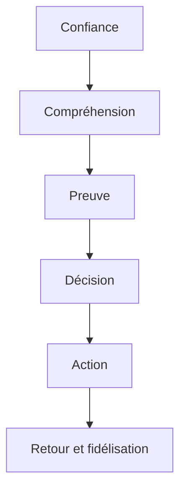

# Structurer une fiche projet mobile-first pour biodiversité et projets apparentés

## Résumé exécutif

### Hypothèses explicites

[HYPOTHESE] Votre segmentation n’est pas spécifiée dans le brief. Le rapport suppose donc un usage **B2C grand public**, en **app mobile-first**, avec des fiches conçues pour convertir à une **contribution immédiate** tout en conservant un niveau élevé d’honnêteté, de traçabilité et d’accessibilité.  
[CIBLE_VALIDEE] Je prends comme contrainte produit de votre brief que **“Credits Impact” n’apparaît que pour le cas “soutien producteur”**, et non pour les autres typologies de fiches.

### Les conclusions les plus importantes

| Conclusion | Ce que cela implique pour Make the Change |
|---|---|
| [VALIDÉ] La question centrale n’est pas seulement “comment faire cliquer”, mais **comment faire confiance vite**: les sites des organisations restent la première source d’information avant don pour les donateurs qui se renseignent, tandis qu’un fort écart subsiste entre l’importance accordée à la confiance et le niveau de confiance réellement déclaré. citeturn17view3turn17view0 | La fiche doit réduire le **time-to-confidence** avant d’optimiser le **time-to-CTA**. |
| [VALIDÉ] Les dimensions les plus structurantes de la transparence perçue côté donateurs sont **accessibilité, complétude et exactitude** de l’information. citeturn17view0 | Il faut une barre de preuve visible, des dates, des sources, et une réponse claire à “où va mon argent ?”. |
| [VALIDÉ] Sur mobile, la hiérarchie doit être drastique: la majorité des expériences de page produit mobile restent médiocres ou pires, et les utilisateurs abandonnent souvent à cause d’accumulations de frictions évitables. citeturn15view1 | Une fiche projet ne doit pas ressembler à une page “rapport annuel”. Elle doit être séquencée en blocs courts, avec un seul chemin principal. |
| [VALIDÉ] Un CTA sticky peut aider, mais il doit rester **unique, visuellement distinct, entouré d’espace, et non ambigu**. citeturn16view5turn16view4 | Préférer une **barre sticky basse** avec un primaire net et un secondaire discret “Voir les preuves”. |
| [VALIDÉ] Un **bottom sheet** est pertinent pour une interaction **courte, contextuelle et secondaire**; il ne doit pas devenir la fiche elle-même ni masquer des contenus indispensables. NN/g déconseille d’y loger des interactions longues ou des pages “happy path” complètes. Material précise que les bottom sheets affichent du **contenu secondaire** ancré en bas de l’écran. citeturn39view0turn38search0turn38search2 | Le bottom sheet doit servir à **choisir un montant / une périodicité / confirmer**, pas à cacher l’essentiel de la preuve, de la méthode ou des risques. |
| [VALIDÉ] En accessibilité, les contraintes les plus importantes pour votre pattern sont: **taille cible minimale**, **contraste**, **reflow**, **text spacing**, et surtout **focus non masqué** par le footer sticky. citeturn15view2turn15view6turn12search3turn37search2turn37search3turn15view7 | Tout footer sticky doit réserver un scroll-padding et ne jamais recouvrir le focus ni le contenu zoomé. |
| [VALIDÉ] Côté biodiversité, il n’existe pas de métrique miracle unique: TNFD encourage des métriques liées aux dépendances/impacts mais reconnaît qu’aucune métrique unique ne capture tout l’état de la nature; les indicateurs doivent être **contextuels, localisés, datés**. citeturn19view2turn19view1 | Les fiches doivent privilégier un **petit set d’indicateurs contextuels** plutôt qu’un pseudo-score universel. |
| [VALIDÉ] Les meilleurs standards insistent sur la **théorie du changement**, le **suivi adaptatif**, les **baselines**, la **provenance** et l’**incertitude**. CMP formalise la theory of change via les results chains; le cadre BMSF demande des valeurs relatives à une baseline et un état de référence, avec incertitude et chaîne de provenance. citeturn25view0turn26view1turn26view2turn20view4turn24view0 | La fiche doit toujours montrer **ce qu’on mesure**, **par rapport à quoi**, **à quelle date**, **par qui**, et **avec quel niveau de confiance**. |
| [VALIDÉ] Les sources officielles européennes et françaises ont durci les règles contre l’écoblanchiment: les **allégations environnementales génériques** non étayées sont interdites, les labels de durabilité non fondés sur un schéma de certification sont prohibés, et les promesses futures exigent des engagements détaillés, mesurables et vérifiables. La directive EU 2024/825 est en vigueur; la future Green Claims Directive, elle, semble **mise en pause** depuis juin 2025. citeturn27view1turn30view0turn30view2turn30view3turn27view4turn27view6turn31view0turn31view1 | Il faut un langage **spécifique, limité, daté**, et éviter tout raccourci du type “écologique”, “durable”, “bon pour la planète”, “neutre”. |
| [VALIDÉ] En fidélisation, le premier don doit rapidement être suivi d’une **preuve d’impact lisible** et d’**updates**: le FEP identifie la conversion du premier don en second don comme un problème majeur, et recommande une démonstration d’impact rapide et claire. citeturn17view2turn17view1 | Le module **actualités / terrain / avancées** n’est pas cosmétique: il est au cœur de la rétention. |

## Ce que disent les meilleures sources

### Synthèse des sources par famille

| Famille | Sources prioritaires | Ce qu’elles apportent |
|---|---|---|
| UX mobile et hiérarchie | NN/g sur les sites non-profit, bottom sheets et simplification des formulaires; Baymard sur product pages, sections repliables et CTA; W3C WCAG 2.2 et guidance mobile. citeturn15view0turn39view0turn15view4turn15view5turn15view1turn16view5turn15view2turn15view6turn15view7turn37search2turn37search3 | Priorisation mobile, réduction de charge cognitive, rôle du sticky CTA, usages et limites du bottom sheet, exigences AA. |
| Don, confiance et rétention | Give.org Donor Trust Report 2026, article académique sur la transparence perçue des NPO, Fundraising Effectiveness Project. citeturn17view3turn17view0turn17view2turn17view1 | Informations à montrer avant conversion, lien entre confiance et don, importance de prouver vite l’impact pour convertir un premier don en relation durable. |
| Standards biodiversité et preuve | IUCN Global Standard, TNFD Recommendations + LEAP + metrics, GRI 101 Biodiversity 2024, CMP Open Standards, article sur “evidence in conservation”, Conservation Evidence Toolkit, BMSF 2026. citeturn19view0turn19view1turn19view2turn20view0turn19view4turn19view5turn25view0turn26view1turn26view2turn20view2turn20view3turn20view4 | Théorie du changement, auto-évaluation NbS, disclosure localisée, métriques et targets, baseline, incertitude, provenance, adaptive management. |
| Anti-greenwashing et droit consommateur | Directive (EU) 2024/825, Commission européenne Green Claims, sweep 2021, ADEME/CNC, ministère de la Transition écologique, DGCCRF/SignalConso. citeturn27view1turn27view0turn28view0turn27view3turn27view4turn27view5turn27view6 | Cadre sémantique: ce qu’on peut dire, ce qu’on doit prouver, quelles promesses sont dangereuses juridiquement. |
| Exemples de plateformes | Coral Gardeners, Restor, iNaturalist / Seek, Ecologi, Mossy Earth, Rewilding Europe, WWF UK, Treeapp, The Nature Conservancy. citeturn35view0turn35view1turn35view3turn33view4turn33view6turn33view10turn33view9turn34view2turn33view2turn33view3turn33view11turn33view7turn33view8turn33view12turn36search6 | Patterns concrets à copier ou éviter pour les fiches projet et les pages d’adoption / soutien. |

### Ce que ces sources justifient pour votre cas

Votre fiche projet est un **hybride** entre une page produit mobile, une page de don et une mini-page de reporting. L’analogie la plus utile n’est donc ni la page e-commerce pure, ni la page ONG institutionnelle pure, mais un modèle combinant **hiérarchie mobile rigoureuse**, **friction minimale à l’action**, **explicitation du mécanisme de contribution**, et **preuve proportionnée au niveau de maturité de la donnée**. C’est une inférence, mais elle est très solidement soutenue par la convergence entre les travaux de Baymard, NN/g, Give.org, TNFD, GRI et CMP. citeturn15view1turn15view0turn17view3turn19view1turn19view4turn25view0

### Questions ouvertes et limites

[NON_DECIDE] Certains points dépendent encore de décisions produit ou juridiques propres à Make the Change: pays exacts d’opération et de collecte, traitement fiscal des dons, nature exacte du paiement pour “soutien producteur”, place des attestations/réductions fiscales, part de financement “poolé” vs “affecté”, et niveau de validation juridique interne des formulations marketing.  
[RISQUE] Sur le plan réglementaire, la **Directive (EU) 2024/825** est bien en vigueur, mais la **Green Claims Directive** séparée n’a pas, à date, un statut final stabilisé; la dernière trace officielle du Parlement européen ouverte dans les résultats consultés datait de mars 2025, tandis que Reuters a documenté la pause des négociations en juin 2025. Il faut donc traiter ses exigences détaillées comme **meilleure pratique anticipatrice**, pas comme droit dur définitivement adopté. citeturn27view1turn31view0turn31view1

## Modèle mental de la fiche et principes structurants

### Les objectifs réels d’une fiche projet

Une bonne fiche projet biodiversité doit remplir six fonctions dans cet ordre:



Ce modèle répond directement à ce que les donateurs cherchent sur les sites d’organisation avant de donner, à leurs attentes de transparence, et au besoin de démontrer rapidement l’impact après la première contribution. Il est également cohérent avec les standards de disclosure biodiversité, qui demandent des informations à la fois **localisées**, **explicites**, **matérielles** et **vérifiables**. citeturn17view3turn17view0turn17view2turn19view1turn19view2turn19view5

### Les questions auxquelles la fiche doit répondre dès le premier écran

Le premier écran doit permettre de répondre, sans scroll profond, à huit questions:

1. **Qu’est-ce que c’est ?**  
2. **Où cela se passe-t-il ?**  
3. **Qui agit ?**  
4. **Que finance exactement mon geste ?**  
5. **Quel est le niveau de preuve ?**  
6. **À quand remontent les données ?**  
7. **Y a-t-il une espèce / un habitat / une communauté explicitement reliés au projet ?**  
8. **Que se passe-t-il quand j’appuie sur le CTA ?**

Si l’une de ces réponses manque, la charge cognitive augmente, la confiance baisse, et la page passe d’un registre “je comprends donc j’agis” à “je dois interpréter donc je remets à plus tard”. citeturn15view4turn15view5turn17view0turn17view3

### Les arbitrages conversion versus honnêteté

| Arbitrage | Règle recommandée |
|---|---|
| Vitesse vs nuance | [VALIDÉ] Le CTA peut être immédiat, mais la **base de preuve** ne doit jamais être cachée plus bas qu’un second écran ou derrière un menu opaque. citeturn17view3turn17view0 |
| Simplicité vs précision | [VALIDÉ] Utiliser des formulations simples en façade, puis ouvrir le détail de méthode, baseline et source via accordions/cards; Baymard montre l’intérêt des sections repliables sur les longues pages produit. citeturn16view5 |
| Émotion vs véracité | [VALIDÉ] L’émotion visuelle peut ouvrir la page, mais toute promesse écologique doit être spécifique et étayée; les claims génériques non démontrés sont précisément ce que le droit européen vise désormais. citeturn30view0turn30view3turn27view4 |
| Gamification vs sérieux | [HYPOTHESE] Les mécaniques type badge/collection ne doivent jamais supplanter la logique de preuve. Inspirer par Seek est utile pour l’exploration espèces, pas pour transformer le don en jeu. citeturn33view9turn33view10 |
| Data-rich vs data-poor | [VALIDÉ] Si la donnée est pauvre, il faut **devenir plus explicite**, pas moins: dire ce qu’on sait, ce qu’on ne sait pas, comment on suivra, et quand la prochaine mise à jour arrivera. GRI prévoit explicitement le cas où certains items n’existent pas encore et demande de le déclarer. citeturn19view5turn28view0turn17view0 |

## Ordre recommandé de la fiche mobile

### Ordre exact des sections

Le pattern recommandé ci-dessous suppose une **barre sticky basse permanente** et un **bottom sheet modal d’action**. Les contenus indispensables restent sur la page; le sheet ne contient que l’action et sa clarification.

| Ordre | Section | Objectif utilisateur | Objectif produit | Priorité | Contenu / UI recommandé | Risque UX | Risque greenwashing | Microcopy type |
|---|---|---|---|---|---|---|---|---|
| 1 | **Hero d’identité** | Comprendre instantanément le projet | Ancrer le contexte | P1 | Image/vidéo courte, titre, type de projet, pays/région, partenaire, tags | Hero trop “pub” | Image émotionnelle sans fait | “Restauration de récifs à Moorea” |
| 2 | **Barre de confiance** | Vérifier si c’est réel et récent | Réduire le doute initial | P1 | Badge niveau de preuve, date de dernière mise à jour, source principale, localisation, partenaire légal | Bar trop dense | Badge trompeur ou auto-décerné | “Preuve: Suivi en cours · MAJ 12 mai 2026” |
| 3 | **En une phrase** | Savoir ce que le geste finance | Clarifier la proposition de valeur | P1 | Une phrase “Votre soutien finance…” | Flou sur l’usage des fonds | Claim trop absolu | “Votre soutien finance la mise en œuvre et le suivi local.” |
| 4 | **Bloc d’action immédiat** | Pouvoir agir sans chercher | Convertir | P1 | Résumé montant/choix, rappel de la nature du geste, ouverture du sheet | CTA concurrentiels | “Sauver”/“neutraliser” exagérés | “Soutenir ce projet” / “Choisir un montant” |
| 5 | **Métriques essentielles** | Évaluer le concret | Donner une base rationnelle | P1 | 3 à 5 cartes max: surface, unités, producteurs, ruches, récifs, survie, etc. + date | Trop de KPI | KPI sans baseline/date | “120 ruches installées • MAJ 04/2026” |
| 6 | **Comment cela fonctionne** | Comprendre la théorie d’action | Réduire l’ambiguïté | P1 | Parcours en 3–4 étapes inspiré “choose / grow / track / plant” ou version locale | Trop abstrait | Confusion action / résultat | “Financer → mettre en œuvre → suivre → publier” |
| 7 | **Preuves et méthode** | Vérifier la robustesse | Protéger la crédibilité | P1 | Baseline, méthode, source, qui mesure, fréquence, incertitude, docs | Trop technique | Méthode absente | “Données issues d’un suivi trimestriel…” |
| 8 | **Espèces et habitats** | Rendre vivant et spécifique | Connecter BioDex / Atlas | P2 | Chips espèces, statuts, habitats, cartes, liens BioDex | Infobésité taxonomique | Espèce reliée sans preuve directe | “Espèces observées sur site” / “Habitat associé” |
| 9 | **Actualités terrain** | Voir que le projet vit | Créer récurrence et retention | P2 | Timeline des updates, photos datées, mini news, prochaines étapes | Module vide | News cosmétique sans substance | “Dernière sortie terrain…” |
| 10 | **Partenaire et gouvernance** | Savoir qui exécute | Rassurer sur la gestion | P2 | Identité légale, zone d’action, rôle, audits/rapports, due diligence | Trop institutionnel | Effacement des responsabilités | “Projet mis en œuvre par…” |
| 11 | **Apprendre davantage** | Comprendre l’enjeu | Relier Academy / Atlas / Toile vivante | P3 | Cartes pédagogiques, cartes écosystèmes, relations vivantes, glossaire | Trop bas si essentiel | Contenu éducatif utilisé comme preuve | “Comprendre cet écosystème” |
| 12 | **FAQ, limites et mentions** | Lever les derniers freins | Réduire support et risque juridique | P3 | FAQ, limites, attestations, fiscalité, mentions “adoption symbolique”, politique de mise à jour | Trop caché | Disclaimer invisible | “Ce projet n’est pas un crédit carbone.” |

Cette séquence synthétise les besoins d’information des donateurs, les patterns de hiérarchie mobile, les contraintes de bottom sheet, et les standards de disclosure biodiversité. citeturn17view3turn17view0turn15view1turn39view0turn19view1turn19view2turn19view5

### Le rôle exact du sticky CTA et du bottom sheet

| Élément | Recommandation |
|---|---|
| Sticky bottom bar | [VALIDÉ] Une seule action primaire visible après le hero, distincte, avec espace autour; éviter le bord-à-bord totalement agressif. citeturn16view5turn16view4 |
| Secondary action | [VALIDÉ] Ajouter un lien discret type “Voir les preuves” ou “Comprendre la méthode”, jamais un second bouton primaire équivalent. citeturn16view4 |
| Bottom sheet | [VALIDÉ] Modal, court, contextualisé, avec titre explicite, bouton de fermeture visible, dismiss par Back, et contenu limité à l’action. citeturn39view0turn38search16 |
| Contenu du sheet | [VALIDÉ] Montant, fréquence, variante d’action, validation / reçu / note symbolique, total, CTA final. Pas de longue méthodologie, pas d’actualités, pas d’espèces détaillées. citeturn39view0turn38search0 |
| Accessibilité | [VALIDÉ] Le sticky footer ne doit jamais masquer le focus ni le contenu zoomé; prévoir scroll-padding et tests clavier/lecteur d’écran. citeturn15view6turn15view7 |

## Wireframes textuels et catalogue de composants

### Wireframes textuels mobiles

#### Scénario don pur

```text
[Hero image]
Type de projet · Pays · Partenaire
Titre
Phrase d’impact courte
Badge preuve · Dernière MAJ · Source

[3 KPI cards]
Surface / unités financées / prochaine étape

[Bloc “Votre don sert à”]
- Mise en œuvre
- Suivi
- Publication d’updates

[Comment ça marche]
1. Financement
2. Mise en œuvre locale
3. Suivi
4. Publication

[Preuves & méthode]
Baseline · méthode · fréquence · limites

[Habitat / espèces associées]
[Actualités terrain]
[Partenaire / gouvernance]
[FAQ / limites / mentions]

[Sticky bottom bar]
Soutenir ce projet
Voir les preuves
```

Spécificités: **pas de “Credits Impact”**, pas d’ambiguïté sur un bénéfice individualisé, priorité au financement, au pourquoi et à la preuve.  
[CIBLE_VALIDEE] “Credits Impact” absent.

#### Scénario soutien producteur

```text
[Hero]
Type: Soutien producteur
Nom du producteur / coopérative
Lieu / filière / partenaire
Badge preuve · Dernière MAJ

[Bloc double]
Soutien économique direct
Bénéfices écologiques attendus

[Producteur]
Qui produit ? quel territoire ? quelle pratique ?

[Ce que finance votre soutien]
- Intrants / matériel / transition / accompagnement

[Impact suivi]
Rendement / surfaces / haies / pollinisateurs / eau (si disponible)

[Credits Impact]
VISIBLE UNIQUEMENT ICI [CIBLE_VALIDEE]
explication de l’unité + ce qu’elle signifie + ce qu’elle ne signifie pas

[Preuves & méthode]
[Actualités de campagne / récolte]
[Espèces / habitats si preuve directe]
[FAQ]
```

Spécificités: dissocier clairement **l’aide économique au producteur** et **les bénéfices écologiques observés ou attendus**.  
[INTERDIT] Ne pas laisser croire qu’un “Credit Impact” vaut un résultat biodiversité garanti si le niveau de preuve n’y autorise pas.

#### Scénario low-data

```text
[Hero]
Titre
Lieu
Partenaire
Badge preuve: Données en construction
Dernière MAJ

[Bloc honnêteté]
Ce que nous savons
Ce que nous ne savons pas encore
Quand la prochaine mise à jour est prévue

[Votre soutien sert à]
mener l’action + mettre en place le suivi

[Pourquoi ce projet a été retenu]
due diligence / partenaire / ancrage local / méthode prévue

[Plan de suivi à venir]
indicateurs prévus / cadence / responsable

[Documents disponibles]
[FAQ limites]
```

Spécificités: transformer le déficit de données en **transparence explicite**, pas en vide.  
[VALIDÉ] Cette logique est cohérente avec GRI (raisons d’omission), la transparence perçue par les donateurs, et les règles anti-claims génériques. citeturn19view5turn17view0turn30view0

#### Scénario frequent-updates

```text
[Hero]
Titre
Badge preuve
Dernière MAJ

[Timeline visible très haut]
MAJ terrain 1
MAJ terrain 2
MAJ terrain 3

[KPI vivants]
progression / photos / jalon suivant

[Bloc “Votre soutien aujourd’hui”]
[Journal du projet]
[Preuves consolidées]
[Partenaire]
```

Spécificités: remonter la **timeline** dès le haut de page, car la récurrence et la preuve fraîche sont le moteur de la rétention. Coral Gardeners et Treeapp montrent l’intérêt d’un suivi continu et de mises à jour de terrain. citeturn35view0turn35view3turn33view7

#### Scénario BioDex-linked

```text
[Hero]
Titre
Lieu
Habitat principal
Badge preuve

[Bloc espèces]
Espèces ciblées
Espèces observées
Espèces sentinelles

[Chip species]
Nom vernaculaire · nom latin · statut
→ ouvre fiche BioDex

[Atlas]
carte / biome / connectivité / aire d’observation

[Toile vivante]
pressions · interactions · espèces liées · services écosystémiques

[Preuves]
quelle liaison est directe / indirecte / supposée
```

Spécificités: distinguer visuellement **espèces directement suivies**, **espèces observées dans la zone**, et **espèces emblématiques non suivies**. Restor et iNaturalist sont particulièrement instructifs sur la manière d’afficher espèces, statuts et observation locale. citeturn33view6turn33view10

### Catalogue des composants UI

| Composant | Usage | États / variantes | Note de design |
|---|---|---|---|
| Hero média | crédibilité + contexte | image, vidéo courte, galerie 3 médias | [VALIDÉ] Si possible, varier les vues plutôt qu’une seule image “hero”; Baymard montre l’intérêt d’une pluralité visuelle pour l’évaluation. citeturn16view5 |
| Badge preuve | niveau de preuve | P1, P2, P3, P4, P5 | Toujours accompagné d’une date de MAJ |
| Line trust bar | méta confiance | source, date, lieu, partner | Visible avant scroll profond |
| KPI card | métrique essentielle | normal, low-data, outdated | Toujours datée |
| Evidence card | document ou méthode | résumé, PDF, protocole, audit | Ne pas noyer l’utilisateur |
| Species chip | BioDex | observée, ciblée, habitat associé | Code iconographique + texte, pas couleur seule |
| Update card | actualité terrain | photo, note, jalon, alerte | Date visible |
| Partner card | confiance opérationnelle | ONG, coopérative, producteur, collectivité | Nom légal + rôle |
| Disclaimer banner | transparence | fiscalité, symbolique, limites, non-équivalence | Affiché dès qu’un risque sémantique existe |
| Sticky CTA bar | action | idle, scrolled, loading, disabled | Primaire net + secondaire lien |
| Modal bottom sheet | conversion | closed, partial, expanded, loading, error, success | Bouton fermer + Back + titre |
| Accordion | détails longs | collapsed, expanded | Cohérent sur toute la fiche |
| Map / Atlas card | contexte spatial | preview, expanded, external | Pas indispensable si position sensible |
| Skeleton / empty state | robustesse | loading, no data, pending update | “Pas encore disponible” > vide |

## Gouvernance éditoriale, preuve, microcopy et risques

### Modèle de données éditorial recommandé

| Champ | Statut | Visibilité | Risque si absent |
|---|---|---|---|
| `project_id`, `slug`, `type_projet` | Requis | back-office | impossible d’auditer / relier |
| `titre_court` | Requis | public | fiche incompréhensible |
| `phrase_impact_courte` | Requis | public | proposition de valeur floue |
| `pays`, `région`, `coordonnées ou zone` | Requis | public si non sensible | impossibilité de situer / TNFD faible |
| `partenaire_nom_legal` | Requis | public | confiance affaiblie |
| `role_partenaire` | Requis | public | responsabilité floue |
| `ce_que_finance_le_geste` | Requis | public | conversion faible / soupçon d’opacité |
| `nature_du_geste` | Requis | public | don, soutien, adoption symbolique, soutien producteur; confusion critique si absent |
| `proof_level` | Requis | public | surpromesse probable |
| `proof_basis_summary` | Requis | public | badge incompréhensible |
| `last_update_at` | Requis | public | donnée périmée non détectable |
| `source_primaire` / `docs` | Requis | public | claim non vérifiable |
| `metrics_public[]` | Requis ou mention d’absence | public | vide de preuve si silencieux |
| `baseline` / `reference_state` | Recommandé | public | métriques non interprétables |
| `method_summary` | Recommandé | public | preuve fragile |
| `uncertainty_note` | Recommandé | public | faux sentiment de certitude |
| `review_cadence` | Recommandé | public | promesse d’update non crédible |
| `next_update_due` | Recommandé | public | pas d’attente claire |
| `species_links[]` BioDex | Optionnel mais structurant | public | acceptable si absent, mais seulement si vous l’expliquez |
| `academy_link`, `atlas_link`, `toile_vivante_link` | Recommandé | public | perte de profondeur pédagogique |
| `risks_and_limits` | Requis | public | greenwashing par omission |
| `fiscal_note` / `attestation_note` | Requis si pertinent | public | [RISQUE] juridique majeur |
| `credits_impact` | [CIBLE_VALIDEE] seulement en soutien producteur | public | [INTERDIT] hors soutien producteur |

Cette structure reflète directement les exigences de transparence demandées par les donateurs et les standards biodiversité qui exigent matérialité, localisation, méthode, indicateurs et, quand nécessaire, raisons d’omission. citeturn17view0turn17view3turn19view1turn19view4turn19view5turn20view4

### Taxonomie simple des niveaux de preuve

| Niveau | Définition | Formulations autorisées | Formulations à éviter | Badge suggéré |
|---|---|---|---|---|
| **P1 Intention documentée** | Projet cadré, partenaire identifié, action prévue, pas encore de preuve terrain publique | “finance le lancement”, “projet en préparation”, “objectif visé” | “restaure déjà”, “protège x espèces”, chiffres d’impact écologique | `Projet lancé` |
| **P2 Mise en œuvre prouvée** | Action engagée avec traces datées: photos, achats, installations, surfaces, participants | “x ruches installées”, “x ha engagés”, “suivi en cours” | “biodiversité améliorée” sans mesure | `Mise en œuvre prouvée` |
| **P3 Suivi mesuré** | Indicateurs suivis avec méthode, date, fréquence | “survie observée”, “tendance mesurée”, “espèces observées sur site” | inférer une causalité forte | `Suivi en cours` |
| **P4 Résultat attribuable** | Baseline/référence + résultat mesuré + interprétation prudente | “amélioration mesurée par rapport à 2024” | “a sauvé”, “a régénéré” sans réserve | `Résultats mesurés` |
| **P5 Vérification indépendante** | Audit, revue indépendante, standard reconnu, ou littérature externe convergente | “vérifié indépendamment”, “aligné IUCN/TNFD/GRI” | “garanti” ou “sans impact négatif” | `Vérifié` |

Cette taxonomie est une simplification opérationnelle d’un corpus où l’on retrouve: la théorie du changement et l’adaptive management du CMP, la logique de disclosure de TNFD/GRI, l’idée d’une base de preuve mêlant données, études et synthèses, et le besoin de baselines, d’incertitude et de provenance du BMSF. citeturn25view0turn26view1turn20view2turn19view1turn19view2turn19view5turn20view4

### Checklist avant publication

Avant toute mise en ligne, la fiche doit permettre de répondre “oui” aux questions suivantes:

**Identité et clarté**
- Le titre dit-il **quoi**, **où** et **quel type de projet** ?
- Le partenaire légal est-il nommé ?
- Le geste est-il qualifié clairement: don pur, soutien producteur, adoption symbolique, projet associatif ?

**Financement**
- La fiche dit-elle **ce que finance le geste maintenant**, et pas seulement la vision long terme ?
- Le financement est-il affecté, poolé, ou mixte ?
- La promesse fiscale éventuelle est-elle validée juridiquement pour les juridictions concernées ? Les règles officielles françaises et belges montrent bien qu’il existe des conditions d’éligibilité et d’attestation spécifiques. citeturn14search0turn14search1turn14search4turn14search7 |

**Méthode et preuve**
- Le niveau de preuve est-il affiché ?
- Y a-t-il une date de mise à jour ?
- Les chiffres ont-ils une baseline ou un point de comparaison ?
- Le protocole de mesure est-il résumé simplement ?
- Si la donnée manque, l’absence est-elle explicitement déclarée ?

**Biodiversité**
- Les espèces montrées sont-elles **directement suivies**, **observées localement**, ou **simplement associées au biome** ?
- Les habitats sont-ils décrits même quand les espèces ne peuvent pas l’être sérieusement ?
- Les risques ou effets négatifs possibles sont-ils mentionnés ?

**Légalité et greenwashing**
- Avez-vous supprimé tout claim générique non étayé ?
- Avez-vous évité les affirmations absolues ?
- Toute promesse future repose-t-elle sur un plan public, mesurable, réaliste et vérifiable ?
- Évitez-vous les formulations type “climate neutral” fondées sur compensation ? citeturn30view0turn30view1turn30view2turn27view4turn27view6 |

**UX**
- Le premier écran répond-il aux huit questions critiques ?
- Le sticky CTA laisse-t-il lire la page, même avec zoom ?
- Le bottom sheet ne contient-il que l’action et non pas la fiche entière ?
- Le bouton primaire est-il unique et distinct ?

**Accessibilité**
- Les contrastes AA sont-ils respectés ?
- Les cibles tactiles sont-elles suffisantes ?
- Le focus n’est-il jamais masqué ?
- Les états loading/error/success sont-ils lisibles sans couleur seule ? citeturn15view2turn15view6turn37search2turn37search3turn37search12 |

**Retention**
- Y a-t-il un module actualités ?
- Une date de prochaine mise à jour est-elle affichée si peu d’updates existent ?
- L’utilisateur peut-il revenir à la preuve après contribution ? citeturn17view2turn35view0 |

### Bibliothèque de microcopy

| Cas | Microcopy recommandé |
|---|---|
| CTA don pur | “Soutenir ce projet” |
| CTA récurrent | “Soutenir chaque mois” |
| CTA soutien producteur | “Soutenir ce producteur” |
| CTA secondaire | “Voir les preuves” |
| Baseline absente | “Les indicateurs écologiques consolidés sont en cours de mise en place. Publication prévue: septembre 2026.” |
| Adoption symbolique | “Cette adoption est symbolique: votre contribution soutient l’action globale du projet.” |
| Donnée prudente | “Espèces observées dans la zone du projet, sans attribution directe à ce financement.” |
| Limite forte | “Nous ne disposons pas encore d’une mesure robuste de l’effet sur la biodiversité. Nous publions ici ce qui est aujourd’hui vérifiable.” |
| Future target | “Objectif visé à horizon 2030, non garanti à ce stade.” |
| Éviter un faux absolu | “Contribue à…” plutôt que “sauve”, “neutralise” ou “régénère” |
| Empty state updates | “Aucune actualité publiée pour le moment. Prochaine mise à jour prévue le…” |
| Error state evidence | “La preuve détaillée n’a pas pu se charger. Vous pouvez revenir plus tard ou consulter le résumé ci-dessous.” |

### Formulations interdites ou à très haut risque

| Formulation | Statut | Pourquoi | Alternative plus sûre |
|---|---|---|---|
| “Projet écologique” | [INTERDIT] | claim générique non spécifique | “Projet de restauration de récifs coralliens à Moorea, avec suivi trimestriel.” |
| “Bon pour la planète” | [INTERDIT] | absolu invérifiable | “Contribue à la restauration locale de…” |
| “Durable / responsable / green” seul | [RISQUE] | wording générique ciblé par les règles européennes | “Produit avec 100% d’énergie renouvelable sur telle étape” ou “haies plantées sur x km” |
| “Neutre en carbone” ou “climate compensated” | [INTERDIT] si fondé sur compensation | prohibé en B2C dans ce cas | “Finance un projet de restauration; ne constitue pas une neutralisation de vos émissions.” |
| “Sauve les abeilles” | [RISQUE] | causalité et résultat absolu | “Finance l’installation de ruchers et le suivi des pollinisateurs.” |
| “Restaure la biodiversité” sans baseline | [INTERDIT] | pas de référence ni mesure | “Suivi de la végétation et des espèces en cours; résultats comparatifs à venir.” |
| “Impact garanti” | [INTERDIT] | promesse absolue impossible | “Résultats suivis et publiés à mesure de leur consolidation.” |
| “Zéro impact négatif” | [INTERDIT] | quasi impossible à démontrer | “Des garde-fous socio-environnementaux sont prévus et décrits ici.” |
| “L’espèce X revient grâce à vous” | [RISQUE] | attribution abusive | “L’espèce X est observée sur le site; l’effet du projet est suivi via…” |
| “Ce label prouve tout” | [RISQUE] | simplification trompeuse | “Ce standard couvre tel périmètre; voir limites et méthode.” |

Ces interdictions et reformulations sont cohérentes avec la directive 2024/825, les guides ADEME/DGCCRF et le sweep européen sur les allégations trompeuses. citeturn30view0turn30view1turn30view2turn30view3turn27view3turn27view5turn28view0

## Benchmark, scorecard et feuille de route

### Benchmark de plateformes

| Plateforme | À copier | À éviter | Source |
|---|---|---|---|
| **Coral Gardeners** | Parcours ultra clair “choose / grow / track / plant”, logique de suivi, photos réelles, updates personnels | ton e-commerce trop fort, reviews client peu utiles pour une fiche à forte exigence scientifique | citeturn35view0turn35view1turn35view3 |
| **Restor** | logique carte + données + espèces + “scientific data”, excellente inspiration pour Atlas/BioDex | surcharge analytique si copié tel quel dans une fiche de conversion | citeturn33view4turn33view6turn32search20 |
| **iNaturalist Places** | affichage espèces, abondance, statut de conservation, filtres | ambiguïté potentielle entre présence locale observée et effet du projet | citeturn33view10 |
| **Seek** | bonne inspiration pour exploration espèces / badges éducatifs / découverte mobile | gamification trop forte si elle remplace la preuve | citeturn33view9 |
| **Ecologi Projects** | taxonomie claire des projets par type, browsing simple d’un portefeuille | risque de mettre côte à côte natures d’impact très différentes sans assez d’explication méthodologique | citeturn34view2 |
| **Mossy Earth** | proposition de valeur rapide, promesse simple, entrée basse friction | formulation très haute altitude si l’on cherche une fiche projet très probante au niveau local | citeturn33view2 |
| **Rewilding Europe** | logique “landscapes” très parlante à l’échelle habitat / territoire | CTA diffus si la page reste trop inspirationnelle | citeturn33view3 |
| **Treeapp** | explication du monitoring, module actu / news récurrentes, clarté opérationnelle | promesse “impact en 60 secondes” à manier avec prudence sur des sujets biodiversité complexes | citeturn33view7turn33view8 |
| **WWF UK Adopt** | explicitation du caractère **symbolique** de l’adoption | confusion possible si l’utilisateur pense financer uniquement “son” animal | citeturn33view11 |
| **The Nature Conservancy** | bloc don + accountability/annual report très utile pour le trust | trop générique si vous cherchez la conversion projet par projet | citeturn33view12turn36search6turn36search0 |

### Scorecard interne pour évaluer une fiche

Attribuez à chaque critère 0, 50% ou 100% de son poids.

| Critère | Poids | Question d’évaluation |
|---|---:|---|
| Clarté initiale | 15 | Le premier écran permet-il de comprendre quoi/où/qui/pourquoi ? |
| Mécanisme de contribution | 15 | L’utilisateur comprend-il ce que finance son geste ? |
| Preuve et méthode | 20 | Baseline, date, source, méthode, incertitude sont-elles visibles ? |
| Transparence partenaire / gouvernance | 15 | Le partenaire, son rôle et le cadre de confiance sont-ils explicites ? |
| Honnêteté sémantique | 10 | Aucune surpromesse, aucun claim générique, aucune confusion offset ? |
| Accessibilité mobile | 10 | Sticky bar, focus, contraste, target size, lecture mobile: OK ? |
| Actualisation | 10 | La fiche vit-elle avec une date de mise à jour et un feed d’updates ? |
| Contexte espèces / habitats | 5 | Le vivant est-il rendu spécifique sans exagération ? |

**Interprétation**
- **85–100**: [VALIDÉ] fiches robustes, prêtes à scaler.
- **70–84**: publiables avec dette éditoriale maîtrisée.
- **50–69**: MVP seulement, avec disclaimers visibles.
- **<50**: [RISQUE] ne pas publier.

### Quinze décisions de design à prendre

1. [VALIDÉ] Afficher le **niveau de preuve** au-dessus de la ligne de flottaison.  
2. [VALIDÉ] Afficher la **date de dernière mise à jour** près du badge de preuve.  
3. [VALIDÉ] Limiter la zone sticky à **un primaire unique** + un lien secondaire.  
4. [VALIDÉ] Utiliser le bottom sheet uniquement pour l’**action courte**.  
5. [VALIDÉ] Distinguer visuellement **ce que finance le geste** de **ce que le projet espère produire**.  
6. [VALIDÉ] Utiliser des **sections repliables** pour la méthode et les FAQ.  
7. [VALIDÉ] Limiter les KPI publics à **3–5 métriques**.  
8. [VALIDÉ] Préférer **habitat** à **espèce** quand la preuve taxonomique est faible.  
9. [VALIDÉ] Toujours afficher les **limites** ou inconnues.  
10. [CIBLE_VALIDEE] Réserver **Credits Impact** au seul cas **soutien producteur**.  
11. [VALIDÉ] Rendre le module **updates/news** natif à la fiche, pas périphérique.  
12. [VALIDÉ] Ajouter un lien profond vers **Academy** pour le contexte pédagogique, pas pour porter seul la preuve.  
13. [VALIDÉ] Ajouter un lien profond vers **Atlas** pour la spatialisation, pas pour cacher la localisation de base.  
14. [VALIDÉ] Utiliser **BioDex** seulement si la liaison espèce↔projet est qualifiée.  
15. [NON_DECIDE] Déterminer si la fiche doit exposer un **score interne** de qualité; si oui, il doit rester éditorial et non marketing.

Ces décisions sont le prolongement direct des contraintes UX, trust et anti-greenwashing documentées plus haut. citeturn15view1turn17view3turn19view1turn39view0turn30view0

### Quinze questions à poser aux partenaires avant publication

1. Quelle entité juridique met réellement en œuvre le projet ?  
2. Quel est le périmètre géographique exact ?  
3. Que finance précisément un euro supplémentaire dans les 12 prochains mois ?  
4. Quelle part des fonds est affectée versus mutualisée ?  
5. Quel est votre objectif écologique principal ?  
6. Quelle baseline utilisez-vous ?  
7. Quels indicateurs pouvez-vous publier en public ?  
8. Qui mesure, à quelle fréquence, avec quelle méthode ?  
9. Quelle part des résultats est attribuable au projet et quelle part reste contextuelle ?  
10. Quelles espèces sont effectivement suivies ?  
11. Quels risques ou effets indésirables avez-vous identifiés ?  
12. Quels garde-fous socio-environnementaux sont en place ?  
13. Quand la prochaine mise à jour publique pourra-t-elle être publiée ?  
14. Quels documents ou preuves terrain pouvons-nous montrer ?  
15. Si “soutien producteur”, comment distinguez-vous soutien économique, pratiques et indicateurs écologiques ?

### Quinze erreurs à éviter

1. Ouvrir sur une promesse émotionnelle sans contexte.  
2. Cacher le niveau de preuve sous l’écran initial.  
3. Utiliser “écologique”, “durable”, “responsable” sans qualification.  
4. Mettre plusieurs CTA primaires en concurrence.  
5. Transformer la fiche entière en bottom sheet.  
6. Afficher des chiffres non datés.  
7. Afficher des chiffres sans baseline ni source.  
8. Faire croire qu’une espèce emblématique est “sauvée” par le projet sans preuve.  
9. Mélanger financement, résultat et ambition future.  
10. Confondre projet biodiversité et compensation carbone.  
11. Omettre les inconnues en cas de data-poor.  
12. Utiliser un sticky footer qui masque le contenu ou le focus.  
13. Ne pas préciser quand l’adoption est symbolique.  
14. Promettre une attestation fiscale sans validation juridique.  
15. Publier une fiche sans module de mise à jour.

### MVP et fiche idéale à long terme

| Niveau | Ce qu’il faut absolument avoir |
|---|---|
| **MVP publiable** | hero clair, lieu, partenaire, phrase “votre soutien sert à…”, sticky CTA, badge preuve, date MAJ, 3 KPI max, une note de méthode simple, un disclaimer risques/limites, FAQ courte, et distinction nette du type de geste |
| **Version cible robuste** | tout le MVP + baseline, provenance, incertitude, actualités terrain, partner card détaillée, Academy/Atlas/Toile vivante intégrés, espèces BioDex qualifiées, revue éditoriale anti-greenwashing, scorecard interne, historique des updates, et gouvernance documentaire |
| **Version idéale long terme** | tout le niveau robuste + bibliothèque de preuves versionnées, rendu personnalisé selon P-level, modularité par scénario, moteur de cohérence sémantique, alertes de péremption de données, comparaison de projets par niveaux de preuve, et pilotage rétention post-don |

### Recommandation finale de design

Si je devais réduire tout le rapport à une seule règle produit, ce serait celle-ci:

**la fiche ne doit jamais afficher une promesse plus forte que son niveau de preuve, et elle ne doit jamais demander l’action avant d’avoir donné les éléments minimaux de confiance.**

En pratique, cela conduit à une fiche mobile-first où le **hero identifie**, la **trust bar rassure**, les **KPI cadrent**, le **bloc “votre geste sert à” clarifie**, le **sticky CTA active**, le **bottom sheet convertit**, la **méthode protège**, les **espèces/habitats contextualisent**, et les **updates fidélisent**. Ce pattern est le plus cohérent avec les meilleures recherches UX, les études sur le don, les standards biodiversité et le cadre anti-greenwashing actuel. citeturn15view0turn15view1turn17view3turn17view2turn19view1turn19view4turn39view0turn27view1turn30view0turn30view1