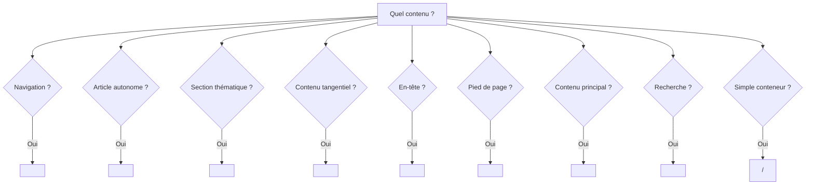

# 📖 Analyse Approfondie des Éléments HTML Sémantiques

> **Source** : [MDN Web Docs](https://developer.mozilla.org/fr/docs/Web/HTML/Reference/Elements)
> **Date** : 18 février 2026

---

## Table des matières

1. [Éléments de sectionnement](#1-éléments-de-sectionnement)
2. [Contenu de regroupement](#2-contenu-de-regroupement)
3. [Sémantique en ligne](#3-sémantique-en-ligne)
4. [Médias & Images](#4-médias--images)
5. [Édition](#5-édition)
6. [Tableaux](#6-tableaux)
7. [Formulaires](#7-formulaires)
8. [Éléments interactifs](#8-éléments-interactifs)

---

## 1. Éléments de sectionnement

### `<article>` — Contenu d'un article
📎 [MDN](https://developer.mozilla.org/fr/docs/Web/HTML/Reference/Elements/article)

| Propriété | Détail |
|-----------|--------|
| **Rôle ARIA** | `article` |
| **Catégorie** | Contenu de flux, contenu de sectionnement |
| **Modèle de contenu** | Contenu de flux |

**Description** : Représente une composition autonome destinée à être distribuée ou réutilisée indépendamment (article de blog, commentaire, widget interactif, post de forum). Chaque `<article>` devrait être identifié par un titre (`<h1>`–`<h6>`).

**Notes d'utilisation** :
- Les `<article>` imbriqués représentent des articles liés au parent (ex. commentaires sous un billet)
- Les infos auteur se placent dans `<address>` à l'intérieur d'un `<footer>` du `<article>`
- La date de publication peut être indiquée via `<time datetime="...">`

---

### `<aside>` — Aparté
📎 [MDN](https://developer.mozilla.org/fr/docs/Web/HTML/Reference/Elements/aside)

| Propriété | Détail |
|-----------|--------|
| **Rôle ARIA** | `complementary` |
| **Catégorie** | Contenu de flux, contenu de sectionnement |

**Description** : Représente du contenu indirectement lié au contenu principal : encadrés, biographies d'auteur, publicités, groupes de liens connexes.

**Notes d'utilisation** :
- Ne pas utiliser pour du texte parenthétique faisant partie du flux principal
- Souvent utilisé pour les barres latérales (sidebars)

---

### `<footer>` — Pied de page
📎 [MDN](https://developer.mozilla.org/fr/docs/Web/HTML/Reference/Elements/footer)

| Propriété | Détail |
|-----------|--------|
| **Rôle ARIA** | `contentinfo` (si enfant direct de `<body>`) |
| **Catégorie** | Contenu de flux |

**Description** : Représente le pied de page de son ancêtre de sectionnement le plus proche. Contient typiquement des informations de copyright, des liens de navigation, des coordonnées de contact.

**Notes d'utilisation** :
- Les infos auteur doivent être dans un `<address>` à l'intérieur du `<footer>`
- Quand ancêtre = `<body>`, s'applique à toute la page
- N'introduit pas de nouvelle section dans le plan du document
- **Accessibilité** : ajouter `role="contentinfo"` pour les anciens Safari (< 13)

---

### `<header>` — En-tête
📎 [MDN](https://developer.mozilla.org/fr/docs/Web/HTML/Reference/Elements/header)

| Propriété | Détail |
|-----------|--------|
| **Rôle ARIA** | `banner` (si non imbriqué dans un sectionnement) |
| **Catégorie** | Contenu de flux |

**Description** : Représente du contenu introductif ou un ensemble d'aides à la navigation. Contient typiquement le logo, le titre, la navigation, un formulaire de recherche.

**Notes d'utilisation** :
- En dehors d'un contenu sectionné → repère global `banner` (en-tête du site)
- Imbriqué dans `<article>`, `<section>`, etc. → en-tête de cette section spécifique
- Ne peut pas contenir de `<footer>` ou d'autre `<header>`

---

### `<hgroup>` — Regroupement de titres
📎 [MDN](https://developer.mozilla.org/fr/docs/Web/HTML/Reference/Elements/hgroup)

| Propriété | Détail |
|-----------|--------|
| **Rôle ARIA** | `group` |
| **Catégorie** | Contenu de flux |

**Description** : Regroupe un titre (`<h1>`–`<h6>`) avec du contenu secondaire associé (sous-titres, slogans) via des éléments `
`.

**Notes d'utilisation** :
- Seul le titre intégré contribue au plan du document
- Les `
` enfants servent de sous-titres ou méta-titres
- Remplace l'ancien usage de `<h1>` + `<h2>` pour titre + sous-titre

---

### `<h1>` à `<h4>` — Titres de section
📎 [MDN](https://developer.mozilla.org/fr/docs/Web/HTML/Reference/Elements/Heading_Elements)

| Propriété | Détail |
|-----------|--------|
| **Rôle ARIA** | `heading` (avec `aria-level` correspondant) |
| **Catégorie** | Contenu de flux, contenu de titre |

**Description** : Les éléments `<h1>` à `<h6>` représentent six niveaux de titres de section. `<h1>` est le plus important, `<h6>` le moins.

**Notes d'utilisation** :
- **Un seul `<h1>` par page** pour le titre principal
- Ne jamais sauter de niveaux (h1 → h3 sans h2 = ❌)
- Ne pas utiliser pour ajuster la taille du texte → utiliser CSS `font-size`
- Les lecteurs d'écran génèrent une table des matières à partir des titres
- **Accessibilité** : ~60% des utilisateurs de lecteurs d'écran naviguent par titres

---

### `<main>` — Contenu principal
📎 [MDN](https://developer.mozilla.org/fr/docs/Web/HTML/Reference/Elements/main)

| Propriété | Détail |
|-----------|--------|
| **Rôle ARIA** | `main` |
| **Catégorie** | Contenu de flux |

**Description** : Représente le contenu principal du `<body>`. Le contenu doit être unique au document, excluant les barres latérales, navigation, copyright, logos.

**Notes d'utilisation** :
- **Un seul `<main>` visible** par document (sans attribut `hidden`)
- Ne contribue pas à la structure du plan (outline)
- Sert de point de repère pour la navigation rapide (« Aller au contenu »)
- Active le « mode lecture » sur certains navigateurs

---

### `<nav>` — Navigation
📎 [MDN](https://developer.mozilla.org/fr/docs/Web/HTML/Reference/Elements/nav)

| Propriété | Détail |
|-----------|--------|
| **Rôle ARIA** | `navigation` |
| **Catégorie** | Contenu de flux, contenu de sectionnement |

**Description** : Section de page destinée à fournir des liens de navigation (menus, tables des matières, fils d'Ariane).

**Notes d'utilisation** :
- Pas besoin de mettre TOUS les liens dans un `<nav>` — réservé aux blocs de navigation principaux
- Plusieurs `<nav>` possibles (site nav + page nav) → différencier avec `aria-labelledby`
- Les lecteurs d'écran peuvent omettre le contenu de `<nav>` au rendu initial

---

### `<section>` — Section générique
📎 [MDN](https://developer.mozilla.org/fr/docs/Web/HTML/Reference/Elements/section)

| Propriété | Détail |
|-----------|--------|
| **Rôle ARIA** | `region` (si nommé via `aria-label` ou `aria-labelledby`) |
| **Catégorie** | Contenu de flux, contenu de sectionnement |

**Description** : Représente une section thématique générique d'un document. À utiliser uniquement quand aucun élément plus spécifique ne convient.

**Notes d'utilisation** :
- Contenu autonome → préférer `<article>`
- Information tangente → préférer `<aside>`
- Zone principale → préférer `<main>`
- Simple conteneur de style → préférer `
`
- Chaque `<section>` devrait avoir un titre (`<h1>`–`<h6>`)

---

### `<search>` — Recherche
📎 [MDN](https://developer.mozilla.org/fr/docs/Web/HTML/Reference/Elements/search)

| Propriété | Détail |
|-----------|--------|
| **Rôle ARIA** | `search` |
| **Catégorie** | Contenu de flux |

**Description** : Identifie une partie du document contenant un formulaire ou des contrôles liés à une fonctionnalité de recherche ou de filtrage.

**Notes d'utilisation** :
- N'est **pas** destiné à présenter les résultats de recherche
- Les suggestions/liens de « recherche rapide » peuvent y être imbriqués
- Remplace le pattern `<form role="search">` — plus besoin de rôle ARIA explicite
- Élément **récent** (2023), bien supporté par les navigateurs modernes

---

## 2. Contenu de regroupement

### `<blockquote>` — Citation longue
📎 [MDN](https://developer.mozilla.org/fr/docs/Web/HTML/Reference/Elements/blockquote)

| Propriété | Détail |
|-----------|--------|
| **Rôle ARIA** | `blockquote` |
| **Attribut spécifique** | `cite` (URL de la source) |

**Description** : Indique qu'un texte est une citation longue. Le navigateur ajoute généralement une indentation. L'attribut `cite` permet d'indiquer l'URL source.

**Notes** : Pour l'attribution visible, utiliser `<figcaption>` ou `<cite>` en dehors du `<blockquote>`.

---

### `<dd>` — Détail de description
📎 [MDN](https://developer.mozilla.org/fr/docs/Web/HTML/Reference/Elements/dd)

**Description** : Fournit la description, la définition ou la valeur du terme précédent (`<dt>`) dans une liste de description (`<dl>`).

---

### `
` — Division générique
📎 [MDN](https://developer.mozilla.org/fr/docs/Web/HTML/Reference/Elements/div)

**Description** : Conteneur générique pour du contenu de flux. **Aucune valeur sémantique**. À utiliser uniquement quand aucun autre élément sémantique ne convient. Utile pour le regroupement CSS ou JavaScript.

**⚠️ Anti-pattern** : `
` ne doit jamais remplacer un élément sémantique (`<article>`, `<section>`, `<nav>`, etc.).

---

### `<dl>` — Liste de descriptions
📎 [MDN](https://developer.mozilla.org/fr/docs/Web/HTML/Reference/Elements/dl)

**Description** : Représente une liste de paires terme-description. Usages : glossaires, métadonnées (clé-valeur), FAQ.

**Structure** : `<dl>` → `<dt>` (terme) + `<dd>` (description). Plusieurs `<dt>` ou `<dd>` consécutifs sont autorisés.

---

### `<dt>` — Terme de description
📎 [MDN](https://developer.mozilla.org/fr/docs/Web/HTML/Reference/Elements/dt)

**Description** : Spécifie un terme dans une `<dl>`. Doit être suivi d'au moins un `<dd>` ou d'un autre `<dt>`.

---

### `<figcaption>` — Légende de figure
📎 [MDN](https://developer.mozilla.org/fr/docs/Web/HTML/Reference/Elements/figcaption)

**Description** : Représente la légende ou le texte explicatif d'un élément `<figure>`. Doit être le premier ou le dernier enfant de `<figure>`.

---

### `<figure>` — Figure
📎 [MDN](https://developer.mozilla.org/fr/docs/Web/HTML/Reference/Elements/figure)

| Propriété | Détail |
|-----------|--------|
| **Rôle ARIA** | `figure` |

**Description** : Représente un contenu autonome, souvent avec une légende (`<figcaption>`). S'applique à : images, diagrammes, extraits de code, citations.

**Notes** : La position dans le flux n'a pas d'importance — peut être déplacé sans affecter le sens principal.

---

### `
` — Séparation thématique
📎 [MDN](https://developer.mozilla.org/fr/docs/Web/HTML/Reference/Elements/hr)

| Propriété | Détail |
|-----------|--------|
| **Rôle ARIA** | `separator` |

**Description** : Représente une césure thématique (changement de sujet, de scène). Rendu visuellement comme une ligne horizontale.

**Notes** : Pour un simple trait décoratif, utiliser CSS `border` sur un autre élément. `
` a une valeur sémantique de transition.

---

### `<li>` — Élément de liste
📎 [MDN](https://developer.mozilla.org/fr/docs/Web/HTML/Reference/Elements/li)

| Attribut | Détail |
|----------|--------|
| `value` | Valeur ordinale (uniquement dans `<ol>`) |

**Description** : Représente un élément dans une liste ordonnée (`<ol>`), non ordonnée (`<ul>`) ou un menu (`<menu>`).

---

### `<menu>` — Menu
📎 [MDN](https://developer.mozilla.org/fr/docs/Web/HTML/Reference/Elements/menu)

| Propriété | Détail |
|-----------|--------|
| **Rôle ARIA** | `list` |

**Description** : Alternative sémantique à `<ul>` pour les listes de commandes/actions (barres d'outils, menus contextuels). En pratique, le rendu est identique à `<ul>`.

---

### `<ol>` — Liste ordonnée
📎 [MDN](https://developer.mozilla.org/fr/docs/Web/HTML/Reference/Elements/ol)

| Attribut | Détail |
|----------|--------|
| `reversed` | Numérotation inversée |
| `start` | Valeur de départ |
| `type` | Type de numérotation (`1`, `a`, `A`, `i`, `I`) |

**Description** : Liste d'éléments dont l'**ordre a une importance** (étapes, classements).

---

### `
` — Paragraphe
📎 [MDN](https://developer.mozilla.org/fr/docs/Web/HTML/Reference/Elements/p)

**Description** : Représente un paragraphe de texte. Élément de bloc le plus fondamental. Les navigateurs ajoutent automatiquement des marges.

**Notes** : Ne pas utiliser `
` pour l'espacement — utiliser CSS `margin`.

---

### `<pre>` — Texte préformaté
📎 [MDN](https://developer.mozilla.org/fr/docs/Web/HTML/Reference/Elements/pre)

**Description** : Représente du texte préformaté, affiché exactement tel qu'il est écrit (espaces, retours à la ligne conservés). Police monospace par défaut.

**Usage** : Code source, art ASCII, e-mails avec mise en forme. Souvent combiné avec `<code>`.

---

### `<ul>` — Liste non ordonnée
📎 [MDN](https://developer.mozilla.org/fr/docs/Web/HTML/Reference/Elements/ul)

**Description** : Liste d'éléments dont l'**ordre n'a pas d'importance**. Rendu avec des puces par défaut.

**Notes** : `<ul>` et `<ol>` ne peuvent contenir directement que des `<li>`.

---

## 3. Sémantique en ligne

### `<a>` — Ancre (lien hypertexte)
📎 [MDN](https://developer.mozilla.org/fr/docs/Web/HTML/Reference/Elements/a)

| Attribut | Détail |
|----------|--------|
| `href` | URL de destination |
| `target` | Contexte de navigation (`_blank`, `_self`…) |
| `rel` | Relation (`noopener`, `noreferrer`, `nofollow`…) |
| `download` | Téléchargement plutôt que navigation |

**Description** : Crée un lien hypertexte vers des pages, fichiers, emplacements, e-mails, téléphone.

**Accessibilité** : Le texte du lien doit être descriptif — éviter « cliquez ici ».

---

### `<abbr>` — Abréviation
📎 [MDN](https://developer.mozilla.org/fr/docs/Web/HTML/Reference/Elements/abbr)

| Attribut | Détail |
|----------|--------|
| `title` | Forme développée de l'abréviation |

**Description** : Représente une abréviation ou un acronyme. L'attribut `title` fournit l'expansion complète en infobulle.

**Accessibilité** : Épeler l'abréviation en entier à la première occurrence dans le texte.

---

### `<b>` — Mise en gras
📎 [MDN](https://developer.mozilla.org/fr/docs/Web/HTML/Reference/Elements/b)

**Description** : Attire l'attention sur du contenu sans lui donner une importance particulière (mots-clés, noms de produits). **Pas de valeur sémantique forte** — utiliser `<strong>` pour l'importance.

---

### `<bdi>` — Isolation bidirectionnelle
📎 [MDN](https://developer.mozilla.org/fr/docs/Web/HTML/Reference/Elements/bdi)

**Description** : Isole un fragment de texte dont la directionnalité peut être différente du texte environnant. Essentiel pour les contenus générés par l'utilisateur en contexte multilingue (noms arabe/hébreu dans du texte latin).

---

### `<bdo>` — Remplacement bidirectionnel
📎 [MDN](https://developer.mozilla.org/fr/docs/Web/HTML/Reference/Elements/bdo)

| Attribut | Détail |
|----------|--------|
| `dir` | Direction du texte (`ltr` ou `rtl`) |

**Description** : Force la direction du texte, outrepassant l'algorithme bidirectionnel Unicode.

---

### ` ` — Saut de ligne
📎 [MDN](https://developer.mozilla.org/fr/docs/Web/HTML/Reference/Elements/br)

**Description** : Produit un saut de ligne dans le texte. Élément vide (pas de balise fermante).

**⚠️** : Ne pas utiliser pour créer des espaces entre paragraphes — utiliser `
` et CSS `margin`.

---

### `<cite>` — Citation (titre d'œuvre)
📎 [MDN](https://developer.mozilla.org/fr/docs/Web/HTML/Reference/Elements/cite)

**Description** : Représente le titre d'une œuvre citée (livre, film, chanson, exposition, brevet…). Rendu en italique par défaut.

**Notes** : Ne pas utiliser pour le nom d'une personne — `<cite>` est strictement pour les titres d'œuvres.

---

### `<data>` — Données lisible machine
📎 [MDN](https://developer.mozilla.org/fr/docs/Web/HTML/Reference/Elements/data)

| Attribut | Détail |
|----------|--------|
| `value` | Valeur lisible par machine |

**Description** : Lie un contenu textuel à une valeur lisible par machine. Ex : nom de produit associé à un code UPC.

---

### `<dfn>` — Définition
📎 [MDN](https://developer.mozilla.org/fr/docs/Web/HTML/Reference/Elements/dfn)

**Description** : Indique le terme en cours de définition dans le contexte. Le paragraphe parent ou la `<section>` fournit la définition.

---

### `<em>` — Emphase
📎 [MDN](https://developer.mozilla.org/fr/docs/Web/HTML/Reference/Elements/em)

**Description** : Marque un texte avec une **emphase**. Les lecteurs d'écran prononcent le contenu avec une intonation différente. Rendu en italique.

**vs `<i>`** : `<em>` = stress vocal sémantique. `<i>` = convention typographique (pensée, terme étranger).

---

### `<i>` — Texte alternatif
📎 [MDN](https://developer.mozilla.org/fr/docs/Web/HTML/Reference/Elements/i)

**Description** : Représente du texte distingué du contenu normal pour des raisons de lisibilité : termes techniques, mots d'une langue étrangère, pensées d'un personnage. Rendu en italique.

---

### `<kbd>` — Saisie clavier
📎 [MDN](https://developer.mozilla.org/fr/docs/Web/HTML/Reference/Elements/kbd)

**Description** : Représente une entrée utilisateur au clavier (touches, commandes vocales). Police monospace par défaut.

**Exemple** : `Appuyez sur <kbd>Ctrl</kbd> + <kbd>C</kbd>`

---

### `<mark>` — Texte surligné
📎 [MDN](https://developer.mozilla.org/fr/docs/Web/HTML/Reference/Elements/mark)

**Description** : Texte marqué/surligné pour référence, pertinence contextuelle (résultats de recherche). Fond jaune par défaut.

---

### `<q>` — Citation en ligne
📎 [MDN](https://developer.mozilla.org/fr/docs/Web/HTML/Reference/Elements/q)

| Attribut | Détail |
|----------|--------|
| `cite` | URL de la source |

**Description** : Citation courte en ligne. Les navigateurs ajoutent automatiquement des guillemets.

---

### `<rp>`, `<rt>`, `<ruby>` — Annotations Ruby
📎 [MDN ruby](https://developer.mozilla.org/fr/docs/Web/HTML/Reference/Elements/ruby) · [rt](https://developer.mozilla.org/fr/docs/Web/HTML/Reference/Elements/rt) · [rp](https://developer.mozilla.org/fr/docs/Web/HTML/Reference/Elements/rp)

**Description** : Annotations ruby pour la prononciation de caractères est-asiatiques (furigana japonais, bopomofo chinois).
- `<ruby>` : conteneur
- `<rt>` : texte d'annotation (prononciation)
- `<rp>` : parenthèses de repli pour navigateurs sans support ruby

---

### `<s>` — Texte barré (inexact)
📎 [MDN](https://developer.mozilla.org/fr/docs/Web/HTML/Reference/Elements/s)

**Description** : Texte qui n'est plus correct ou pertinent (ancien prix, info obsolète). ≠ `<del>` qui indique une suppression éditoriale.

---

### `<samp>` — Sortie programme
📎 [MDN](https://developer.mozilla.org/fr/docs/Web/HTML/Reference/Elements/samp)

**Description** : Représente une sortie ou un résultat de programme informatique. Police monospace.

---

### `<small>` — Commentaire accessoire
📎 [MDN](https://developer.mozilla.org/fr/docs/Web/HTML/Reference/Elements/small)

**Description** : Représente des commentaires secondaires (mentions légales, copyright, avertissements). Texte plus petit par défaut.

---

### `` — Conteneur en ligne générique
📎 [MDN](https://developer.mozilla.org/fr/docs/Web/HTML/Reference/Elements/span)

**Description** : Conteneur en ligne **sans signification sémantique**. Équivalent inline de `
`. À utiliser uniquement pour le styling ou le JavaScript quand aucun élément sémantique ne convient.

---

### `<strong>` — Importance forte
📎 [MDN](https://developer.mozilla.org/fr/docs/Web/HTML/Reference/Elements/strong)

**Description** : Indique que le contenu a une **importance, gravité ou urgence** particulière. Rendu en gras. Les lecteurs d'écran modifient l'intonation.

**vs `<b>`** : `<strong>` = importance sémantique. `<b>` = simple mise en forme visuelle.

---

### `` / `` — Indice / Exposant
📎 [MDN sub](https://developer.mozilla.org/fr/docs/Web/HTML/Reference/Elements/sub) · [sup](https://developer.mozilla.org/fr/docs/Web/HTML/Reference/Elements/sup)

**Description** :
- `` : texte en indice (formules chimiques : H₂O)
- `` : texte en exposant (puissances : x², notes de bas de page)

---

### `<time>` — Date/heure
📎 [MDN](https://developer.mozilla.org/fr/docs/Web/HTML/Reference/Elements/time)

| Attribut | Détail |
|----------|--------|
| `datetime` | Date/heure au format machine (ISO 8601) |

**Description** : Représente une date, une heure ou une durée au format lisible humain, avec une valeur machine dans `datetime`.

**Exemple** : `<time datetime="2026-02-18">18 février 2026</time>`

---

### `<u>` — Annotation non textuelle
📎 [MDN](https://developer.mozilla.org/fr/docs/Web/HTML/Reference/Elements/u)

**Description** : Représente du texte avec une annotation non textuelle (noms propres en chinois, erreurs d'orthographe). Souligné par défaut. **Éviter** car confusion avec les liens.

---

### `<var>` — Variable
📎 [MDN](https://developer.mozilla.org/fr/docs/Web/HTML/Reference/Elements/var)

**Description** : Représente une variable dans une expression mathématique ou un contexte de programmation. Rendu en italique.

---

### `<wbr>` — Opportunité de retour à la ligne
📎 [MDN](https://developer.mozilla.org/fr/docs/Web/HTML/Reference/Elements/wbr)

**Description** : Indique une position où le navigateur **peut** couper le texte long. N'ajoute pas de tiret. Utile pour les URL ou mots très longs.

---

## 4. Médias & Images

### `<area>` — Zone de carte image
📎 [MDN](https://developer.mozilla.org/fr/docs/Web/HTML/Reference/Elements/area)

| Attribut | Détail |
|----------|--------|
| `shape` | Forme (`rect`, `circle`, `poly`, `default`) |
| `coords` | Coordonnées de la zone |
| `href` | URL de destination |
| `alt` | Texte alternatif |

**Description** : Définit une zone interactive cliquable dans un `<map>`. Élément vide.

---

### `<map>` — Carte image
📎 [MDN](https://developer.mozilla.org/fr/docs/Web/HTML/Reference/Elements/map)

| Attribut | Détail |
|----------|--------|
| `name` | Nom référencé par `usemap` de `` |

**Description** : Utilisé avec `<area>` pour définir une image cliquable avec des zones interactives.

---

### `<picture>` — Image adaptative
📎 [MDN](https://developer.mozilla.org/fr/docs/Web/HTML/Reference/Elements/picture)

**Description** : Conteneur pour spécifier plusieurs `<source>` alternatives pour un ``. Permet le chargement d'images adaptatives selon le viewport, la résolution, ou le format supporté (WebP, AVIF).

**Structure** : `<picture>` → `<source>` (0+) + `` (obligatoire, fallback).

---

## 5. Édition

### `<del>` — Texte supprimé
📎 [MDN](https://developer.mozilla.org/fr/docs/Web/HTML/Reference/Elements/del)

| Attribut | Détail |
|----------|--------|
| `cite` | URL expliquant la suppression |
| `datetime` | Date/heure de la suppression |

**Description** : Représente du texte qui a été supprimé d'un document. Rendu barré. Utilisé pour le suivi des modifications.

---

### `<ins>` — Texte inséré
📎 [MDN](https://developer.mozilla.org/fr/docs/Web/HTML/Reference/Elements/ins)

| Attribut | Détail |
|----------|--------|
| `cite` | URL expliquant l'insertion |
| `datetime` | Date/heure de l'insertion |

**Description** : Représente du texte qui a été ajouté au document. Rendu souligné. Complémentaire de `<del>`.

---

## 6. Tableaux

### `<table>` — Tableau
📎 [MDN](https://developer.mozilla.org/fr/docs/Web/HTML/Reference/Elements/table)

| Rôle ARIA | `table` |
|-----------|---------|

**Description** : Représente des données tabulaires en deux dimensions. **Ne jamais utiliser pour la mise en page**.

---

### `<caption>` — Légende du tableau
📎 [MDN](https://developer.mozilla.org/fr/docs/Web/HTML/Reference/Elements/caption)

**Description** : Titre ou légende du tableau. Doit être le **premier enfant** de `<table>`. Essentiel pour l'accessibilité.

---

### `<thead>`, `<tbody>`, `<tfoot>` — Sections de tableau
📎 [MDN thead](https://developer.mozilla.org/fr/docs/Web/HTML/Reference/Elements/thead) · [tbody](https://developer.mozilla.org/fr/docs/Web/HTML/Reference/Elements/tbody) · [tfoot](https://developer.mozilla.org/fr/docs/Web/HTML/Reference/Elements/tfoot)

| Élément | Rôle |
|---------|------|
| `<thead>` | En-tête (titres de colonnes) |
| `<tbody>` | Corps (données principales) |
| `<tfoot>` | Pied (totaux, résumés) |

**Notes** : Ordre dans le DOM : `<caption>` → `<colgroup>` → `<thead>` → `<tbody>` → `<tfoot>`.

---

### `<tr>` — Ligne de tableau
📎 [MDN](https://developer.mozilla.org/fr/docs/Web/HTML/Reference/Elements/tr)

**Description** : Définit une ligne de cellules dans un tableau. Contient des `<td>` et/ou `<th>`.

---

### `<th>` — Cellule d'en-tête
📎 [MDN](https://developer.mozilla.org/fr/docs/Web/HTML/Reference/Elements/th)

| Attribut | Détail |
|----------|--------|
| `scope` | Portée (`col`, `row`, `colgroup`, `rowgroup`) |
| `colspan`/`rowspan` | Fusion de cellules |

**Description** : Cellule d'en-tête. L'attribut `scope` est crucial pour l'accessibilité.

---

### `<td>` — Cellule de données
📎 [MDN](https://developer.mozilla.org/fr/docs/Web/HTML/Reference/Elements/td)

| Attribut | Détail |
|----------|--------|
| `colspan`/`rowspan` | Fusion de cellules |
| `headers` | IDs des `<th>` associés |

**Description** : Cellule contenant des données.

---

### `<col>` / `<colgroup>` — Colonnes
📎 [MDN col](https://developer.mozilla.org/fr/docs/Web/HTML/Reference/Elements/col) · [colgroup](https://developer.mozilla.org/fr/docs/Web/HTML/Reference/Elements/colgroup)

**Description** :
- `<colgroup>` : Groupe de colonnes pour appliquer des styles uniformes
- `<col>` : Colonne individuelle (attribut `span` pour couvrir plusieurs colonnes)

---

## 7. Formulaires

### `<form>` — Formulaire
📎 [MDN](https://developer.mozilla.org/fr/docs/Web/HTML/Reference/Elements/form)

| Attribut | Détail |
|----------|--------|
| `action` | URL de soumission |
| `method` | Méthode HTTP (`get`, `post`, `dialog`) |
| `enctype` | Encodage (`application/x-www-form-urlencoded`, `multipart/form-data`) |
| `novalidate` | Désactive la validation native |

**Description** : Conteneur pour les contrôles interactifs de saisie de données.

---

### `<input>` — Champ de saisie
📎 [MDN](https://developer.mozilla.org/fr/docs/Web/HTML/Reference/Elements/input)

**Description** : L'élément le plus polyvalent des formulaires. Plus de 20 types : `text`, `email`, `password`, `number`, `date`, `file`, `checkbox`, `radio`, `range`, `color`, `search`, `tel`, `url`, `hidden`, `submit`, `reset`, `button`, `image`.

**Accessibilité** : Toujours associer un `<label>` via `for`/`id`.

---

### `<label>` — Étiquette
📎 [MDN](https://developer.mozilla.org/fr/docs/Web/HTML/Reference/Elements/label)

| Attribut | Détail |
|----------|--------|
| `for` | ID du contrôle associé |

**Description** : Associe un texte descriptif à un contrôle de formulaire. Cliquer sur le label active le contrôle associé. **Essentiel pour l'accessibilité**.

---

### `<button>` — Bouton
📎 [MDN](https://developer.mozilla.org/fr/docs/Web/HTML/Reference/Elements/button)

| Attribut | Détail |
|----------|--------|
| `type` | `submit` (défaut), `reset`, `button` |
| `disabled` | Désactivé |
| `form` | ID du formulaire associé |

**Description** : Bouton interactif activable. Peut contenir du HTML riche contrairement à `<input type="button">`.

---

### `<select>` — Liste déroulante
📎 [MDN](https://developer.mozilla.org/fr/docs/Web/HTML/Reference/Elements/select)

| Attribut | Détail |
|----------|--------|
| `multiple` | Sélection multiple |
| `size` | Nombre de lignes visibles |

**Description** : Menu de sélection d'options. Contient `<option>` et optionnellement `<optgroup>`.

---

### `<option>` / `<optgroup>` — Options
📎 [MDN option](https://developer.mozilla.org/fr/docs/Web/HTML/Reference/Elements/option) · [optgroup](https://developer.mozilla.org/fr/docs/Web/HTML/Reference/Elements/optgroup)

- `<option>` : Élément individuel dans `<select>` ou `<datalist>` (attributs : `value`, `selected`, `disabled`)
- `<optgroup>` : Groupe d'options avec un `label`

---

### `<textarea>` — Zone de texte multiligne
📎 [MDN](https://developer.mozilla.org/fr/docs/Web/HTML/Reference/Elements/textarea)

| Attribut | Détail |
|----------|--------|
| `rows`/`cols` | Dimensions visibles |
| `maxlength`/`minlength` | Limites de caractères |
| `placeholder` | Texte indicatif |
| `wrap` | Mode d'enveloppement (`soft`, `hard`) |

---

### `<datalist>` — Liste de suggestions
📎 [MDN](https://developer.mozilla.org/fr/docs/Web/HTML/Reference/Elements/datalist)

**Description** : Fournit une liste de suggestions prédéfinies pour un `<input>` (liaison via `list="id"`). L'utilisateur reste libre de saisir une autre valeur.

---

### `<fieldset>` / `<legend>` — Groupe de champs
📎 [MDN fieldset](https://developer.mozilla.org/fr/docs/Web/HTML/Reference/Elements/fieldset) · [legend](https://developer.mozilla.org/fr/docs/Web/HTML/Reference/Elements/legend)

- `<fieldset>` : Regroupe visuellement et sémantiquement des contrôles liés (bordure par défaut)
- `<legend>` : Titre/légende du `<fieldset>` — premier enfant obligatoire

---

### `<meter>` — Valeur scalaire
📎 [MDN](https://developer.mozilla.org/fr/docs/Web/HTML/Reference/Elements/meter)

| Attribut | Détail |
|----------|--------|
| `min`/`max` | Bornes |
| `low`/`high`/`optimum` | Plages qualitatives |
| `value` | Valeur actuelle |

**Description** : Représente une valeur dans une plage connue (espace disque, score). ≠ `<progress>`.

---

### `<output>` — Résultat de calcul
📎 [MDN](https://developer.mozilla.org/fr/docs/Web/HTML/Reference/Elements/output)

| Attribut | Détail |
|----------|--------|
| `for` | IDs des éléments contributifs |

**Description** : Zone de résultat d'un calcul ou d'une action utilisateur. Rôle ARIA `status` par défaut.

---

### `<progress>` — Barre de progression
📎 [MDN](https://developer.mozilla.org/fr/docs/Web/HTML/Reference/Elements/progress)

| Attribut | Détail |
|----------|--------|
| `max` | Valeur maximale |
| `value` | Progression actuelle |

**Description** : Affiche l'avancement d'une tâche. Sans `value`, indéterminé (chargement).

---

### `<selectedcontent>` — Contenu sélectionné (expérimental)
📎 [MDN](https://developer.mozilla.org/fr/docs/Web/HTML/Reference/Elements/selectedcontent)

**Description** : Élément **expérimental** permettant d'afficher le contenu riche sélectionné dans un `<select>` personnalisé. Support encore très limité.

---

## 8. Éléments interactifs

### `
` — Détails repliables
📎 [MDN](https://developer.mozilla.org/fr/docs/Web/HTML/Reference/Elements/details)

| Attribut | Détail |
|----------|--------|
| `open` | Section dépliée par défaut |
| `name` | Groupe accordion (exclusivité) |

**Description** : Widget de divulgation — contenu masqué/visible au clic. Premier enfant = `
`.

**Nouveauté** : L'attribut `name` permet de créer des groupes accordion natifs sans JavaScript.

---

### `
` — Résumé de details
📎 [MDN](https://developer.mozilla.org/fr/docs/Web/HTML/Reference/Elements/summary)

**Description** : Titre cliquable d'un élément `
`. Toujours visible, contrôle l'ouverture/fermeture. Si absent, le navigateur utilise « Détails ».

---

### `<dialog>` — Boîte de dialogue
📎 [MDN](https://developer.mozilla.org/fr/docs/Web/HTML/Reference/Elements/dialog)

| Attribut | Détail |
|----------|--------|
| `open` | Affiché (non-modal) |

| Méthode JS | Détail |
|------------|--------|
| `showModal()` | Ouvre en modal (avec backdrop, piège le focus) |
| `show()` | Ouvre en non-modal |
| `close()` | Ferme la dialog |

**Description** : Sous-fenêtre interactive (modale ou non). Gère nativement le piège de focus, la touche `Escape`, et le backdrop `::backdrop`.

**Accessibilité** : Utiliser `aria-label` ou `aria-labelledby` pour nommer la boîte de dialogue. Préférer la méthode `showModal()` pour les dialogs qui nécessitent une action utilisateur.

---

## Synthèse : Choix de l'élément sémantique

> **Règle d'or** : Toujours choisir l'élément le plus spécifique possible. `
` et `` sont des **derniers recours** sans valeur sémantique.
