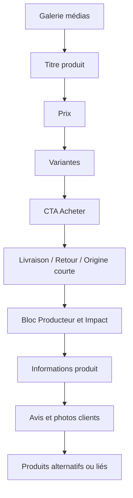
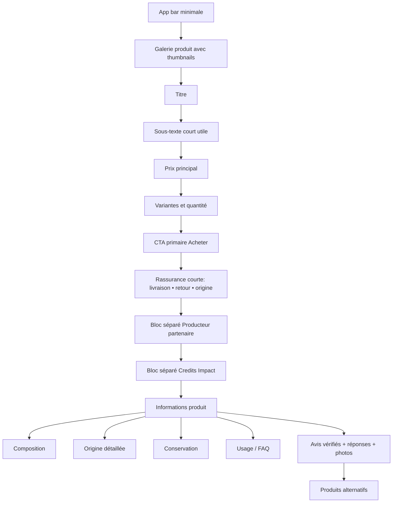

# Structurer une fiche produit mobile en 2025 et 2026 pour Make the Change

## Conclusion claire

La meilleure fiche produit mobile en 2025–25 mai 2026 n’est pas une fiche “riche” au sens d’accumuler des blocs, mais une fiche **hiérarchisée en trois couches clairement séparées** : **décision d’achat**, **preuve produit**, **preuve de mission**. En mobile, cela signifie très concrètement : **galerie claire**, **titre**, **prix**, **variante**, **CTA primaire visible**, puis juste après **livraison / retour / origine courte**, ensuite **producteur et traçabilité**, puis **Informations produit** en **accordéons courts et scannables**, puis **avis** et enfin **produits liés**. Les preuves de mission — soutien producteur, origine, Credits Impact — doivent être visibles, mais **ne jamais brouiller la compréhension du prix, du vendeur, ni de l’action principale “Acheter”**. C’est la ligne la plus robuste au regard des benchmarks Baymard 2025–2026, des recommandations NN/g sur la divulgation progressive, et des contraintes d’accessibilité WCAG 2.2, Apple et Material. citeturn29view0turn31view8turn31view7turn29view14turn29view17turn29view20turn29view25

J’utilise les marqueurs suivants : **[VALIDÉ]** quand plusieurs sources soutiennent directement la recommandation, **[CIBLE_VALIDEE]** quand je propose une cible UI précise cohérente avec les standards, **[HYPOTHESE]** quand l’orientation est solide mais que la meilleure variante dépendra d’un test, **[NON_DECIDE]** quand la littérature ne tranche pas clairement pour votre cas, et **[INTERDIT]** quand le pattern est explicitement contre-indiqué par les sources ou par l’accessibilité.

### Réponses directes aux questions clés

| Question clé | Réponse courte | Statut | Base probante |
|---|---|---|---|
| Quel est l’objectif principal d’une PDP mobile | Réduire l’incertitude assez vite pour permettre une décision d’achat confiante, sans forcer l’utilisateur à quitter la page ni à “chercher” des infos essentielles. | [VALIDÉ] | Baymard rappelle que la product page est le centre de la décision d’achat et que la plupart des sites restent médiocres sur ce point. citeturn13search4turn29view5 |
| Que doit contenir l’above the fold | Galerie, titre, prix, variante, CTA principal, et au minimum un résumé de livraison / coût total / retour si cela influence la décision. | [VALIDÉ] | citeturn29view4turn29view9turn32view6turn32view7 |
| Les images doivent-elles arriver avant le texte | Oui. Les visuels restent décisifs pour évaluer taille, usage réel et confiance ; ils doivent ouvrir la page et rendre les vues additionnelles facilement découvrables. | [VALIDÉ] | citeturn29view4turn32view2turn32view3 |
| Le titre doit-il être court | Oui : titre descriptif, scannable, sans surcharge marketing. Le détail complémentaire doit passer en sous-texte ou metadata. | [VALIDÉ] | citeturn24search1turn3search2turn19search9 |
| Faut-il une short description | Oui, mais courte : une phrase utile ou 2–3 highlights, pas un paragraphe bloc. | [VALIDÉ] | citeturn12search0turn29view5turn3search2 |
| Où placer le prix | Au-dessus de la ligne de flottaison, près du CTA et près des variantes si celles-ci changent le prix. | [VALIDÉ] | citeturn29view9turn32view5turn32view6 |
| Comment afficher les variantes | En **boutons / chips exposés**, pas en menu déroulant si le choix est critique. | [VALIDÉ] | citeturn32view0turn32view1 |
| Le CTA doit-il être unique | Oui pour l’action principale d’achat. Les actions de soutien ou d’information doivent être secondaires et visuellement séparées. | [VALIDÉ] | citeturn25search14turn24search1turn3search2 |
| Faut-il un sticky CTA | Oui sur les pages longues, à condition qu’il n’occulte ni contenu ni focus, et qu’il respecte la safe area. | [VALIDÉ] | citeturn22search1turn22search3turn29view17 |
| Le prix doit-il être dans le sticky CTA | Mieux vaut en général **prix à côté / au-dessus du bouton dans la barre**, pas **dans** le libellé du bouton ; l’exception est un cas simple où la variante fait fortement varier le prix. | [HYPOTHESE] | Appuyé par l’importance de la proximité prix/achat et du coût total près du buy section, mais pas tranché explicitement par une source unique. citeturn29view9turn32view5turn32view6 |
| Quel ordre de sections sous le buy box | Réassurance courte, producteur / traçabilité, informations produit, avis, produits liés. | [CIBLE_VALIDEE] | citeturn32view6turn32view7turn29view10turn17search2 |
| Faut-il des accordéons | Oui pour le **secondaire bien découpé** ; non pour les informations décisives si elles sont trop cachées. | [VALIDÉ] | citeturn31view10turn23search1turn34view6 |
| Accordéons ouverts ou fermés par défaut | Ouvrir par défaut **le premier panneau le plus décisionnel** ; fermer le reste avec intitulés très explicites. | [HYPOTHESE] | Les sources valident le principe de divulgation progressive, mais pas une règle universelle de “tout ouvert” ou “tout fermé”. citeturn31view10turn29view14turn34view7 |
| Colonne unique ou 2 colonnes dans Informations produit | En mobile : **colonne unique empilée**. Les tableaux / 2 colonnes ne doivent exister que pour des paires très courtes et doivent casser en empilé avec grand texte. | [VALIDÉ] | citeturn31view9turn34view2turn5search2 |
| Quels espacements viser | Système 8pt/8dp, marges latérales 16–20, gap intra-bloc 8–12, gap inter-sections 24–32. | [CIBLE_VALIDEE] | Basé sur l’échelle 8dp de Material et les contraintes de cibles tactiles Apple/Android. citeturn35search0turn35search2turn29view20turn29view25 |
| Quelle typographie viser | Corps lisible, support du texte augmenté à 200%, line-height ~1.5 pour les petits corps, hiérarchie nette. | [VALIDÉ] | citeturn29view20turn37search1turn15search1turn38search1turn20search0 |
| Quelles exigences de contraste et dark mode | Texte normal 4.5:1 min, grand texte 3:1 min ; en dark mode, éviter les gris trop faibles sur noir et tester en contraste renforcé. | [VALIDÉ] | citeturn34view15turn36search3turn21search12 |
| Comment éviter le greenwashing | Remplacer les promesses vagues par des affirmations spécifiques, limitées, vérifiables et contextualisées. | [VALIDÉ] | citeturn29view28turn29view29turn14search7 |
| Quels patterns éviter | Tabs horizontaux, sous-pages PDP, sélecteurs cachés, texte incrusté dans les images, sticky bars masquantes, multi-colonnes denses. | [INTERDIT] | citeturn34view0turn29view3turn32view1turn33view3turn22search13turn31view9 |
| Quels A/B tests lancer | Sticky CTA, ordre des preuves, panneau info par défaut ouvert, place du module producteur, affichage des Credits Impact, microcopy du prix et de l’origine. | [VALIDÉ] | citeturn29view30turn18search6turn18search12 |

## Ce que disent les sources

Les sources les plus solides convergent assez fortement. **Baymard** apporte la masse empirique la plus directement applicable au commerce : benchmark produit 2026 avec **30 000+ scores PDP**, benchmark mobile 2025 avec **52 000+ éléments** et benchmark mobile app 2026 avec **11 000+ éléments**, plus des articles très précis sur variantes, coûts de livraison, structure des descriptions, scannabilité des specs, tabs horizontaux et navigation des visuels. C’est la base la plus opérationnelle pour décider de l’ordre de page et des patterns à éviter. citeturn13search4turn31view8turn31view7turn29view6turn34view0

**NN/g** sert surtout à arbitrer la forme de l’information et non le “commerce” au sens strict : les articles sur les **accordéons**, la **divulgation progressive**, le **chunking**, les **tables des matières mobiles**, la **hiérarchie visuelle**, les **touch targets** et les **A/B tests** donnent le cadre pour savoir quand cacher, quand montrer, et comment éviter qu’une PDP longue devienne désorientante. Leur position est claire : cacher du contenu secondaire peut aider, mais cacher du contenu décisif fait perdre en découvrabilité ; les accordéons sont utiles quand le contenu est bien chunké, mais mauvais quand l’utilisateur a besoin de lire l’essentiel du contenu pour décider. citeturn31view10turn23search1turn34view6turn3search2turn34view7turn24search1turn29view12turn29view30

**W3C/WCAG 2.2**, **Apple HIG** et **Material / Android** permettent de convertir ces principes UX en garde-fous de conception. WCAG 2.2 impose notamment des cibles minimales de **24×24 CSS px** au niveau AA, un contraste de **4.5:1** pour le texte normal, le **reflow** à **320 CSS px**, et le fait que le focus ne soit pas masqué par des éléments sticky. Apple recommande des hit targets d’au moins **44×44 pt** et un texte d’au moins **11 pt** comme base minimale de lisibilité. Android / Material recommandent des cibles tactiles d’au moins **48×48 dp**, une échelle d’espacement **8dp**, et le test des layouts avec texte agrandi à **200%**. citeturn29view17turn29view18turn5search2turn22search1turn29view20turn6search1turn29view25turn35search0turn35search2turn38search2

Enfin, pour la **traçabilité** et l’**anti-greenwashing**, les sources officielles ne recommandent pas “plus de claims”, elles recommandent **des claims plus précis**. La CMA britannique exige des allégations environnementales **vraies, exactes et non trompeuses**, tandis que l’UE interdit les formulations vagues du type “green” ou “environmentally friendly” si elles ne sont pas démontrées. Pour Make the Change, cela signifie qu’**origine**, **soutien producteur**, **Credits Impact** et toute dimension “impact” doivent être formulés séparément, explicitement, et avec un mode de preuve consultable. citeturn29view28turn29view29turn29view27

## Structure idéale et ordre recommandé

La structure la plus robuste pour une PDP mobile-first est la suivante : **médias**, **titre et identité du produit**, **prix et variation**, **CTA principal**, **réassurance transactionnelle courte**, **preuve de mission / producteur**, **Informations produit**, **avis**, puis **alternatives / produits liés**. Cet ordre respecte à la fois la logique commerciale de Baymard — l’utilisateur doit d’abord pouvoir décider s’il achète — et la logique cognitive de NN/g — le contenu secondaire peut être progressivement révélé, mais le contenu décisionnel ne doit pas être enterré. citeturn29view0turn29view9turn32view6turn34view6turn24search1

Pour **l’above the fold**, je recommande ceci comme ordre cible : **galerie**, **titre**, **prix**, **variante**, **CTA**, puis une **rangée courte** de signaux “livraison / retour / origine”. Le **producteur** et les **Credits Impact** ne doivent pas vivre dans le même bloc visuel que le prix et le CTA principal, sinon on crée une ambiguïté entre “acheter un produit”, “soutenir une cause” et “gagner des crédits”. Pour Make the Change, cette séparation est essentielle parce que votre proposition de valeur combine commerce, mission et récompense ; la page doit donc les **articuler**, pas les fusionner. citeturn32view6turn32view7turn29view28turn24search1turn3search2

L’ordre recommandé par section est le suivant :

| Zone | Contenu recommandé | Statut | Pourquoi |
|---|---|---|---|
| Haut de page | Galerie avec miniatures / états de galerie clairs | [VALIDÉ] | Les visuels sont décisifs et les vues supplémentaires doivent être découvrables. citeturn29view4turn32view2 |
| Bloc achat | Titre, sous-texte ultra court, prix, variantes, stock, CTA | [VALIDÉ] | C’est le cœur de la décision d’achat. citeturn13search4turn29view9turn32view0 |
| Réassurance immédiate | Livraison estimée, retour, coût total estimé si sensible, origine courte | [VALIDÉ] | Les coûts et politiques influencent directement l’ajout au panier. citeturn32view6turn32view7turn29view7turn31view11 |
| Bloc mission | Producteur partenaire, traçabilité, Credits Impact expliqués, soutien producteur | [CIBLE_VALIDEE] | Important pour votre marque, mais doit rester distinct de l’action d’achat. citeturn29view28turn29view29turn3search2turn24search1 |
| Informations produit | Composition, origine, conservation, usage, certifications, FAQ courtes | [VALIDÉ] | Contenu scannable, chunké, sans sous-page séparée. citeturn29view3turn29view6turn34view2 |
| Avis et preuves | Note, avis vérifiés, réponses aux avis négatifs, photos clients | [VALIDÉ] | Les avis sont critiques pour la décision ; les réponses et la vérification augmentent la confiance. citeturn17search2turn17search1turn29view10 |
| Bas de page | Produits alternatifs / associés très pertinents | [VALIDÉ] | Utile, mais seulement après la preuve principale et sans distraire du produit courant. citeturn31view11turn33view3 |

Pour les PDP longues, j’ajoute une nuance importante : si “Informations produit”, “Avis” et “Producteur” deviennent très longs, il est pertinent d’ajouter une **mini table des matières mobile** ou des **liens d’ancrage**. NN/g montre que ces tables des matières aident les utilisateurs à construire une vue d’ensemble de la page et à sauter directement vers la section pertinente. C’est une bonne alternative à un excès d’accordéons fermés. citeturn34view7turn34view8



## Wireframe mobile textuel complet

Le wireframe ci-dessous est celui que je recommanderais pour une app mobile-first comme Make the Change. Il suppose que vous n’avez pas fourni le screenshot complet de la page actuelle, donc il s’agit d’une **structure cible** et non d’un verdict sur votre page entière. Vos contraintes métier — app mobile-first, vente de produits partenaires, clarté entre achat, soutien producteur et Credits Impact — viennent bien de votre brief. fileciteturn0file0

Le point clé est de **séparer clairement les couches de sens** : le produit, la transaction, puis la mission. C’est particulièrement important pour éviter qu’un utilisateur interprète “Credits Impact” comme une remise, ou “soutien producteur” comme un supplément obligatoire, ou encore “origine” comme une promesse environnementale totale alors qu’il ne s’agit que d’un attribut de provenance. citeturn29view28turn29view29turn24search1turn3search2



Wireframe textuel recommandé :

```text
[App bar]
←  Nom catégorie / retour            [Partager] [Favori]

[Galerie]
Image 1/6
Miniatures ou indicateur clair
Zoom / plein écran / vidéo si utile

[Titre]
Miel d'Eucalyptus
Producteur partenaire : Coopérative X

[Short description]
Miel ambré, boisé, notes fraîches
ou 2-3 highlights max

[Prix]
3,50 €
Si variante: "140 g sélectionné"

[Variantes]
[140 g] [250 g] [500 g]
Stock / dispo si nécessaire

[CTA primaire]
Acheter

[Rassurance courte]
Livraison 2–3 jours • Retour • Origine Madagascar

[Bloc mission séparé]
Soutien producteur
Texte explicatif court + lien "Comment ça marche"

[Bloc Credits Impact séparé]
+ 350 Credits Impact
Texte explicatif court + lien "Comprendre les credits"

[Informations produit]
Composition
Origine
Conservation
Mode d’usage
Certifications / traçabilité

[Avis]
Note globale
Avis vérifiés
Réponses marque
Photos clients

[Alternatives]
Produits similaires / du même producteur
```

Je déconseille de placer très haut des blocs promotionnels, carrousels secondaires ou contenus horizontaux occupant une grande part de la hauteur du viewport. Baymard note qu’en app mobile, les composants horizontaux non critiques doivent idéalement prendre moins de 50% de la hauteur verticale disponible ; sinon ils dégradent la fluidité du scroll. citeturn33view3

## Recommandations UI précises

La littérature donne peu de “pixels obligatoires” pour une PDP commerce donnée, mais elle donne des **contraintes fortes** : échelle d’espacement régulière, grandes cibles tactiles, reflow, texte agrandissable et contraste suffisant. À partir de là, je recommande pour une PDP mobile moderne un système basé sur **8 pt / 8 dp**, avec **16–20** de padding latéral, **8–12** entre éléments d’un même bloc, et **24–32** entre sections de niveau supérieur. C’est cohérent avec Material, avec les contraintes de touch target Apple/Android, et avec la nécessité de conserver une hiérarchie visuelle nette. citeturn35search0turn35search2turn29view20turn29view25turn24search1

### Grille UI recommandée

| Élément | Valeur recommandée | Statut | Justification |
|---|---:|---|---|
| Padding horizontal global | 16 px / dp / pt sur phone standard ; 20 sur grands phones | [CIBLE_VALIDEE] | Compatible avec échelle 8 et lecture confortable. citeturn35search0turn35search1 |
| Écart image → titre | 12–16 | [CIBLE_VALIDEE] | Sépare médias et achat sans casser la continuité. citeturn24search1turn3search2 |
| Écart titre → prix | 8 | [CIBLE_VALIDEE] | Proximité forte entre identité et coût. citeturn29view9 |
| Écart prix → variantes | 12 | [CIBLE_VALIDEE] | Lecture claire du choix avant action. citeturn32view0 |
| Écart variantes → CTA | 12–16 | [CIBLE_VALIDEE] | Permet de distinguer “choix” et “action”. citeturn24search1turn29view12 |
| Écart entre sections majeures | 24–32 | [CIBLE_VALIDEE] | Soutient la hiérarchie et le chunking. citeturn35search1turn3search2 |
| Padding interne d’un accordion header | 16 vertical / 16 horizontal | [CIBLE_VALIDEE] | Cohérent avec scannabilité mobile et cibles tactiles. citeturn31view10turn29view25 |
| Padding interne d’une ligne clé-valeur | 12 vertical / 0–8 entre label et valeur | [CIBLE_VALIDEE] | Vitesse de scan sans densité excessive. citeturn34view2turn3search2 |
| Hauteur minimale d’un bouton / chip interactif | 48 dp Android, 44 pt Apple, ne jamais descendre sous 24 CSS px WCAG | [VALIDÉ] | citeturn29view25turn29view20turn29view17 |
| Espace entre cibles tactiles | au moins 8 dp si possible | [VALIDÉ] | citeturn35search2turn29view17 |

### Typographie recommandée

| Usage | Taille cible | Line-height cible | Statut | Base |
|---|---:|---:|---|---|
| Titre produit | 22–28 | 1.2–1.3 | [CIBLE_VALIDEE] | Lisibilité + hiérarchie forte. citeturn37search0turn24search1 |
| Prix principal | 24–32 | 1.1–1.2 | [CIBLE_VALIDEE] | Le prix doit ressortir clairement. citeturn29view9 |
| Corps / descriptif court | 15–17 | ~1.5 | [CIBLE_VALIDEE] | Aligné avec recommandations de lisibilité Apple/Material. citeturn29view20turn38search1 |
| Label secondaire / metadata | 12–14 | 1.4–1.5 | [CIBLE_VALIDEE] | Reste lisible, sans concurrence avec le primaire. citeturn29view20turn37search0 |
| Texte minimal absolu | 11 pt | n/a | [VALIDÉ] | Minimum Apple, pas une cible de confort. citeturn29view20 |

Il faut surtout concevoir **pour le texte agrandi**, pas seulement pour la valeur par défaut. Apple recommande de supporter au moins **200%** de texte agrandi, et Android 14 pousse aussi le test jusqu’à **200%**. En pratique, cela veut dire : pas de hauteur fixe sur les accordion headers, pas de colonnes rigides pour les specs, et des boutons dont le libellé reste compréhensible sur deux lignes maximum si nécessaire. citeturn37search1turn15search1turn38search2turn37search8

### Sticky CTA

| Variante | Recommandation | Statut | Pourquoi |
|---|---|---|---|
| Barre sticky avec seulement un bouton “Acheter” | Bonne pour des PDP ultra simples | [HYPOTHESE] | Utile si variante déjà choisie et prix stable. citeturn32view0turn22search1 |
| Barre sticky avec **prix + variante sélectionnée + bouton** | Meilleure option par défaut | [CIBLE_VALIDEE] | Maintient le lien cognitif avec l’offre réellement achetée. citeturn29view9turn32view5turn32view6 |
| Prix **dans** le libellé du bouton | À éviter en standard | [INTERDIT] | Le bouton doit décrire l’action ; le prix peut changer et brouiller la sémantique. Appuyer sur proximité prix/CTA sans fusion du message. citeturn29view9turn24search1 |
| Sticky bar sans compensation de safe area ni padding bas de page | À proscrire | [INTERDIT] | Risque d’occulter focus, contenu et actions. citeturn22search1turn22search3turn22search13 |

Recommandation d’implémentation : **déclencher** la sticky bar quand le buy box initial sort du viewport ; **hauteur utile** de la barre de 64–72, plus safe area ; **CTA** interne de 48dp / 44pt minimum ; **padding bas de la page** au moins égal à la hauteur totale de la barre + 16, pour que le dernier contenu ne soit jamais masqué. La barre doit conserver une lecture immédiate : **prix**, **variante courante**, **CTA**. citeturn22search1turn22search3turn29view25turn29view20

### Accessibilité et dark mode

En mode sombre, le minimum n’est pas de “faire noir”, mais de rester lisible. WCAG demande **4.5:1** pour le texte normal et **3:1** pour le grand texte. Apple dit explicitement qu’en dark mode, un simple gris sur noir peut rester problématique pour certaines personnes, et recommande de tester aussi avec **Increase Contrast**. Pour une PDP commerce, je recommande de viser **7:1** quand c’est possible sur les textes critiques — prix, CTA, titre des sections — et de ne jamais communiquer un état uniquement par la couleur. citeturn34view15turn36search3turn21search12turn36search4

## Focus sur Informations produit

C’est ici que votre question initiale est la plus nette : **à l’intérieur** de la section “Informations produit”, la forme correcte en mobile est généralement **empilée**, pas “2 colonnes desktop miniaturisées”. Baymard indique que les feuilles de specs en formats multicolonnes sont difficiles à scanner et recommande le **groupement sémantique**, le **styling pour le scan**, et l’évitement du multi-colonnes pour la plupart des cas. WCAG ajoute qu’un contenu doit reflow correctement à **320 CSS px**, ce qui pénalise fortement les structures à deux colonnes serrées. citeturn31view9turn34view2turn5search2turn5search9

### Ce que je recommande pour cette section

**Structure cible** :

- un **titre de section** “Informations produit”
- des **sous-sections courtes**, chacune avec un intitulé très explicite
- à l’intérieur de chaque sous-section, des **lignes clé → valeur** empilées, ou des **paragraphes courts**
- si une valeur est très courte, vous pouvez la garder **sur une ligne** en duo label/valeur
- dès que la valeur dépasse un ou deux mots, repassez en **label au-dessus / valeur dessous**

Cette structure fonctionne mieux qu’une grille 2-colonnes parce qu’elle résiste mieux au texte agrandi, à la localisation, et au scan vertical mobile. citeturn34view2turn29view14turn5search2turn37search1

### Accordéons dans Informations produit

Le bon compromis pour votre cas est : **accordéons autorisés**, mais avec des conditions strictes. NN/g rappelle qu’un accordion mobile économise l’espace, mais peut créer désorientation et scroll excessif ; il faut donc que les intitulés donnent une **information scent** forte. Baymard montre en parallèle que les **tabs horizontaux** et les **sous-pages** font rater des contenus entiers. La bonne lecture est donc : **éviter les patterns qui cachent trop loin**, mais **utiliser des accordéons bien nommés** pour le contenu secondaire chunké. citeturn31view10turn34view0turn29view3turn34view5

Je recommande ici :

| Pattern | Recommandation | Statut | Détail |
|---|---|---|---|
| Tout fermé par défaut | Possible seulement si les titres sont très explicites et si un résumé important est visible | [HYPOTHESE] | À tester sur votre catégorie. citeturn31view10turn34view7 |
| Premier panneau critique ouvert | Ma recommandation par défaut | [CIBLE_VALIDEE] | Exemple : Composition pour un produit alimentaire. citeturn29view14turn31view10 |
| Tous les panneaux ouverts | À éviter si la page devient très longue | [INTERDIT] | Perd le bénéfice de la hiérarchie mobile. citeturn23search1turn29view14 |
| Tabs horizontaux dans Informations produit | À proscrire | [INTERDIT] | 27% des utilisateurs ratent du contenu caché. citeturn34view0 |

### Microcopy recommandée

La microcopy doit être **factuelle**, **courte**, **non promotionnelle**. Pour cette zone, je recommande des labels comme :

- **Composition**
- **Origine**
- **Conservation**
- **Mode d’usage**
- **Traçabilité**
- **Certifications**
- **Questions fréquentes**

Et non des labels flous comme :

- “À savoir”
- “Détails”
- “Infos utiles”
- “Notre engagement”
- “Qualité”

Les labels vagues réduisent l’information scent ; les labels spécifiques augmentent le taux d’ouverture et la vitesse de scan. citeturn34view5turn24search1turn3search2

Exemple cible :

```text
Informations produit

Composition
100% miel d’eucalyptus

Origine
Madagascar
Région / coopérative / lot si disponible

Conservation
À conserver à l’abri de l’humidité et de la chaleur,
à température ambiante

Traçabilité
Récolte / conditionnement / date / lien vers preuve
```

Pour “Composition & Origine”, je déconseille donc la présentation en deux colonnes parallèles **si** vous voulez rendre la section robuste à la montée de texte, à la traduction, et à de futurs contenus plus longs. Un duo en une ligne peut passer pour des valeurs très courtes ; sinon, mieux vaut **un empilement vertical**. citeturn31view9turn34view2turn5search2

## Adaptation Make the Change et expérimentations

Pour Make the Change, la page doit exprimer trois vérités **sans ambiguïté** : **j’achète un produit**, **ce produit vient d’un partenaire / producteur identifiable**, **mon interaction produit aussi un effet de mission / Credits Impact**. Votre brief explicite bien cette exigence de clarté, ainsi que le fait qu’on ne juge pas ici le design global actuel faute de screenshot complet. fileciteturn0file0

Je recommande donc une **séparation nette des codes visuels** :

| Couche | Doit contenir | Ne doit pas contenir | Statut |
|---|---|---|---|
| Commerce | prix, variante, stock, CTA, livraison | storytelling long, impact flou, slogan de mission | [VALIDÉ] |
| Produit | composition, origine, conservation, usages, preuves | promesse vague non démontrée | [VALIDÉ] |
| Mission | producteur partenaire, soutien, Credits Impact, méthode de calcul | CTA d’achat primaire, prix confondus, promesses absolues | [CIBLE_VALIDEE] |

Cette séparation protège à la fois la **conversion** et la **confiance**. Si vos Credits Impact sont mélangés au prix, l’utilisateur peut les lire comme une remise ou une monnaie ; s’ils sont trop loin, ils perdent leur rôle différenciant. La meilleure place est donc un **bloc séparé**, immédiatement après la réassurance courte, avec un intitulé explicite et un lien “Comment ça marche”. citeturn24search1turn3search2turn29view28turn29view29

### Wording anti-greenwashing

Voici la règle la plus importante : **éviter les termes parapluie** si vous ne les qualifiez pas. Préférez :

- “Origine : Madagascar”
- “Producteur partenaire : Coopérative X”
- “Soutien producteur : X% de la marge nette / montant fixe / mécanisme expliqué”
- “Credits Impact : 350 credits gagnés pour cet achat”
- “Méthode de calcul : voir détail”

Évitez :

- “Produit éthique”
- “Impact positif”
- “Éco-responsable”
- “Durable”
- “Bon pour la planète”

… sauf si vous rattachez immédiatement ces termes à une **preuve précise**, limitée et consultable. C’est exactement ce qu’exigent les sources officielles anti-greenwashing. citeturn29view28turn29view29turn14search7

### Patterns à éviter

Les patterns suivants sont à bannir sur votre PDP mobile :

| Pattern | Pourquoi | Statut | Base |
|---|---|---|---|
| Onglets horizontaux pour specs / livraison / avis | Une part importante des utilisateurs ignore le contenu caché | [INTERDIT] | citeturn34view0 |
| Sous-pages distinctes pour des infos produit | Certaines informations ne sont jamais vues | [INTERDIT] | citeturn29view3 |
| Sélecteurs critiques en dropdown | Les options sont cachées et déçoivent après interaction | [INTERDIT] | citeturn32view0turn32view1 |
| Texte incrusté dans les images | Lisibilité, confiance et accessibilité se dégradent | [INTERDIT] | citeturn33view3 |
| Sticky bar qui masque le bas de page ou le focus | Échec UX et accessibilité | [INTERDIT] | citeturn22search1turn22search13 |
| Specs en deux colonnes serrées | Scan plus lent, reflow fragile | [INTERDIT] | citeturn31view9turn5search2 |
| Bloc producteur / impact mélangé au CTA d’achat | Confusion sémantique | [INTERDIT] | citeturn24search1turn29view28 |

### A/B tests recommandés

NN/g rappelle qu’un A/B test sert à comparer des variations selon une métrique business prédéfinie, mais qu’il ne faut pas l’utiliser “à l’aveugle” sans hypothèse UX préalable. Pour votre cas, je lancerais un plan court de tests, centré sur la clarté et non sur des micro-gains décoratifs. citeturn29view30turn18search6turn18search12

Tests prioritaires :

| Test | Variante A | Variante B | KPI principal | Statut |
|---|---|---|---|---|
| Sticky CTA | prix + variante + CTA | CTA seul | add-to-cart rate | [VALIDÉ] |
| Accordéons info | premier panneau ouvert | tous fermés | ouverture utile + add-to-cart | [VALIDÉ] |
| Place du bloc producteur | juste sous réassurance | après informations produit | scroll depth + compréhension | [VALIDÉ] |
| Credits Impact | bloc séparé sous producteur | chip sous prix | confusion perçue + add-to-cart | [VALIDÉ] |
| Short description | phrase unique | 3 highlights | temps de lecture + CTA | [VALIDÉ] |
| Origine | ligne courte sous CTA | panneau accordéon seulement | accès à l’info + confiance | [VALIDÉ] |

Je mesurerais au minimum : **taux d’ajout panier**, **taux de sélection variante réussie**, **scroll depth vers Informations produit**, **ouverture des blocs origine / producteur / Credits Impact**, **consultation avis**, **taux de retour arrière**, et surtout **tickets support / incompréhensions** sur livraison, origine et mécanisme Credits Impact. citeturn32view6turn32view7turn29view30

### Limites

Cette analyse ne tient pas compte du **design global actuel de votre page**, puisque le screenshot complet n’a pas été fourni. Elle vise donc la **structure idéale** d’une PDP mobile-first et, plus précisément, la meilleure manière d’organiser le contenu, le sticky CTA, l’accessibilité et la sous-section **Informations produit** dans votre contexte. fileciteturn0file0

## Checklist finale

### Checklist designers

- [ ] **[VALIDÉ]** Above the fold limité à : galerie, titre, prix, variantes, CTA, réassurance courte. citeturn29view4turn29view9turn32view6
- [ ] **[VALIDÉ]** Variantes critiques en **boutons / chips**, jamais enfouies dans un dropdown. citeturn32view0turn32view1
- [ ] **[VALIDÉ]** Prix et coût total estimé restent proches du buy section. citeturn32view6turn29view7
- [ ] **[CIBLE_VALIDEE]** Sticky CTA = barre avec prix + variante + bouton, pas prix dans le libellé. citeturn29view9turn32view5turn22search1
- [ ] **[VALIDÉ]** Bloc producteur et bloc Credits Impact séparés du bloc achat. citeturn29view28turn29view29turn24search1
- [ ] **[VALIDÉ]** “Informations produit” en colonne unique empilée. citeturn31view9turn5search2
- [ ] **[HYPOTHESE]** Premier panneau d’info ouvert si la catégorie l’exige ; sinon tout fermé avec libellés explicites. citeturn31view10turn29view14
- [ ] **[VALIDÉ]** Éviter tabs horizontaux et sous-pages PDP. citeturn34view0turn29view3
- [ ] **[VALIDÉ]** Ajouter avis vérifiés, réponses aux avis négatifs, photos clients si possible. citeturn17search2turn17search1turn29view10
- [ ] **[INTERDIT]** Pas de wording vague du type “impact positif”, “durable”, “éthique” sans preuve précise. citeturn29view28turn29view29

### Checklist UI

- [ ] **[CIBLE_VALIDEE]** Système d’espacement sur base 8. Marges 16–20, gaps internes 8–12, sections 24–32. citeturn35search0turn35search2
- [ ] **[VALIDÉ]** Cibles tactiles au moins 48dp Android / 44pt Apple ; ne jamais descendre sous 24 CSS px WCAG. citeturn29view25turn29view20turn29view17
- [ ] **[VALIDÉ]** Contraste texte normal ≥ 4.5:1 ; viser plus haut pour prix, CTA et dark mode. citeturn34view15turn36search3
- [ ] **[VALIDÉ]** Support du texte agrandi à 200% minimum ; aucune hauteur fixe sur headers et lignes de metadata. citeturn37search1turn15search1turn38search2
- [ ] **[VALIDÉ]** Safe area respectée ; le sticky footer ne masque ni contenu ni focus. citeturn22search1turn22search3turn22search13
- [ ] **[INTERDIT]** Pas de texte essentiel incrusté dans des images ou overlays peu lisibles. citeturn33view3

### Checklist contenu

- [ ] **[VALIDÉ]** Short description courte : 1 phrase ou 2–3 highlights. citeturn12search0turn29view5turn3search2
- [ ] **[VALIDÉ]** Intitulés d’accordéons spécifiques : Composition, Origine, Conservation, Traçabilité. citeturn34view5turn3search2
- [ ] **[VALIDÉ]** Réassurance courte visible près du CTA : livraison, retour, origine courte. citeturn32view6turn32view7turn31view11
- [ ] **[VALIDÉ]** Claims “impact” spécifiques, contextualisés, prouvables et limités dans leur portée. citeturn29view28turn29view29turn29view27

### Checklist produit et dev

- [ ] **[VALIDÉ]** Mesurer add-to-cart, sélection variante, scroll depth, ouverture des blocs info, consultation avis, confusion sur Credits Impact. citeturn29view30turn32view6
- [ ] **[VALIDÉ]** Lancer A/B tests sur sticky CTA, ordre des preuves, ouverture par défaut du premier panneau, place du bloc producteur, place des Credits Impact. citeturn29view30turn18search6
- [ ] **[VALIDÉ]** Tester la page avec Dark Mode, Increase Contrast, grand texte, VoiceOver / lecteur d’écran, zoom et petites largeurs. citeturn21search12turn37search1turn34view16
- [ ] **[NON_DECIDE]** Valider par test utilisateur si le bloc “Producteur partenaire” doit passer avant ou après “Informations produit” selon la force de votre différenciation marque. citeturn24search1turn29view30