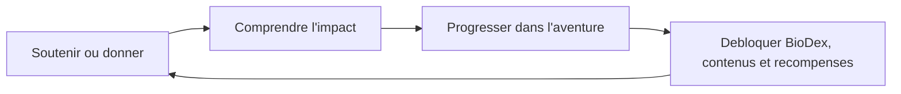

# Make the Change - Vision et Cap Produit

> Source de contexte pour les Gems Gemini.
> Perimetre: `apps/web-client` uniquement.
> Ce document decrit la vision cible en assumant que le produit est encore en construction.

---

## 1. Role Du Document

Ce fichier donne le nord commun a tous les experts IA: produit, design, business, RSE, biodiversite, gamification et technique.

Il ne doit pas etre lu comme un cahier des charges fige. Make the Change est un produit en construction; certaines decisions peuvent changer. Les documents utilisent donc des statuts pour eviter les confusions.

## 2. Convention De Statut

- **Actuel**: observe dans le code actuel de `apps/web-client`.
- **Cible validee**: decision confirmee pendant la phase de cadrage.
- **Hypothese forte**: recommandation actuelle a suivre sauf contradiction future.
- **A decider**: sujet encore ouvert.
- **Futur**: piste pertinente mais pas prioritaire pour la premiere version produit.

Ces statuts ne creent pas des documents supplementaires. Ils servent a aider les Gems a raisonner sans transformer une idee provisoire en verite definitive.

## 3. Pitch

Make the Change aide les personnes et les organisations a soutenir des projets biodiversite concrets, a comprendre leur impact, et a progresser dans une experience mobile vivante.

La promesse centrale n'est pas seulement de donner, acheter ou jouer. La boucle cible est:

Priorite cible validee:

1. Soutenir ou donner a des projets reels.
2. Decouvrir et comprendre la biodiversite.
3. Progresser dans une aventure gamifiee.
4. Recevoir des recompenses tangibles ou symboliques.

Les recompenses sont importantes, mais elles ne doivent pas devenir le coeur moral du produit. Elles prolongent l'engagement; elles ne remplacent pas l'impact.

## 4. Positionnement

Make the Change doit se situer entre quatre univers:

- **Plateforme d'impact**: projets reels, partenaires, dons, soutiens producteurs, RSE.
- **Application educative**: Academy, contenus biodiversite, vulgarisation scientifique.
- **Aventure mobile**: mascottes, factions, BioDex, progression, Graines.
- **Marketplace selectionnee**: produits partenaires, Points d'Impact, achats en euros.

Le positionnement recommande est:

> Une app d'impact premium avec une couche d'aventure vivante.

Elle ne doit pas devenir:

- un jeu mobile qui utilise la biodiversite comme decor;
- une boutique qui utilise l'ecologie comme argument;
- une ONG froide sans plaisir d'usage;
- un produit enfantin qui affaiblit la confiance au moment du paiement.

## 5. Publics Cibles

### 5.1 Utilisateur B2C Engage

Veut soutenir des projets concrets, voir des preuves, comprendre ou va son argent, et se sentir utile.

### 5.2 Utilisateur Curieux / Apprenant

Veut comprendre la biodiversite sans lire des articles scientifiques longs. L'Academy et le BioDex doivent l'aider a apprendre progressivement.

### 5.3 Utilisateur Collectionneur / Gamifie

Est motive par la progression, les especes debloquees, les niveaux, les badges, les objectifs collectifs et les mascottes.

### 5.4 Acheteur Responsable

Cherche des produits utiles, beaux ou alimentaires, lies a des producteurs et projets. Il peut acheter en euros ou utiliser ses Points d'Impact.

### 5.5 Entreprise / RSE

Cherche a financer des projets biodiversite, engager ses collaborateurs, obtenir des preuves d'impact, et produire des rapports ou contenus RSE credibles.

## 6. Mascottes Et Factions

**Cible validee**: les mascottes sont un fil rouge emotionnel fort, mais leur presence doit etre calibree selon le contexte.

| Mascotte | Faction           | Theme                        | Role narratif                              |
| -------- | ----------------- | ---------------------------- | ------------------------------------------ |
| Melli    | Vie Sauvage       | Pollinisateurs / faune       | Energie, pollinisation, proximite locale   |
| Sylva    | Terres & Forets   | Sols / forets / regeneration | Croissance, protection terrestre, patience |
| Ondine   | Gardiens des mers | Oceans / recifs / eau        | Fluidite, protection marine, sensibilite   |

### Presence Recommandee

- Forte: onboarding, hub Aventure, Academy, BioDex, moments de succes.
- Moyenne: profil, objectifs de faction, notifications, empty states.
- Discrete: paiement, don, soutien producteur, legal, pages de confiance.

La mascotte doit accompagner, pas infantiliser.

## 7. Premier Onglet Cible: Aventure

**Cible validee**: le premier onglet cible doit devenir `Aventure`.

Il remplace progressivement l'idee trop etroite de `Defis`. Son role est celui d'un hub quotidien:

- continuer l'Academy;
- voir l'action prioritaire du jour;
- decouvrir un projet recommande;
- suivre une espece BioDex;
- voir l'objectif collectif ou de faction;
- acceder aux recompenses sans transformer la page en boutique.

`Aventure` doit etre la page de retour naturelle apres connexion ou ouverture de l'app.

## 8. Monnaies Et Valeur Symbolique

**Cible validee**: conserver deux monnaies separees.

| Monnaie         | Role                                              | Sources principales                             | Usage                                         |
| --------------- | ------------------------------------------------- | ----------------------------------------------- | --------------------------------------------- |
| Graines         | Engagement, apprentissage, progression symbolique | dons purs, Academy, missions, bonus symboliques | progression, contenus BioDex, Academy, badges |
| Points d'Impact | Valeur economique liee aux projets producteurs    | soutiens producteurs uniquement                 | produits partenaires, marketplace             |

Pourquoi deux monnaies:

- les Graines representent l'engagement et la progression;
- les Points d'Impact representent une valeur boutique;
- fusionner les deux brouillerait la difference entre apprendre, donner, soutenir un producteur et acheter.

**Hypothese forte**: ne pas vendre directement des Graines. Cela transformerait la progression en achat de niveau et affaiblirait la confiance.

## 9. Academy

**Cible validee**: l'Academy est une brique importante du produit.

**Hypothese forte**: elle ne doit pas etre obligatoire pour payer, donner, soutenir ou acheter.

Role cible:

- eduquer;
- renforcer la comprehension de l'impact;
- nourrir la retention;
- donner des Graines;
- servir de moteur narratif dans le hub Aventure.

Academy de base recommandee:

- gratuite;
- visible;
- integree a l'Aventure;
- eventuellement completee plus tard par des contenus avances inclus dans l'abonnement Ambassadeur.

## 10. BioDex

**Cible validee**: le BioDex doit combiner encyclopedie accessible et collection personnelle.

Structure cible:

- fiche publique courte;
- contenu enrichi debloque par impact reel;
- contenus supplementaires ou niveaux de connaissance/protection ameliores avec des Graines;
- evolution visuelle IA possible en V2 apres validation artistique.

Regle centrale:

> Une espece ne se debloque que si le projet soutenu ou donne est explicitement lie a cette espece.

## 11. Business Et RSE

Make the Change doit etre pense a la fois en B2C et en B2B/RSE.

Sources de revenus cible:

- commissions sur dons;
- commissions ou marges sur produits partenaires;
- abonnement unique Ambassadeur;
- financement de projets par entreprises;
- abonnement ou budget de soutien pour employes;
- sponsoring discret;
- rapports d'impact RSE;
- contenus premium avances, sans bloquer l'Academy de base.

La RSE peut devenir un pilier majeur, pas seulement un canal secondaire.

## 12. Principe Directeur Pour Les Gems

Quand un Gem hesite, il doit prioriser:

1. la credibilite de l'impact reel;
2. la clarte pour l'utilisateur;
3. la coherence entre soutien, education, progression et recompense;
4. la confiance au moment de l'argent;
5. la magie emotionnelle des mascottes et de l'aventure.

Les anciennes documentations hors `apps/web-client/doc` ne sont pas des sources de verite pour cette base Gemini.
