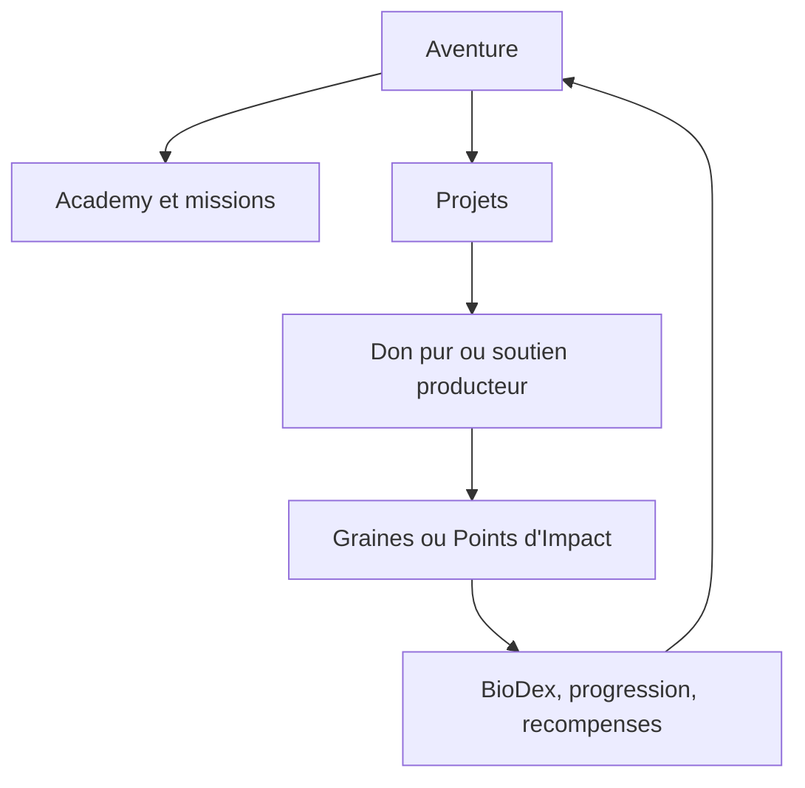

# Make the Change - Reference Produit Web Client

> Source produit pour les Gems.
> Perimetre: `apps/web-client` uniquement.
> Objectif: decrire le produit actuel, la cible et les zones ouvertes sans figer artificiellement le futur.

---

## 1. Resume Executif

Make the Change est une application mobile-first en construction autour d'une boucle:

Priorite cible validee:

1. Soutenir ou donner a des projets reels.
2. Comprendre la biodiversite et l'impact.
3. Progresser dans l'aventure.
4. Acceder a des recompenses.

## 2. Navigation Principale

### 2.1 Actuel Dans Le Code

Le code `apps/web-client` utilise le route group `(tabs)` avec 5 onglets mobiles:

| Onglet actuel | Route actuelle | Role actuel                        |
| ------------- | -------------- | ---------------------------------- |
| Defis         | `/challenges`  | missions et challenges             |
| Projets       | `/projects`    | catalogue des projets              |
| Collectif     | `/impact`      | feed, factions, objectif collectif |
| Recompenses   | `/products`    | boutique produits                  |
| Profil        | `/profile`     | profil, stats, BioDex, settings    |

Composant de navigation: `src/app/[locale]/(tabs)/_components/mobile-bottom-nav.tsx`.

### 2.2 Cible Validee

Le premier onglet doit devenir **Aventure**.

| Onglet cible | Role cible                                                          |
| ------------ | ------------------------------------------------------------------- |
| Aventure     | hub quotidien: Academy, mission, projet, BioDex, objectif collectif |
| Projets      | soutenir ou donner a des projets reels                              |
| Collectif    | impact commun, factions, feed, campagnes                            |
| Recompenses  | boutique en Points d'Impact et euros                                |
| Profil       | identite, progression, BioDex, historique, settings                 |

`Aventure` ne doit pas etre un simple renommage de `Defis`. Il doit absorber les missions, la progression et l'Academy.

## 3. Hub Aventure

**Cible validee**: premiere page apres ouverture ou connexion.

Blocs recommandes:

1. Carte hero courte avec mascotte, faction et progression.
2. Continuer l'Academy.
3. Action prioritaire du jour.
4. Projet recommande.
5. BioDex: espece recente, verrouillee ou liee au projet.
6. Objectif collectif ou faction.
7. Recompense disponible ou solde Points d'Impact, de facon discrete.

Personnalisation cible:

- meme structure pour tous;
- accents visuels selon faction;
- recommandations adaptees;
- pas trois experiences separees a maintenir.

## 4. Projets

Les projets sont le coeur business et impact du produit.

### Types De Projets

| Type               | Role                                                     | Gain utilisateur                                      |
| ------------------ | -------------------------------------------------------- | ----------------------------------------------------- |
| Don pur            | financer un projet sans produit associe                  | Graines, BioDex si espece liee                        |
| Soutien producteur | financer un projet qui produit une contrepartie tangible | Points d'Impact, bonus symbolique possible en Graines |

### Regles Produit

- Un don pur ne donne pas de Points d'Impact.
- Un don pur peut debloquer une espece BioDex si le projet est explicitement lie a cette espece.
- Un soutien producteur donne principalement des Points d'Impact.
- Un soutien producteur peut donner un petit bonus de Graines, comme reconnaissance symbolique.
- Les projets doivent etre reliables a un producteur, une localisation, une histoire et idealement une espece principale.

## 5. Recompenses Et Boutique

**Cible validee**: les produits peuvent etre obtenus via Points d'Impact ou achetes en euros.

Priorite UX:

1. utiliser les Points d'Impact;
2. permettre l'achat en euros;
3. ne pas presenter l'achat produit comme l'action la plus impactante.

Modele cible:

- marketplace partenaire selectionnee;
- Make the Change choisit les produits phares;
- experience utilisateur type boutique Make the Change;
- operationnellement, logique partenaire/commission plutot que stock propre au depart.

## 6. Academy

**Cible validee**: l'Academy est une brique produit importante.

**Hypothese forte**: ne pas rendre l'Academy obligatoire avant un don, un soutien ou un achat.

Role:

- apprendre;
- gagner des Graines;
- renforcer la comprehension des projets;
- nourrir le hub Aventure;
- creer de la retention.

Structure observee dans le code:

- route group `(lab)`;
- routes `academy`, `academy/[chapter]`, `academy/[chapter]/[unit]`;
- variantes `kinnu` et `kinnu-v2`;
- contenus pedagogiques riches et encore a consolider.

Statut produit recommande:

- Academy de base gratuite;
- contenus avances possibles via abonnement Ambassadeur;
- pas de paywall sur l'apprentissage fondamental.

## 7. BioDex

Le BioDex represente la relation de l'utilisateur au vivant.

### Structure Cible

| Couche    | Acces       | Contenu                                                  |
| --------- | ----------- | -------------------------------------------------------- |
| Public    | tous        | fiche courte, role ecologique, statut, projet lie        |
| Debloquee | impact reel | image complete, fiche enrichie, lien personnel au projet |
| Amelioree | Graines     | contenus exclusifs, niveaux, anecdotes, progression      |

Regle centrale:

- une espece se debloque uniquement si un projet donne/soutenu est explicitement lie a elle.

Evolution visuelle:

- bonne idee pour la magie du produit;
- a traiter en V2 si les assets IA sont valides humainement et coherents.

## 8. Collectif Et Factions

Actuel:

- page `/impact`;
- feed d'activite;
- objectif collectif;
- contributions par faction;
- bravos et signaux sociaux.

Cible:

- rendre l'impact visible;
- renforcer l'engagement;
- soutenir les campagnes;
- ne pas transformer la plateforme en competition pure.

La faction donne une couleur, une mascotte, un contexte et un sentiment d'appartenance. Elle ne doit pas enfermer l'utilisateur dans une experience differente ou limiter ses projets.

## 9. Profil

Le profil doit regrouper:

- identite utilisateur;
- faction et mascotte;
- soldes Graines / Points d'Impact;
- progression;
- BioDex personnel;
- historique contributions/achats;
- parametres;
- abonnement Ambassadeur le moment venu.

Actuel:

- `/profile`;
- sous-ecrans `account`, `biodex`, `investments`, `seeds`, `settings`, `subscription`.

## 10. Onboarding

Actuel:

- onboarding en plusieurs ecrans;
- selection de faction/mascotte via carousel;
- mode mock avec setup utilisateur;
- bug connu cote valeurs de faction dans certaines actions: ancienne valeur `Artisans Locaux` a ne plus utiliser en cible.

Cible:

- faire choisir un compagnon/faction;
- expliquer la boucle: soutenir, apprendre, progresser;
- envoyer vers Aventure;
- ne pas surcharger avec trop de decisions initiales.

## 11. Abonnement Ambassadeur

**Cible validee**: un seul abonnement cible, nom recommande `Ambassadeur`.

Positionnement:

- soutien mensuel biodiversite;
- experience enrichie;
- pas un simple pass premium.

Regles:

- inclure un budget de soutien mensuel;
- ne pas donner de Points d'Impact mensuels gratuits;
- les Points d'Impact apparaissent seulement si le budget soutient un projet producteur;
- inclure des avantages: contenus avances, rapports, badge, priorite, avantages boutique.

## 12. RSE / Entreprise

La RSE est un pilier cible.

Offres produit possibles:

- financement de projets;
- abonnement ou budget de soutien pour employes;
- sponsoring discret;
- rapports d'impact;
- campagnes internes;
- challenges d'equipe.

Experience recommandee:

- meme app coeur que B2C;
- couche entreprise legere pour budget, badge, reporting, campagnes.

## 13. Statuts Produit

| Domaine                  | Statut                                   |
| ------------------------ | ---------------------------------------- |
| Projets                  | coeur produit                            |
| Boutique                 | importante, mais recompense secondaire   |
| Academy                  | validee comme brique forte               |
| Aventure                 | cible validee pour remplacer Defis       |
| BioDex                   | cible: public + collection + progression |
| RSE                      | pilier business cible                    |
| Evolution IA des especes | futur / V2                               |
| Achat direct de Graines  | deconseille                              |
