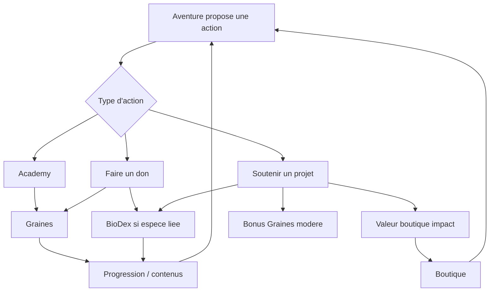

# Make the Change - Gamification et Economie D'Engagement

> Source pour les Gems Gamification, Produit et Design.
> Perimetre: `apps/web-client`.

---

## 1. Role De La Gamification

La gamification doit renforcer l'impact, pas le remplacer.

Priorite:

1. soutenir ou donner;
2. comprendre;
3. progresser;
4. recevoir ou debloquer.

La progression doit donner envie de revenir sans transformer l'app en jeu de recompenses vide.

## 2. Deux Monnaies

| Monnaie                | Nature                                          | Ne pas confondre avec              |
| ---------------------- | ----------------------------------------------- | ---------------------------------- |
| Graines                | engagement, apprentissage, progression          | credit boutique                    |
| Valeur boutique impact | valeur economique issue de soutiens producteurs | XP, score moral, metrique d'impact |

Nom de la valeur boutique:

- nom final: `Credits Impact`;
- nom retenu car il distingue mieux la boutique des graines.

## 3. Graines

Sources:

- dons purs;
- Academy;
- missions;
- bonus symboliques de soutiens producteurs;
- objectifs collectifs;
- recompenses de progression.

Usages:

- debloquer des contenus BioDex avances;
- progresser dans des niveaux de connaissance/protection;
- recharger ou faciliter certaines mecaniques Academy si valide;
- obtenir badges ou contenus cosmediques non economiques.

Regle:

- ne pas vendre directement les Graines dans la cible actuelle.

## 4. Valeur Boutique Impact

Sources:

- soutiens producteurs;
- eventuellement budget Ambassadeur s'il est affecte a un projet producteur.

Usages:

- produits partenaires;
- marketplace;
- avantages lies a la contrepartie economique.

Regles:

- pas de valeur boutique pour dons purs;
- pas de valeur boutique mensuelle gratuite dans l'abonnement;
- pas de valeur boutique comme simple recompense de quiz.
- pas de "Points biodiversite": les indicateurs biodiversite sont des metriques, pas une monnaie.

## 5. Academy

Statut:

- brique produit validee;
- pas obligatoire pour payer ou soutenir;
- centrale pour retention et comprehension.

Role gamification:

- progression par parcours;
- vies ou contraintes legeres si utiles;
- feedback;
- Graines;
- mascottes;
- contenus lies aux projets et especes.

Hypothese forte:

- Academy de base gratuite;
- contenus avances possibles via Ambassadeur.

## 6. Aventure

L'onglet Aventure est maintenant l'orchestrateur gamifie principal en V0.

Il doit presenter:

- mission du jour;
- continuer l'Academy;
- projet recommande;
- espece BioDex;
- objectif collectif;
- progression personnelle.

Il remplace l'idee trop limitee de "Defis" comme onglet principal. Les Defis restent une page secondaire et une source d'actions pour le hub.

Regle de retention validee:

- Aventure orchestre l'impulsion quotidienne;
- Academy fournit une action courte et comprehensible;
- BioDex cree l'attachement emotionnel;
- les projets apportent la preuve et le sens;
- les missions ne doivent pas devenir une routine vide de relation a l'impact reel.

## 7. Missions Et Challenges

Types actuels observes:

- `eco-fact`;
- `daily-harvest`;
- `give-bravo`.

Role cible:

- guider le prochain geste utile;
- relier Academy, projets, BioDex et collectif;
- donner des Graines;
- creer une habitude quotidienne.

Les missions ne doivent pas devenir la source principale d'impact. Elles orientent vers l'impact.

## 8. BioDex

Gamification cible:

- espece visible en mode public;
- silhouette/flou avant debloquage complet;
- debloquage par don ou soutien lie explicitement a l'espece;
- progression avec Graines;
- contenus exclusifs;
- evolution visuelle en futur/V2.

Regle:

> Pas d'espece debloquee sans lien reel avec un projet.

## 9. Factions

Role:

- appartenance;
- personnalisation;
- objectifs collectifs;
- competition douce;
- mascotte.

Elles ne doivent pas:

- limiter les projets accessibles;
- creer trois apps separees;
- transformer l'impact en simple course aux points.

## 10. Score Et Niveaux

Les niveaux doivent rester comprehensibles.

Exemples de dimensions possibles:

- projets soutenus;
- dons effectues;
- Graines gagnees;
- especes debloquees;
- progression Academy;
- contribution collective.

Attention:

- ne pas donner trop de poids aux achats produits;
- ne pas faire du classement un moteur principal en V1 si cela nuit a la confiance.

## 11. Abonnement Ambassadeur

Role gamification:

- statut;
- badge;
- rapports enrichis;
- contenus avances;
- budget de soutien;
- progression de fidelite.

Interdits recommandes:

- valeur boutique gratuite mensuelle;
- achat de statut sans impact;
- achat direct massif de Graines.

## 12. Recompenses

Types:

- Graines;
- badge;
- contenu BioDex;
- espece debloquee;
- titre;
- item cosmetique;
- valeur boutique impact uniquement si lien producteur;
- produit via boutique.

La recompense doit toujours pouvoir etre expliquee.

## 13. Boucle Cible

## 14. Questions A Decider

- Poids exact des Graines par action.
- Cout des contenus BioDex.
- Existence et role des vies Academy.
- Formule de score global.
- Place d'un leaderboard public.
- Type d'items cosmetiques acceptables.
