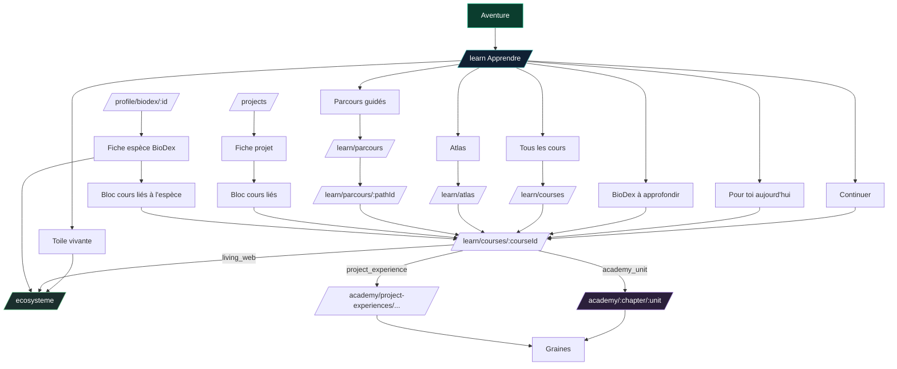
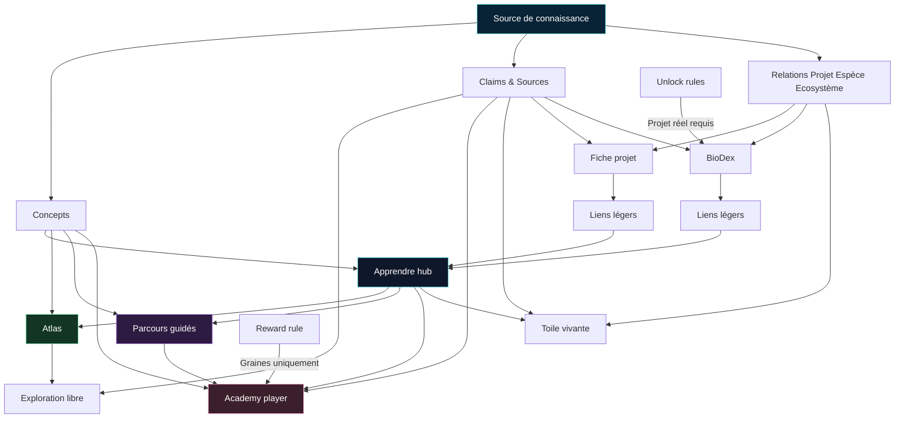
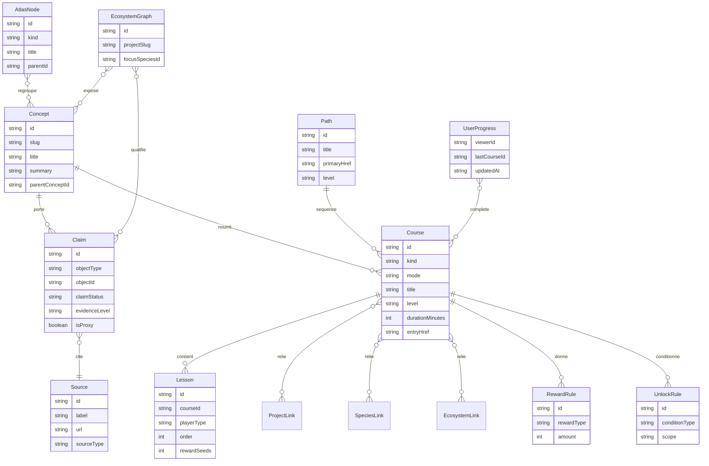

# Revue analytique de l’UX Academy et Apprendre dans Make the Change

## Synthèse exécutive

Le code montre déjà une direction beaucoup plus juste que “faire un Duolingo de toute la biodiversité”. En réalité, l’app a commencé à converger vers un modèle **multi-mode** beaucoup plus pertinent : un hub **Apprendre** qui distribue plusieurs façons d’apprendre, un **mode guidé** pour les sujets à ordre pédagogique clair, un **mode Atlas** pour l’exploration libre, un **mode Toile vivante** pour comprendre les relations écologiques, et des **liens légers** depuis les Projets et le BioDex. Cette architecture existe déjà partiellement dans le code via `entry.kind = academy_unit | project_experience | living_web`, le hub `/learn`, les parcours, l’atlas, les routes Academy, le prototype Kinnu V2 et la Toile vivante. fileciteturn37file0 fileciteturn32file0

La bonne conclusion produit est donc la suivante : **non, il ne faut pas modéliser toute la biodiversité comme un seul cursus linéaire**. La bonne base pour Make the Change est plutôt :
- **Apprendre** comme hub principal d’orientation,
- **Parcours guidés** pour quelques sujets structurés,
- **Atlas / Toile vivante** pour le reste du domaine,
- **Academy** comme lecteur de leçons immersives,
- **cours liés** très légers dans les fiches Projets et BioDex, plutôt que de gros “cours par projet” répétés. fileciteturn32file0 fileciteturn39file0 fileciteturn42file0

Le principal problème aujourd’hui n’est pas l’absence d’idées. C’est la **duplication de modèles** et le mélange entre **prod**, **proto**, **lab** et **contenu source**. On voit au moins quatre couches qui se recouvrent : le modèle `learning/*`, le moteur Academy V2, le graphe `ecosysteme`, et Kinnu V2. La bonne priorité n’est pas de créer plus d’écrans. C’est de **fixer la grammaire produit** : quand un sujet doit être guidé, quand il doit être exploré, et comment un même concept peut être vu depuis Apprendre, Projets, BioDex et Toile vivante sans dupliquer le contenu. fileciteturn35file0 fileciteturn52file0 fileciteturn67file0 fileciteturn64file0

## Constats détaillés

### Ce que le repo `make-the-change` contient déjà

Le tab **Apprendre** `/learn` est déjà un vrai **hub de distribution**. Il ne pousse pas seulement un cours linéaire : il présente “Continuer”, “Pour toi aujourd’hui”, “Lié à tes projets”, “Explorer par thème”, “Parcours guidés”, “Toile vivante”, “BioDex à approfondir”, puis “Tous les cours”. Le texte d’intro est particulièrement important, parce qu’il dit explicitement la vision : continuer un cours, explorer l’Atlas, relier des projets, approfondir le BioDex, ouvrir la Toile vivante. C’est déjà exactement le bon sens produit. fileciteturn31file0 fileciteturn32file0

Le sous-système `src/lib/learning` est déjà une couche d’orchestration très utile. `schema.ts` définit les entités `LearningCourse`, `LearningPath`, `AtlasDomain`, `LearningProgress`, ainsi qu’un point crucial : `entry.kind` distingue `academy_unit`, `project_experience` et `living_web`. Autrement dit, le code dit déjà qu’un “cours” n’est **pas forcément** une leçon Duolingo-like ; il peut aussi être une expérience projet ou une entrée vers la Toile vivante. C’est probablement la découverte la plus importante de cet audit. fileciteturn37file0

Le catalogue `catalog.ts` structure six domaines d’Atlas : `alphabet-du-vivant`, `milieux-habitats`, `relations-du-vivant`, `menaces`, `solutions`, `lire-impact`. Il construit des cours depuis les unités Academy V2, puis y ajoute des cours “project_experience” et “living_web”. Il définit aussi cinq parcours guidés : `bases-du-vivant`, `pollinisateurs`, `forets-sols`, `recifs-oceans`, `lire-impact`. En clair, le code contient déjà la réponse à ta question : certains sujets doivent être guidés, d’autres explorés librement, d’autres reliés contextuellement aux projets. fileciteturn35file0 fileciteturn36file0

Les routes publiques d’apprentissage repérées sont cohérentes avec cette logique :
- `/learn`
- `/learn/atlas`
- `/learn/courses`
- `/learn/courses/[courseId]`
- `/learn/parcours`
- `/learn/parcours/[pathId]`
- `/academy/chapters`
- `/academy/[chapter]/[unit]`
- `/academy/project-experiences/ruchers-antsirabe`
- `/ecosysteme`
- `/ecosysteme/[id]`
- `/ecosysteme/faction/[key]`
- `/ecosysteme/lab/interactions` fileciteturn39file0 fileciteturn40file0 fileciteturn41file0 fileciteturn42file0 fileciteturn43file0 fileciteturn49file0 fileciteturn55file0 fileciteturn65file0 fileciteturn29file13 fileciteturn29file22 fileciteturn29file24

Côté **Academy**, la couche V2 est riche. `schema.ts` définit des exercices `STORY`, `SWIPE`, `DRAG_DROP`, `QUIZ`, des tags cognitifs, des types de leçons, des unités, des chapitres, des récompenses et des règles de génération. Le point clé pour la cohérence business est que `rewardSchema` est strictement `type: 'seeds'`, donc la couche Academy est déjà alignée avec l’idée “récompense en Graines, pas en Crédits Impact”. fileciteturn52file0

Le registre V2 des unités Academy liste vingt unités réparties sur cinq chapitres, dont `ruchersAntsirabeUnit` au chapitre 5. Ce registre remplace progressivement les unités “legacy” via un adapter runtime, ce qui est une bonne direction technique. Mais le rendu de la route Academy utilise encore massivement `mock-academy` depuis le dossier `(lab)`, ce qui montre que la migration est incomplète et que la couche “prod” dépend encore d’une couche “lab”. fileciteturn53file0 fileciteturn46file0

Le cas Antsirabe est le meilleur exemple de la richesse actuelle, mais aussi de son ambiguïté. Il existe :
- une unité Academy V2 `ruchers-antsirabe`,
- une expérience immersive séparée `/academy/project-experiences/ruchers-antsirabe`,
- trois variantes de cours `portrait`, `territory`, `support`,
- des estimations et des sources séparées.  
C’est précieux pour le prototypage, mais cela prouve aussi qu’il y a **trop de manières concurrentes** de raconter la même chose si rien n’est cadré au niveau produit. fileciteturn54file0 fileciteturn56file0 fileciteturn57file0 fileciteturn58file0 fileciteturn59file0 fileciteturn60file0 fileciteturn61file0

La **Toile vivante** a également une vraie substance. `ecosysteme/_lib/graph.ts` ne modélise pas seulement des nodes graphiques : il contient des `nodes`, `edges`, `confidence`, `sourceLabel`, `sourceUrl`, `isProxy`, `projectSlug`, `focusSpeciesId`, `thesis`, `impact`. C’est extrêmement intéressant, parce que cette couche est déjà plus avancée que `LearningCourse` sur la notion de **niveau de preuve**. Le problème est qu’elle vit aujourd’hui comme un module parallèle, encore explicitement présenté comme “Prototype autonome” dans l’écran liste. fileciteturn66file0 fileciteturn67file0

Kinnu V2 est le prototype le plus fort pour la partie **Atlas / explorer mode**. Son document `concept.md` le décrit explicitement comme un prototype d’exploration hexagonale non linéaire. Il structure six îles, vingt-neuf pathways, un mapping partiel vers l’Academy et une logique de fog of war / cross-links. C’est très inspirant en UX, mais il ne faut surtout pas le traiter comme l’architecture finale validée : le document le dit lui-même. fileciteturn64file0 fileciteturn62file0 fileciteturn63file0

Enfin, les surfaces de liaison sont déjà présentes dans l’app. La fiche Projet injecte `ProjectLearningLinks`, et la fiche BioDex espèce injecte des cours reliés à l’espèce avec un accès éventuel vers la Toile vivante. C’est une très bonne idée de fond, mais la version actuelle a un risque de répétition si le bloc “Comprendre ce projet” répète simplement ce que la fiche Projet explique déjà. fileciteturn71file0 fileciteturn73file0 fileciteturn69file0

### Ce que le repo `biodiversity-library` apporte vraiment

Le repo `biodiversity-library` n’est pas un repo UI. C’est plutôt une **source de vérité éditoriale** de type vault Obsidian. Ce point est essentiel : il ne faut pas le confondre avec la structure produit finale, mais il est extrêmement utile comme amont de contenu. Son `README.md` décrit explicitement un “knowledge vault” structuré pour produire des contenus réutilisables. fileciteturn22file0

La pièce la plus utile pour Make the Change est `00-system/property-schema.md`. On y trouve déjà les bons champs pour gérer la qualité des contenus : `reliability`, `claim_status`, `source_coverage`, ainsi que des relations explicites entre espèces, écosystèmes, menaces et solutions. C’est presque exactement ce qui manque au modèle `learning/*`. fileciteturn25file0

Les cartes `01-maps/learning-map.md`, `biodiversity-map.md` et `ecological-relations-map.md` sont également précieuses, car elles organisent le domaine par **chemins de lecture** et non par cours figés. Elles distinguent déjà des parcours débutant / intermédiaire / avancé, et elles regroupent les notions en cartes transversales : biodiversité, espèces, écosystèmes, habitats, pollinisation, symbiose, décomposition, services écosystémiques. Cela en fait un excellent backend intellectuel pour un futur Atlas, mais pas un format UI à recopier tel quel. fileciteturn24file0 fileciteturn27file0 fileciteturn26file0

Le contenu conceptuel lui-même est bien adapté à une logique multi-niveaux. `pollination.md` propose une définition courte, puis une explication par niveau de compréhension, puis des liens internes et des sources à vérifier. Là encore, on voit la bonne direction : **un concept source** peut nourrir plusieurs surfaces UI différentes : carte Atlas, leçon guidée, fiche BioDex, cours lié à un projet. fileciteturn28file0

### Ce que cela dit sur l’UX idéale

Le code actuel prouve déjà une chose importante : **l’app n’a pas besoin d’un seul format pédagogique universel**. Elle a besoin d’un système où plusieurs formats cohabitent proprement. Le tab Apprendre est déjà le bon conteneur pour cela. L’erreur serait de choisir “Duolingo partout” ou “graph libre partout”. La vraie solution est de dire :  
- certains sujets sont mieux en **parcours guidé** ;
- certains sujets sont mieux en **atlas libre** ;
- certains besoin sont mieux servis par une **toile relationnelle** ;
- certains points d’entrée doivent rester **contextuels** depuis Projet ou BioDex. fileciteturn32file0 fileciteturn39file0 fileciteturn42file0 fileciteturn67file0

Autrement dit, la question n’est pas “faut-il des chapitres type Duolingo ou non ?”. La bonne question est : **quel problème UX chaque format résout-il ?**
- le zigzag Academy résout l’engagement, la progression et la pratique d’un sujet borné ;
- l’Atlas résout l’exploration d’un domaine immense ;
- la Toile vivante résout la difficulté à comprendre les relations ;
- les liens Projet/BioDex résolvent la contextualisation sans détour. fileciteturn49file0 fileciteturn39file0 fileciteturn66file0 fileciteturn71file0 fileciteturn69file0

## Liste d’actions priorisée

| Priorité | Action | Effort | Pourquoi |
|---|---|---:|---|
| Haute | Fixer l’architecture produit officielle : **Apprendre = hub**, **Parcours = guidé**, **Atlas = libre**, **Academy = player**, **Toile = relations**, **Projet/BioDex = liens légers** | Small | La direction existe déjà dans le code, mais elle doit devenir une règle produit explicite. |
| Haute | Arrêter de créer des “gros cours par projet” par défaut | Small | Les fiches Projet portent déjà beaucoup d’information. Par défaut, un projet doit seulement pointer vers des contenus transversaux utiles. |
| Haute | Introduire un **schéma canonique unique** pour cours, concepts, liens, preuves et unlocks | Medium | Aujourd’hui, `learning/*`, `academy`, `ecosysteme` et `biodiversity-library` portent chacun une partie de la vérité. |
| Haute | Ajouter des champs de **provenance / niveau de preuve** au modèle `LearningCourse` ou au niveau `Concept` | Medium | La Toile vivante et `biodiversity-library` ont déjà ces notions, le catalogue Learning non. |
| Haute | Renommer le bloc projet “Comprendre ce projet” en “Cours liés” ou “Pour aller plus loin” | Small | Réduit l’effet de répétition et évite de promettre un “cours projet” quand il s’agit surtout de contextualisation. |
| Moyenne | Faire d’Antsirabe un **cas labo** et choisir un seul rôle par format | Medium | Garder un format immersif de référence, utiliser les variantes comme test, pas comme architecture stable. |
| Moyenne | Réutiliser les bonnes idées de Kinnu V2 dans l’Atlas, pas comme module séparé | Medium / Large | Très bonne UX d’exploration, mais prototype assumé et trop coûteux si laissé parallèle. |
| Moyenne | Faire converger l’Academy runtime hors de `mock-academy` | Large | Tant que l’écran Academy dépend encore du lab, la frontière prod / proto reste floue. |
| Moyenne | Ajouter des raisons visibles sur chaque lien d’apprentissage | Small | Exemple : “lié à cette espèce”, “lié à ce projet”, “pour comprendre la preuve”, “dans la Toile vivante”. |
| Moyenne | Instrumenter analytiquement les surfaces d’apprentissage | Medium | Savoir si `learn`, `project links`, `BioDex links`, `Atlas`, `Parcours` poussent vraiment vers soutien / rétention. |
| Basse | Normaliser les assets et éviter les images externes en dur dans le contenu Academy | Small / Medium | Aujourd’hui, certaines unités Academy utilisent des URLs externes Unsplash. fileciteturn54file0 |

Mon avis final est net : **la capsule spécifique par projet ne doit pas être le défaut**. Le défaut doit être un **système de contenus transversaux reliables au projet**. On ne crée une expérience projet dédiée que si le projet a une vraie matière singulière, une démonstration conceptuelle forte, ou un avantage conversion clair. Antsirabe peut justifier un labo. Ce ne doit pas devenir une obligation éditoriale pour chaque projet. fileciteturn57file0 fileciteturn60file0 fileciteturn61file0

## Schéma de données canonique proposé

Le meilleur chemin n’est pas de remplacer tout l’existant. C’est de faire converger `learning/*`, `academy`, `ecosysteme` et `biodiversity-library` vers un schéma centripète.

| Entité | Rôle | Champs clés recommandés | Source actuelle la plus proche |
|---|---|---|---|
| `Concept` | Plus petite unité éditoriale réutilisable | `id`, `slug`, `title`, `question`, `summary`, `parentConceptId`, `domainIds`, `tags`, `difficulty`, `audienceLevels[]` | `biodiversity-library` (`concept`, niveaux de compréhension) fileciteturn28file0 |
| `Claim` | Affirmation pédagogique ou factuelle liée à un concept ou un cours | `id`, `objectType`, `objectId`, `claim`, `claimStatus`, `evidenceLevel`, `sourceCoverage`, `isProxy`, `estimateMethod`, `disclaimer` | `ecosysteme/_lib/graph.ts`, `property-schema.md` fileciteturn67file0 fileciteturn25file0 |
| `Source` | Référence documentaire | `id`, `label`, `url`, `sourceType`, `organization`, `updatedAt`, `usageAllowed` | `antsirabe-sources.ts`, `property-schema.md` fileciteturn59file0 fileciteturn25file0 |
| `Lesson` | Brique jouable dans Academy | `id`, `courseId`, `kind`, `playerType`, `order`, `estimatedMinutes`, `contentRef`, `goal`, `exerciseMix`, `rewardSeeds` | `AcademyLessonDefinition` fileciteturn52file0 |
| `Course` | Objet d’affichage dans `/learn` | `id`, `kind`, `title`, `subtitle`, `summary`, `coverAsset`, `mode`, `durationMinutes`, `level`, `primaryConceptIds[]`, `entry`, `proofBadge`, `accessPolicy` | `LearningCourse` fileciteturn37file0 |
| `Path` | Séquence guidée | `id`, `title`, `description`, `courseIds[]`, `goal`, `level`, `durationMinutes`, `startRule`, `primaryHref` | `LearningPath` fileciteturn37file0 fileciteturn36file0 |
| `AtlasNode` | Entrée d’exploration libre | `id`, `kind`, `title`, `question`, `parentId`, `conceptIds[]`, `childIds[]`, `explorerHref`, `visualType` | `LEARNING_ATLAS_DOMAINS`, cartes du `biodiversity-library`, Kinnu `Pathway` fileciteturn35file0 fileciteturn24file0 fileciteturn63file0 |
| `RelationLink` | Pont contextuel vers Projet, BioDex ou Toile | `id`, `targetType`, `targetId`, `courseId`, `reason`, `priority`, `surface` (`project`, `species`, `ecosystem`, `learn`) | `relatedProjectSlugs`, `relatedSpeciesIds`, `relatedNodeIds` fileciteturn37file0 |
| `UnlockRule` | Règles de disponibilité | `id`, `scope`, `conditionType`, `params`, `resultType`, `resultValue` | `learningAccessPolicy`, règles produit locales |
| `RewardRule` | Récompense pédagogique | `id`, `scope`, `rewardType = seeds`, `amount`, `antiAbusePolicy` | `rewardSchema`, `rewardAmount` fileciteturn52file0 |
| `ProgressRecord` | Progression utilisateur | `viewerId`, `completedCourseIds[]`, `completedLessonIdsByCourse`, `lastCourseId`, `updatedAt`, `masteryState` | `LearningProgress` fileciteturn37file0 |
| `EcosystemGraph` | Vue relationnelle spécialisée | `id`, `projectSlug`, `focusSpeciesId`, `nodes[]`, `edges[]`, `perspectives[]`, `impactProxy`, `evidence` | `ecosysteme/_lib/graph.ts` fileciteturn67file0 |

Le point central est simple : **le concept et la preuve doivent devenir la source**, et les formats UI doivent devenir des **vues** sur cette source. Aujourd’hui, le code fait encore souvent l’inverse : chaque surface porte son propre mini-modèle. fileciteturn35file0 fileciteturn52file0 fileciteturn67file0

## Diagrammes Mermaid

### Flux actuel observé

### Architecture recommandée

### Diagramme entité-relation proposé

## Captures et prototypes utiles

Les captures fournies par toi aident beaucoup à voir **quel format sert quel usage**.

**Toile vivante Manakara**  
Lecture relationnelle excellente pour “qui dépend de quoi ?”, “qu’est-ce qui menace quoi ?”, “quel rôle joue le projet ?”. À garder comme **explorer mode relationnel**, pas comme écran d’accueil de tout l’apprentissage.  
[Ouvrir la capture](sandbox:/mnt/data/61EC410F-E614-493A-AFA4-63E98086CB2F.jpeg)

**Kinnu V2 Hex Archipel**  
Très bon candidat pour la couche Atlas : macro-organisation du domaine, liberté de circulation, sous-domaines, sensation de monde à explorer. Mauvais candidat si on l’utilise comme structure unique obligatoire pour toute la pédagogie.  
[Ouvrir la capture](sandbox:/mnt/data/C66123FE-D979-4744-9791-8757EE681F80.jpeg)

**Academy style zigzag / node path**  
Très bon pour les “bases” ou des compétences bornées. Mauvais si on force ce modèle sur tout le champ biodiversité, parce que cela transforme un domaine immense en faux tunnel linéaire.  
[Ouvrir la capture](sandbox:/mnt/data/B816F6C2-FE5C-494A-B3FE-447C8957B8FF.jpeg)

**Academy style locked nodes**  
Illustre bien la logique de déblocage et de progression. À conserver seulement pour des parcours explicitement guidés, pas pour l’exploration globale.  
[Ouvrir la capture](sandbox:/mnt/data/4B2EF391-0D99-4D17-A325-4B9FF3205140.jpeg)

## Recommandations de wording et microcopy

Le wording doit servir deux objectifs en même temps : **ne pas surpromettre** et **ne pas rendre l’UX froide**.

Je recommande de renommer les surfaces de liaison ainsi :

| Surface | À éviter | Recommandé |
|---|---|---|
| Bloc projet | “Comprendre ce projet” | “Cours liés” / “Pour aller plus loin” / “Comprendre le contexte vivant” |
| Bloc BioDex | “Approfondir cette espèce” si trop “cours” | “Mieux comprendre son rôle” |
| Atlas | “Niveaux” partout | “Thèmes”, “domaines”, “questions”, “portes d’entrée” |
| Parcours | “Chemin obligatoire” | “Parcours conseillé” |
| Academy | “Niveau B2 biodiversité” | “Bases”, “intermédiaire”, “approfondir”, “maîtriser un sujet” |

Quelques exemples de microcopy plus sûrs :

**Projet**
- “Cours liés aux espèces, aux milieux et aux mécanismes utiles pour lire ce projet.”
- “Pour aller plus loin sur les pollinisateurs, les sols et la lecture des métriques.”
- “Bénéfices possibles et ordres de grandeur, pas preuves individualisées.”

**BioDex**
- “Cours liés au rôle écologique de cette espèce.”
- “Voir cette espèce dans la Toile vivante.”
- “Projet lié à cette espèce.”

**Impact / estimations**
- “Ordre de grandeur pédagogique”
- “Proxy”
- “Bénéfice possible”
- “Estimation selon l’hypothèse du projet”
- “Le suivi terrain reste la source principale de preuve”

**À retirer ou encadrer**
- “tes ruches”
- “tu as soutenu” sur une surface pré-soutien
- “investis”
- “les abeilles pollinisent intentionnellement”
- “garantit”
- “disparaîtraient” quand le mécanisme est plus nuancé

Le code Antsirabe montre déjà à la fois de bons et de mauvais réflexes. Le bon réflexe, c’est la présence de disclaimers d’estimation et d’un fichier de sources séparé. Le mauvais réflexe, c’est le retour de formulations trop personnalisées ou trop fortes dans certains écrans et variantes. fileciteturn58file0 fileciteturn59file0 fileciteturn57file0 fileciteturn61file0

## Prochaines étapes recommandées

### Produit

Décider officiellement cette règle : **l’Academy n’est pas la totalité de l’apprentissage, c’est le player du mode guidé**. Le tab **Apprendre** reste le hub. L’Atlas et la Toile vivent comme modes d’exploration. Les Projets et le BioDex restent des surfaces contextuelles. Cette décision existe déjà en germe dans le code ; il faut maintenant la formaliser en doctrine. fileciteturn32file0 fileciteturn37file0

Décider aussi que **le “cours spécifique par projet” n’est pas le format par défaut**. Le format par défaut doit être **des contenus transversaux rattachables à plusieurs projets**. On garde les expériences projet dédiées comme exceptions à forte valeur. Antsirabe peut rester un laboratoire, pas un standard par défaut. fileciteturn57file0 fileciteturn60file0

### Contenu

Faire converger la production de contenu vers une chaîne simple :
1. concept source dans `biodiversity-library`,
2. claims / sources / niveau de preuve,
3. dérivés UI : course, lesson, path, atlas node, project link, biodex link.  
C’est la meilleure façon de couvrir la biodiversité **sur plusieurs années** sans recréer chaque fois des contenus isolés. fileciteturn25file0 fileciteturn24file0 fileciteturn28file0

Structurer la bibliothèque autour de quelques **questions maîtresses** plutôt que de catégories trop encyclopédiques. Pour Make the Change, je recommande :
- Qui vit ?
- Où ça vit ?
- Comment ça fonctionne ensemble ?
- Pourquoi c’est important ?
- Comment lire les menaces et solutions ?
- Comment lire un projet et son niveau de preuve ?  

Cela colle à la fois au besoin pédagogique et au business model du produit.

### Engineering

Créer un **package ou dossier canonique** de modèle d’apprentissage, et faire converger dessus :
- `learning/schema.ts`
- `academy/_lib/schema.ts`
- `ecosysteme/_lib/graph.ts`
- import/export depuis `biodiversity-library`  
Le but n’est pas unifying everything in one huge type. Le but est de partager les entités pivots : `Concept`, `Claim`, `Source`, `Course`, `Lesson`, `Path`, `RelationLink`, `UnlockRule`, `RewardRule`. fileciteturn37file0 fileciteturn52file0 fileciteturn67file0

Faire sortir progressivement l’Academy du runtime `mock-academy`, et transformer Kinnu V2 en **référence UX** plutôt qu’en module parallèle vivant sa propre vie. À court terme, l’objectif n’est pas de supprimer les labs, mais d’éviter qu’ils deviennent des quasi-produits concurrents dans le code. fileciteturn46file0 fileciteturn49file0 fileciteturn64file0

### Limites de cette revue

Cet audit couvre les deux repos demandés et les fichiers locaux fournis, mais il n’est pas un dump récursif parfait de tous les sous-fichiers : le connecteur GitHub est excellent pour lire les fichiers clés, moins pour obtenir un arbre complet et exhaustif en une seule fois. J’ai donc produit un inventaire **fonctionnel et structurant**, centré sur les routes, composants, modèles et contenus qui pilotent réellement l’UX actuelle. Là où un helper importé n’a pas été ouvert, je l’ai traité comme secondaire plutôt que de l’inventer.