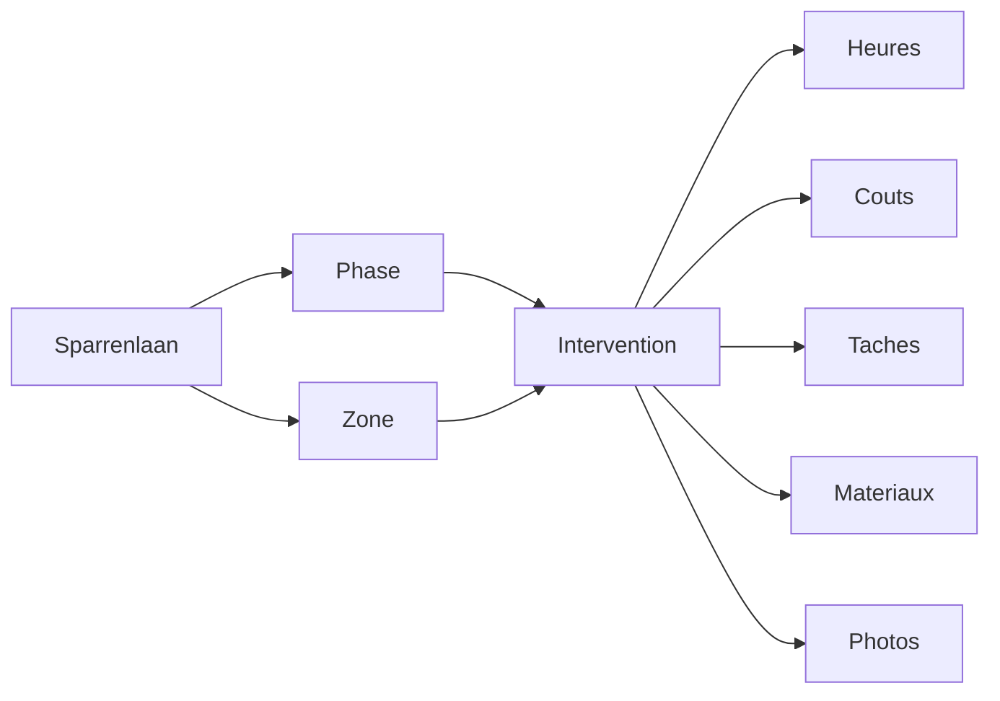

# Clarus Chantier - Synthese produit

## Role du document

Ce document resume la cible produit de **Clarus Chantier - Sparrenlaan** et fixe les limites a respecter pour le prototype.

Il sert de point d'entree avant les documents techniques, UX et data.

## Positionnement

Clarus est une application mobile-first de suivi de chantier interne.

La V0/V1 ne cherche pas a gerer tous les chantiers Clarus. Elle doit comprendre un chantier precis :

- **Nom** : Sparrenlaan
- **Adresse** : Sparrenlaan n°35, 3090 Overijse
- **Usage** : transformation d'une maison unifamiliale
- **Public** : Hubert, Chris, Gregory, Bartosz ou une personne presente sur chantier

L'objectif court terme est de remplacer les notes manuelles par une interface rapide, plus structuree et plus exploitable.

## Promesse V0/V1

En moins de 30 secondes, un utilisateur doit pouvoir encoder une intervention simple :

- ce qui a ete fait ;
- dans quelle zone ;
- par qui ;
- quand ;
- combien d'heures ;
- quel statut financier ou de verification.

L'app calcule ensuite les heures et montants, puis alimente les vues du jour, des interventions et des couts.

## Principe metier central

L'intervention est le noyau du produit.

Une intervention peut rester incomplete, mais elle doit etre marquee comme **a verifier** plutot que bloquer la saisie terrain.

## V0 recommandee

La V0 doit valider l'UX et le modele mental, pas construire un ERP.

Fonctionnalites V0 :

- chantier unique preconfigure ;
- personnes preconfigurees ;
- zones et phases preconfigurees ;
- ajouter intervention ;
- work entries par personne ;
- calcul automatique duree et montant ;
- liste des interventions ;
- vue heures simple ;
- vue couts simple ;
- section "A verifier".

La V0 peut utiliser uniquement des donnees mockees, mais ces mocks doivent etre structures comme une future source de donnees remplacable.

## V1 cible

La V1 devient une version terrain utilisable.

Elle ajoute progressivement :

- taches liees aux interventions ;
- materiaux simples par statut ;
- depenses ;
- photos liees ;
- filtres par zone, phase, personne, statut ;
- meilleure synthese des couts ;
- donnees incompletes visibles sur l'accueil.

## Limites a ne pas depasser

Ne pas construire en V0/V1 :

- multi-chantiers visible ;
- gestion client complete ;
- facturation officielle ;
- TVA ;
- paiement ;
- planning Gantt ;
- roles complexes ;
- portail client ;
- OCR obligatoire ;
- IA avancee ;
- app offline complexe.

Le long terme est prepare par le modele, pas expose dans l'interface.

## Critere de reussite

La V0 est reussie si elle permet de montrer un prototype credible avec des donnees realistes et si l'ecran "Ajouter intervention" donne envie de l'utiliser a la place de Notes.

La V1 est reussie si l'app devient le carnet de chantier principal pour Sparrenlaan.

