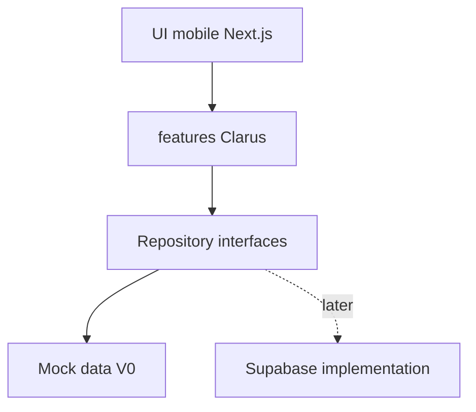

# Patterns web-client a reprendre pour Clarus

## Role du document

Ce document extrait les pratiques utiles de `apps/web-client` et les adapte a Clarus.

L'objectif n'est pas de copier Make the Change. L'objectif est de reprendre les habitudes qui rendent le code propre, maintenable et agreable a faire evoluer.

## Stack recommandee

A reprendre :

- Next.js avec App Router ;
- React ;
- TypeScript strict ;
- Tailwind CSS ;
- Biome pour lint/format ;
- Vitest pour les tests metier ;
- `lucide-react` pour les icones ;
- `zod` pour proteger les types de donnees et les formulaires importants ;
- `date-fns` ou helpers dates simples ;
- mocks internes comme source prototype.

A eviter au demarrage :

- Stripe ;
- Supabase branche directement ;
- Supabase legacy ;
- gamification ;
- labs ;
- i18n complet ;
- `packages/core` complet si Clarus reste une app standalone ;
- `ignoreBuildErrors: true`.

## Organisation de dossiers

Pattern inspire de `web-client` :

```txt
src/
  app/
    (tabs)/
      aujourd-hui/
      interventions/
      couts/
      zones/
    (screens)/
      ajouter-intervention/
      interventions/[id]/
    _components/
  components/
    ui/
  features/
    chantier/
    interventions/
    couts/
    referentiel/
  lib/
    mock/
    repositories/
    calculations/
    formatters/
    dates/
```

Regle :

- `page.tsx` reste leger ;
- les composants ecran vivent dans `_features` ou `features/*` ;
- les calculs et selectors restent hors UI ;
- les donnees mockees ne sont pas lues directement par les composants.

## Pattern mock-first

Dans `web-client`, les mocks servent de source prototype pour tester l'UX avant de stabiliser la DB.

Pour Clarus, reprendre cette logique avec une couche repository :



Les composants appellent des fonctions comme :

- `getInterventions()`
- `getTodaySummary()`
- `getCostSummary()`
- `createInterventionDraft()`

Aujourd'hui ces fonctions lisent les mocks. Plus tard, elles pourront appeler Supabase sans refaire toute l'UI.

## Conventions TypeScript

A reprendre de `TYPESCRIPT_REACT_CONVENTIONS.md` :

- utiliser `type` par defaut ;
- reserver `interface` aux cas d'extension explicite ;
- typer les props avec `function Component(props: Props)` ;
- eviter `React.FC` ;
- eviter `any` ;
- utiliser `unknown` + guards si necessaire ;
- utiliser `satisfies` pour les configs statiques ;
- garder `strict`, `verbatimModuleSyntax`, `noUncheckedIndexedAccess`.

## UI mobile

A reprendre :

- bottom navigation fixe ;
- prise en compte de `env(safe-area-inset-bottom)` ;
- ecrans plein mobile avec scroll interne ;
- header mobile simple ;
- bottom action bar pour les actions importantes ;
- sheet mobile pour choix rapides ou details ;
- boutons avec icones `lucide-react`.

A adapter :

- Clarus doit etre plus lisible et operationnel que premium ;
- les boutons doivent etre gros et faciles a toucher ;
- le contraste doit rester bon en environnement chantier ;
- les textes doivent etre directs : "Ou ?", "Qui ?", "Quand ?", "A verifier".

## Tests a reprendre

Dans `web-client`, les tests utiles verifient surtout :

- les mappings de donnees ;
- les selectors ;
- les calculs ;
- les routes generees ;
- les invariants de catalogue.

Pour Clarus, les premiers tests doivent couvrir :

- calcul d'heures ;
- calcul de montant ;
- totaux par personne ;
- totaux par phase ;
- totaux par zone ;
- detection des donnees incompletes ;
- mapping mock vers modeles de vue.

## Helpers reutilisables

Helpers a prevoir dans Clarus :

- `cn()` pour composer les classes ;
- `formatCurrency()` ;
- `formatDate()` ;
- `formatDuration()` ;
- `parseWorkTime()` ;
- `calculateWorkDurationMinutes()` ;
- `calculateWorkEntryAmount()`.

## Regles de prudence

Ne pas faire entrer dans Clarus les dettes ou specificites de `web-client` :

- build autorise avec erreurs TypeScript ;
- routes legacy ;
- vocabulaire metier Make the Change ;
- dependances non utiles au chantier ;
- composants trop decoratifs.

Clarus doit reprendre la discipline, pas le poids.

