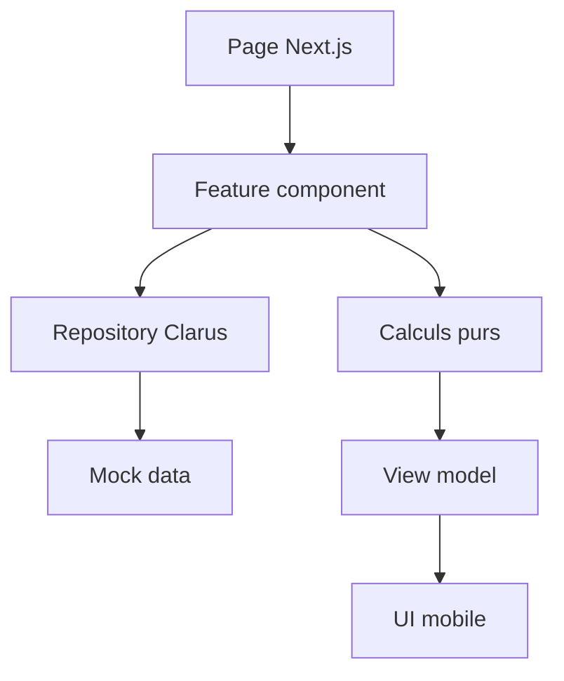

# Architecture technique Clarus

## Role du document

Ce document definit le socle technique recommande pour creer Clarus comme app standalone, mock-first et evolutive.

La cible est une application Next.js mobile-first, optimisee pour le prototype UX/UI du chantier Sparrenlaan.

## Decision principale

Clarus doit demarrer comme une app unique et standalone.

Le modele doit prevoir le long terme, mais sans creer maintenant :

- un monorepo complet ;
- un package UI partage ;
- une base Supabase branchee ;
- une app admin separee ;
- du multi-chantier visible.

## Structure recommandee

```txt
clarus-app/
  src/
    app/
      (tabs)/
        aujourd-hui/
        interventions/
        couts/
        zones/
      (screens)/
        ajouter-intervention/
        interventions/[id]/
      layout.tsx
      page.tsx
    components/
      ui/
    features/
      chantier/
      interventions/
      couts/
      referentiel/
    lib/
      calculations/
      dates/
      formatters/
      mock/
      repositories/
      schemas/
      utils/
```

## Responsabilites

`app/`
: Routage Next.js et pages legeres.

`features/interventions/`
: Ecran ajouter intervention, liste, details, selectors et view models.

`features/couts/`
: Syntheses couts, totaux, filtres, cartes de couts.

`features/referentiel/`
: Zones, phases, personnes, statuts, horaires rapides.

`lib/repositories/`
: Contrats de lecture/ecriture. Les composants ne doivent pas importer les mocks directement.

`lib/mock/`
: Donnees V0 realistes pour Sparrenlaan.

`lib/calculations/`
: Calculs purs et testes : durees, montants, totaux.

`components/ui/`
: Petites primitives UI locales : bouton, badge, sheet, nav, card simple.

## Flux de donnees



## Interfaces minimales

Les premieres interfaces a prevoir :

```ts
type InterventionRepository = {
  getInterventions: () => Promise<Intervention[]>
  getInterventionById: (id: string) => Promise<Intervention | null>
  getTodaySummary: (date: string) => Promise<TodaySummary>
  createInterventionDraft: (input: CreateInterventionDraftInput) => Promise<InterventionDraft>
}
```

Les calculs doivent rester independants :

```ts
type WorkCalculationInput = {
  startTime: string
  endTime: string
  breakMinutes: number
  days: number
  hourlyRate: number
}

type WorkCalculationResult = {
  durationMinutes: number
  amount: number
}
```

## Data source strategy

Clarus peut reprendre l'idee `mock | supabase`, mais sans brancher Supabase en V0.

```txt
CLARUS_DATA_SOURCE=mock
```

Regle :

- V0 : seule valeur supportee = `mock` ;
- plus tard : ajout possible de `supabase` ;
- les repositories gardent la meme signature.

## Configuration recommandee

TypeScript :

- `strict: true`
- `noUncheckedIndexedAccess: true`
- `verbatimModuleSyntax: true`
- `allowJs: false`

Biome :

- format automatique ;
- interdiction de `any` ;
- imports organises ;
- fichiers non utilises detectes.

Next :

- App Router ;
- `reactStrictMode: true` ;
- pas de `ignoreBuildErrors` ;
- pas d'i18n complet au debut.

## Style d'implementation

Regles :

- les pages ne contiennent pas de logique metier lourde ;
- les composants UI ne calculent pas les couts ;
- les mocks sont typés ;
- les selectors convertissent les donnees brutes en modeles de vue ;
- chaque calcul critique a un test Vitest ;
- le multi-chantier reste prepare par `projectId`, invisible en UI.

## Non-objectifs techniques V0

Ne pas construire maintenant :

- auth ;
- offline ;
- upload photo reel ;
- Supabase ;
- migrations DB ;
- roles ;
- logs serveur ;
- exports PDF ;
- OCR ;
- IA.

Ces sujets pourront etre ajoutes quand l'UX sera validee.

