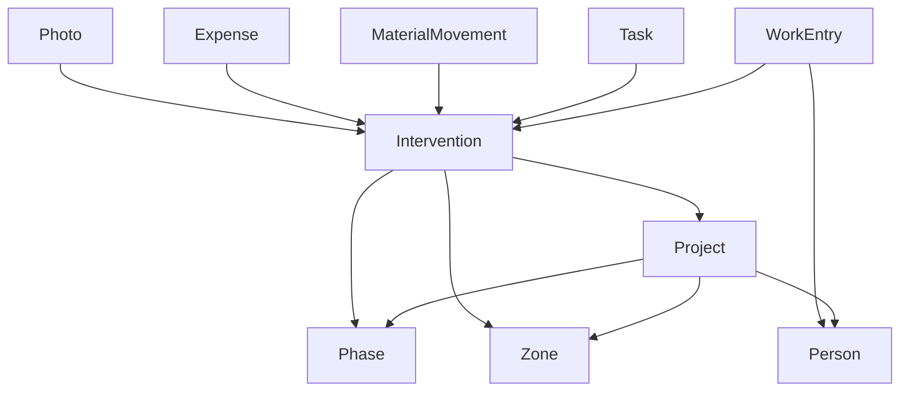

# Modele data mock-first

## Role du document

Ce document transforme le modele metier Clarus en types de donnees prets pour un prototype mock-first.

L'objectif est de pouvoir prototyper l'UX avec des donnees realistes, tout en preparant le remplacement futur par Supabase.

## Principe

Les mocks ne doivent pas etre de simples objets jetables.

Ils doivent respecter les memes contrats que la future source de donnees :

- identifiants stables ;
- relations explicites ;
- statuts normalises ;
- calculs separes des donnees ;
- donnees incompletes marquees comme `to_check`.

## Entites principales



## Types recommandés

```ts
type Project = {
  id: string
  name: string
  address: string
  description: string
  status: 'active' | 'paused' | 'done'
}

type Phase = {
  id: string
  projectId: string
  name: string
  order: number
  description?: string
}

type Zone = {
  id: string
  projectId: string
  name: string
  type: 'simple' | 'technical'
  parentZoneId?: string | null
  technicalCode?: string | null
  planReference?: string | null
}

type Person = {
  id: string
  name: string
  role?: string
  defaultHourlyRate: number
  active: boolean
}
```

## Intervention

```ts
type InterventionType =
  | 'work'
  | 'demolition'
  | 'evacuation'
  | 'protection'
  | 'dismantling'
  | 'structure'
  | 'preparation'
  | 'material_need'
  | 'material_use'
  | 'expense'
  | 'task'
  | 'decision'
  | 'photo'
  | 'extra'
  | 'other'

type InterventionStatus =
  | 'draft'
  | 'to_check'
  | 'in_progress'
  | 'done'
  | 'blocked'
  | 'cancelled'

type BillingStatus =
  | 'not_billable'
  | 'to_check'
  | 'to_invoice'
  | 'invoiced'
  | 'paid'

type PaymentStatus =
  | 'not_applicable'
  | 'to_pay'
  | 'paid'
  | 'partially_paid'
  | 'to_check'

type Intervention = {
  id: string
  projectId: string
  title: string
  description?: string
  type: InterventionType
  date: string
  phaseId: string
  zoneId: string
  status: InterventionStatus
  isExtra: boolean | 'to_check'
  billingStatus: BillingStatus
  paymentStatus: PaymentStatus
  sourceNote?: string
  createdAt: string
  updatedAt: string
}
```

## Heures

```ts
type WorkEntry = {
  id: string
  interventionId: string
  personId: string
  date: string
  startTime: string
  endTime: string
  breakMinutes: number
  days: number
  hourlyRate: number
  durationMinutes: number
  amount: number
  notes?: string
}
```

Regle :

```txt
durationMinutes = (end - start - breakMinutes) * days
amount = durationMinutes / 60 * hourlyRate
```

Le systeme calcule `durationMinutes` et `amount`. L'IA ne calcule pas ces chiffres.

## Taches, materiaux, depenses, photos

```ts
type Task = {
  id: string
  projectId: string
  interventionId?: string | null
  phaseId?: string | null
  zoneId?: string | null
  title: string
  description?: string
  status: 'to_do' | 'in_progress' | 'blocked' | 'done' | 'to_check'
  priority: 'low' | 'normal' | 'high' | 'urgent'
  assignedTo?: string | null
  dueDate?: string | null
  createdAt: string
}

type Material = {
  id: string
  name: string
  category?: string
  defaultUnit?: string
}

type MaterialMovement = {
  id: string
  materialId: string
  interventionId?: string | null
  zoneId?: string | null
  phaseId?: string | null
  type: 'needed' | 'purchased' | 'on_site' | 'used' | 'returned' | 'wasted'
  quantity: number
  unit: string
  estimatedCost?: number | null
  realCost?: number | null
  supplier?: string | null
  status: 'to_buy' | 'bought' | 'on_site' | 'used' | 'missing' | 'to_check'
}

type Expense = {
  id: string
  projectId: string
  interventionId?: string | null
  materialMovementId?: string | null
  supplier: string
  description: string
  amount?: number | null
  date: string
  status: 'to_pay' | 'paid' | 'to_rebill' | 'rebilled' | 'to_check'
  isRebillable: boolean | 'to_check'
  receiptPhotoId?: string | null
}

type Photo = {
  id: string
  projectId: string
  interventionId?: string | null
  zoneId?: string | null
  phaseId?: string | null
  type: 'before' | 'during' | 'after' | 'problem' | 'proof' | 'material' | 'waste' | 'plan' | 'receipt' | 'other'
  url: string
  comment?: string
  takenAt: string
}
```

## Donnees mockees minimales

Les mocks V0 doivent inclure :

- 1 projet : Sparrenlaan ;
- 5 personnes : Hubert, Chris, Bartosz, Gregory, Autre ;
- 9 phases ;
- 12 zones simples ;
- quelques zones techniques ;
- 8 a 12 interventions realistes ;
- work entries multi-personnes ;
- quelques taches a verifier ;
- quelques depenses simples ;
- quelques materiaux fréquents.

## Exemples a inclure dans les mocks

- Demolition garage semelle beton ;
- Demolition beton de sol, 2 jours, Hubert + Chris ;
- Protection sols escalier + premier etage ;
- Demolition beton exterieur + evacuation ;
- Conteneur presque plein ;
- Demander confirmation a Martin pour P1.7 ;
- Lovemat - protection sols - 46,45 EUR ;
- Disques beton a acheter.

## Repository mock-first

Les donnees mockees doivent etre lues via repositories :

```ts
type ClarusRepository = {
  getProject: () => Promise<Project>
  getPeople: () => Promise<Person[]>
  getPhases: () => Promise<Phase[]>
  getZones: () => Promise<Zone[]>
  getInterventions: () => Promise<Intervention[]>
  getWorkEntries: () => Promise<WorkEntry[]>
  getTodaySummary: (date: string) => Promise<TodaySummary>
}
```

## Validation

`zod` est recommande pour :

- schemas de mocks ;
- inputs de creation d'intervention ;
- statuts ;
- dates et horaires ;
- champs financiers sensibles.

Ne pas sur-valider au point de bloquer la saisie terrain. Quand une information manque, utiliser `to_check`.

