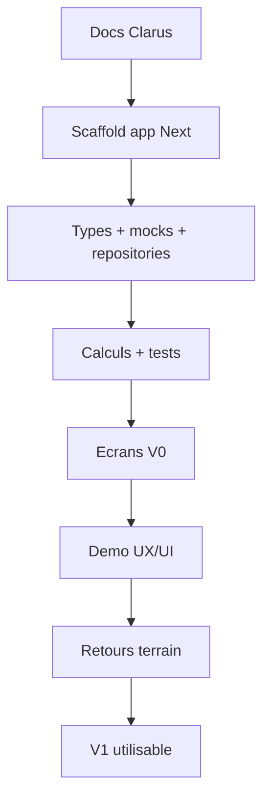

# Roadmap de developpement Clarus

## Role du document

Ce document decoupe le developpement Clarus en etapes progressives.

La roadmap garde une vision long terme, mais protege le prototype contre la surcharge.

## V0 - Prototype UX/UI mock-first

Objectif :

Valider que l'app peut remplacer Notes pour encoder les interventions et calculer les heures.

Fonctionnalites :

- projet Sparrenlaan preconfigure ;
- referentiel personnes/zones/phases ;
- donnees mockees realistes ;
- repository mock-first ;
- ecran Aujourd'hui ;
- ecran Ajouter intervention ;
- ecran Interventions ;
- ecran Couts ;
- calcul duree et montant ;
- section "A verifier".

Critere d'acceptation :

- une intervention simple est encodable en moins de 30 secondes ;
- les heures et montants sont calcules automatiquement ;
- les donnees mocks donnent une demo credible ;
- l'UI ne depend pas directement des mocks ;
- les calculs critiques ont des tests.

## V1 - Version terrain utilisable

Objectif :

Transformer le prototype en outil utilisable sur le chantier.

Ajouts :

- edition d'intervention ;
- detail intervention ;
- taches liees ;
- materiaux simples ;
- depenses ;
- photos placeholder ou upload prepare ;
- filtres par phase, zone, personne, statut ;
- meilleure vue "A verifier" ;
- statuts financiers plus visibles.

Critere d'acceptation :

- les interventions, heures, depenses et taches sont retrouvables ;
- les donnees incompletes sont visibles ;
- les couts sont lisibles par zone et phase ;
- les modules restent simples.

## V1.5 - Confort et preparation exploitation

Objectif :

Faire gagner du temps, pas seulement structurer.

Ajouts possibles :

- templates d'intervention ;
- resume hebdomadaire ;
- exports CSV simples ;
- messages pour Martin ;
- galerie photos par zone ;
- plan mobile simplifie ;
- suggestions automatiques par type/zone.

Critere d'acceptation :

- l'app aide a preparer un decompte ;
- les donnees a verifier diminuent ;
- les utilisateurs gagnent du temps sur les repetitions.

## V2 - Analyse et donnees reelles

Objectif :

Preparer le passage vers une source de donnees reelle et l'analyse cout chantier.

Ajouts possibles :

- Supabase implementation des repositories ;
- auth simple ;
- upload photo reel ;
- exports PDF ;
- comparaison prevu/reel ;
- analyse par zone ;
- analyse par phase ;
- suivi avance des supplements.

Critere d'acceptation :

- remplacer mock par Supabase ne change pas les composants UI principaux ;
- les couts reels du chantier sont compréhensibles ;
- les donnees peuvent servir a preparer facture ou decompte.

## V3 - Intelligence et generalisation

Objectif :

Ajouter de l'assistance et preparer une evolution Clarus plus large si l'usage Sparrenlaan est valide.

Ajouts possibles :

- extraction depuis note libre ;
- detection d'incoherences ;
- OCR tickets ;
- assistant IA chantier ;
- multi-chantiers ;
- modeles de chantier ;
- roles ;
- dashboard admin.

Critere d'acceptation :

- l'IA assiste sans inventer ;
- le multi-chantier n'alourdit pas l'usage terrain ;
- les validations techniques et financieres restent humaines.

## Ordre de travail recommande

## Tests a prevoir

V0 :

- calcul 8h00 -> 18h30 ;
- calcul avec pause ;
- calcul multi-jours ;
- calcul multi-personnes ;
- montant a 45 EUR/h ;
- total par personne ;
- total par phase ;
- total par zone ;
- intervention incomplete marquee `to_check` ;
- mapping mock vers "Aujourd'hui" ;
- mapping mock vers "Couts".

V1 :

- edition intervention ;
- tache herite zone/phase ;
- depense liee a intervention ;
- materiau lie a intervention ;
- photo liee a intervention ;
- filtres par zone/phase/statut.

## Garde-fous

- Ne pas exposer multi-chantier avant besoin reel.
- Ne pas brancher Supabase avant validation UX.
- Ne pas ajouter IA avant des donnees structurees fiables.
- Ne pas transformer Clarus en outil comptable.
- Ne pas sacrifier la rapidite d'encodage pour une modelisation trop parfaite.

## Definition de "pret pour implementation"

Le projet est pret pour implementation quand :

- les docs de ce pack sont validees ;
- la V0 est acceptee comme scope initial ;
- le style UI cible est choisi ;
- les mocks V0 sont listes ;
- les calculs metier sont verrouilles ;
- le futur scaffold peut etre cree sans decision majeure ouverte.

