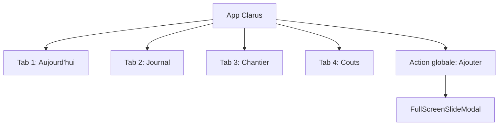
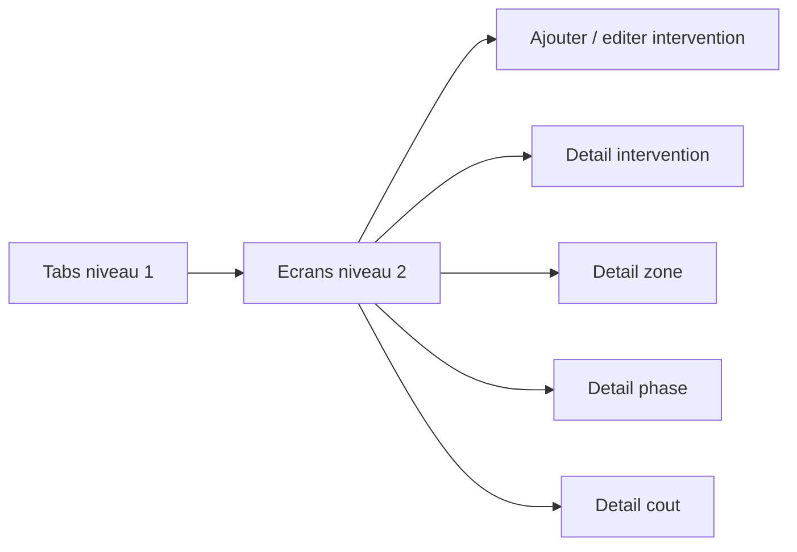

# Cartographie des composants web-client pour Clarus

## Role du document

Ce document cartographie les composants et patterns de `apps/web-client` qui peuvent inspirer Clarus.

Il ne recommande pas de copier tout `web-client`. Le repo contient beaucoup de composants lies a Make the Change, au marketing, a la gamification, aux produits, a l'Academy et aux labs. Pour Clarus, la bonne approche est de reprendre les patterns structurels et les primitives utiles, puis de les adapter a une app chantier mobile-first.

Inventaire observe :

- `apps/web-client/src/app` : environ 320 fichiers `.tsx`.
- `apps/web-client/src/components` : 11 fichiers `.tsx` globaux.
- `packages/core/src/shared/ui` : environ 77 fichiers `.tsx` de primitives et composants UI.

## Synthese de decision

Reprendre directement ou adapter en priorite :

- `TabScreen` et `Screen` pour les shells mobile.
- `MobileBottomNav` pour la navigation principale.
- `FullScreenSlideModal` pour les ecrans d'ajout et de detail en slide plein ecran.
- `InterceptedRouteDialog` pour les routes modales.
- `MobileSheet` ou `BottomSheet` pour les choix rapides.
- `BottomActionBar` pour les CTA bas fixes.
- `ProjectDetailTabs` comme inspiration pour les tabs internes sticky.
- `CheckoutSteps` comme inspiration pour le wizard "Ajouter intervention".
- `QuantityStepper` comme inspiration pour quantites, jours, pauses.
- `ConfirmDestructiveDialog`, `Toast`, `Toaster`, `ErrorBoundary`.
- primitives UI core : `Button`, `Input`, `Textarea`, `Select`, `Tabs`, `Dialog`, `Badge`, `Switch`, `Checkbox`, `Radio`, `Combobox`, `NumberField`.

Ne pas reprendre au demarrage :

- composants marketing `(site)`;
- composants BioDex, Academy, Kinnu, Atlas et labs ;
- composants Stripe / checkout produit sauf patterns de wizard ;
- gamification, mascottes, monnaies, avantages ;
- MapLibre projet sauf plus tard pour plan/zone ;
- `packages/core` complet comme dependance si Clarus demarre standalone.

## Architecture d'ecrans Clarus recommandee

Clarus n'a pas besoin de beaucoup de tabs visibles. Le danger serait de faire une mini-suite chantier trop tot.

### Navigation principale recommandee

Recommandation V0/V1 :

```txt
Aujourd'hui | Journal | Chantier | Couts
```

L'action `Ajouter` ne doit pas etre une tab classique. Elle doit etre un CTA global visible sur l'accueil et disponible depuis les autres ecrans via bouton flottant ou bottom action.

Pourquoi :

- `Aujourd'hui` est le hub operationnel.
- `Journal` est la trace chronologique des interventions.
- `Chantier` regroupe zones, phases, taches, materiaux et photos.
- `Couts` isole la lecture financiere.
- `Ajouter intervention` est une action, pas une destination de consultation.



### Ecrans niveau 1

Les ecrans niveau 1 sont les tabs principales.

| Ecran | Role | Pattern web-client |
|---|---|---|
| Aujourd'hui | Resume du jour, CTA ajouter, alertes | `TabScreen`, `MobileBottomNav`, `BottomActionBar` |
| Journal | Liste des interventions, filtres rapides | `DataList`, segmented filter, cards compactes |
| Chantier | Zones, phases, taches, materiaux, photos | cards + tabs internes legeres |
| Couts | Totaux, filtres, couts par zone/personne/phase | cards KPI + sticky filters |

### Ecrans niveau 2

Les ecrans niveau 2 sont des details ou flows focalises.

| Ecran | Ouverture recommandee | Pattern web-client |
|---|---|---|
| Ajouter intervention | slide plein ecran | `FullScreenSlideModal` |
| Detail intervention | slide plein ecran ou page | `FullScreenSlideModal` avec `asPage` possible |
| Edition intervention | meme flow que ajout | wizard + bottom CTA |
| Detail zone | page secondaire | `Screen` + tabs internes |
| Detail phase | page secondaire | `Screen` + liste liee |
| Detail cout filtre | page secondaire | tabs internes + bottom CTA export plus tard |
| Ajouter depense | sheet ou slide selon complexite | `MobileSheet` puis modal si V1 |
| Ajouter materiau | sheet rapide | `MobileSheet`, `QuantityStepper` |
| Ajouter photo | action rapide liee intervention | `MobileSheet` puis upload reel plus tard |



## Composants structurels a reprendre

### `MobileBottomNav`

Chemin :

`apps/web-client/src/app/[locale]/(tabs)/_components/mobile-bottom-nav.tsx`

Valeur pour Clarus :

- navigation mobile fixe ;
- icones `lucide-react` ;
- etat actif clair ;
- safe-area bottom ;
- labels courts.

Adaptation Clarus :

- tabs : `Aujourd'hui`, `Journal`, `Chantier`, `Couts` ;
- ajouter un bouton d'action global separe ;
- eviter les couleurs MTC lime si le design Clarus part sur une palette chantier.

Statut :

`a adapter`.

### `TabScreen`

Chemin :

`apps/web-client/src/app/[locale]/(tabs)/_components/tab-screen.tsx`

Valeur pour Clarus :

- shell mobile stable ;
- header fixe ;
- scroll interne ;
- padding bottom pour bottom nav ;
- `100dvh` et safe-area.

Adaptation Clarus :

- renommer en `AppTabScreen` ou `ClarusTabScreen` ;
- utiliser une surface plus claire ou plus utilitaire ;
- garder la logique de scroll.

Statut :

`a reprendre presque tel quel, en simplifiant le theme`.

### `Screen`

Chemin :

`apps/web-client/src/app/[locale]/(screens)/_components/screen.tsx`

Valeur pour Clarus :

- shell pour ecrans secondaires ;
- header fixe ;
- scroll ref et `onScroll` disponibles ;
- pas de marge bottom nav obligatoire.

Usage Clarus :

- detail intervention ;
- detail zone ;
- detail cout ;
- reglages plus tard.

Statut :

`a reprendre`.

### `FullScreenSlideModal`

Chemin :

`apps/web-client/src/app/[locale]/@modal/_components/full-screen-slide-modal.tsx`

Valeur pour Clarus :

- tres bon pattern mobile ;
- peut rendre une route comme modal ou comme page via `asPage` ;
- modes header : back, close, none, dynamic ;
- fermeture avec `router.back()` ou fallback ;
- header dynamique selon scroll.

Usage Clarus :

- ajouter intervention ;
- edition intervention ;
- detail intervention depuis journal ;
- ajout depense si flow long ;
- detail photo ou ticket plus tard.

Adaptation Clarus :

- enlever les references MTC ;
- remplacer `fallbackHref='/community'` par `/aujourd-hui` ;
- remplacer le titre document `Make the Change` ;
- simplifier `refreshOnClose` si inutile ;
- garder `asPage`, `headerMode`, `contentClassName`.

Statut :

`priorite haute`.

### `InterceptedRouteDialog`

Chemin :

`apps/web-client/src/app/[locale]/@modal/_components/intercepted-route-dialog.tsx`

Valeur pour Clarus :

- wrapper simple autour du full screen modal ;
- permet de standardiser les routes interceptees.

Usage Clarus :

- `@modal/(.)interventions/new` ;
- `@modal/(.)interventions/[id]` ;
- `@modal/(.)expenses/new` plus tard.

Statut :

`a adapter`.

### `modal-content-presets`

Chemin :

`apps/web-client/src/app/[locale]/@modal/_components/modal-content-presets.ts`

Valeur pour Clarus :

- centralise les classes de surfaces modales ;
- evite de recopier des chaines Tailwind partout.

Adaptation Clarus :

- creer des presets Clarus plus sobres :
  - `CLARUS_FULLSCREEN_MODAL_CLASSNAME`
  - `CLARUS_SHEET_CLASSNAME`
  - `CLARUS_FORM_MODAL_CLASSNAME`

Statut :

`reprendre le principe, pas les classes`.

### `BottomActionBar`

Chemin :

`apps/web-client/src/app/[locale]/_components/bottom-action-bar.tsx`

Valeur pour Clarus :

- CTA bas fixe ;
- safe-area ;
- utile pour valider un flow.

Usage Clarus :

- bouton `Valider intervention` ;
- bouton `Enregistrer modification` ;
- bouton `Ajouter photo` apres validation ;
- bouton `Exporter` plus tard.

Statut :

`a reprendre`.

## Sheets, dialogs et feedback

### `MobileSheet`

Chemins :

- `apps/web-client/src/components/ui/mobile-sheet.tsx`
- `apps/web-client/src/app/[locale]/(screens)/projects/[slug]/_components/shared/mobile-sheet.tsx`

Valeur pour Clarus :

- choix rapides ;
- selection zone/personne/statut ;
- ajout court de materiau ou depense ;
- interface mobile naturelle.

Adaptation Clarus :

- ajouter handle visuel si besoin ;
- tailles plus compactes ;
- garder `max-h` et safe-area.

Statut :

`priorite haute`.

### `BottomSheet` core

Chemin :

`packages/core/src/shared/ui/bottom-sheet.tsx`

Valeur pour Clarus :

- swipe down possible ;
- bonne base accessible via Dialog ;
- contenu avec handle.

Decision :

- si Clarus reste standalone, mieux vaut copier une version simplifiee localement ;
- eviter d'importer tout `packages/core` juste pour ce composant.

Statut :

`inspiration technique`.

### `ConfirmDestructiveDialog`

Chemin :

`apps/web-client/src/components/ui/confirm-destructive-dialog.tsx`

Valeur pour Clarus :

- confirmer suppression intervention ;
- confirmer suppression depense ;
- confirmer abandon d'un brouillon.

Adaptation :

- remplacer theme dark MTC par theme Clarus ;
- garder `isPending`, `confirmLabel`, `cancelLabel`.

Statut :

`a reprendre`.

### Toasts

Chemins :

- `apps/web-client/src/components/ui/toast.tsx`
- `apps/web-client/src/components/ui/toaster.tsx`
- `apps/web-client/src/components/ui/use-toast.ts`

Valeur pour Clarus :

- feedback apres sauvegarde ;
- alerte donnee incomplete ;
- confirmation de calcul/ajout.

Statut :

`a reprendre ou remplacer par une librairie simple`.

### `ErrorBoundary`

Chemin :

`apps/web-client/src/components/ui/error-boundary.tsx`

Valeur pour Clarus :

- evite un ecran blanc en demo ;
- utile dans un prototype.

Adaptation :

- retirer les exceptions Next.js specifiques MTC si inutiles ;
- message FR.

Statut :

`a adapter`.

## Patterns d'ecrans a reprendre

### Detail avec tabs internes sticky

Reference :

`apps/web-client/src/app/[locale]/(screens)/projects/[slug]/_components/project-detail-tabs.tsx`

Valeur pour Clarus :

- parfait pour les fiches longues ;
- tabs horizontales ;
- CTA bas fixe ;
- scroll vers la nav quand on change de tab.

Usage Clarus :

- fiche intervention :
  - resume ;
  - heures ;
  - couts ;
  - photos ;
  - historique ;
- fiche zone :
  - resume ;
  - interventions ;
  - taches ;
  - couts ;
  - photos ;
- vue couts :
  - par phase ;
  - par zone ;
  - par personne ;
  - a verifier.

Statut :

`a reprendre comme pattern, pas les ids metier`.

### Wizard / stepper

Reference :

`apps/web-client/src/app/[locale]/(screens)/products/checkout/_components/checkout-steps.tsx`

Valeur pour Clarus :

- indique ou on est dans un flow ;
- simple, textuel, compact.

Usage Clarus :

```txt
Quoi > Ou > Qui > Quand > Statut > Resume
```

Statut :

`a adapter`.

### Quantity stepper

Reference :

`apps/web-client/src/app/[locale]/(screens)/products/[id]/_components/quantity-stepper.tsx`

Valeur pour Clarus :

- quantite de materiaux ;
- nombre de jours ;
- pause en pas de 15 minutes ;
- nombre de personnes si besoin.

Adaptation :

- renommer `NumberStepper` ;
- separer l'action delete du decrement si c'est ambigu pour chantier.

Statut :

`a adapter`.

### Segmented filters

Reference :

`apps/web-client/src/app/[locale]/(screens)/profile/contributions/_features/activity-filter.tsx`

Valeur pour Clarus :

- filtre rapide `Tout / A verifier / Paye / Supplement` ;
- filtre `Jour / Semaine / Tout` ;
- filtre `Phase / Zone / Personne`.

Adaptation :

- creer un composant generique `SegmentedControl` ;
- eviter quatre boutons hardcodes dans chaque ecran.

Statut :

`reprendre le pattern, pas le code tel quel`.

## Primitives UI de packages/core utiles

Ces composants existent dans `packages/core/src/shared/ui`.

Pour Clarus, deux options :

1. Copier/adaptater une petite selection dans `src/components/ui`.
2. Installer une base type shadcn/ui et recreer les patterns.

Selection utile :

| Primitive | Usage Clarus |
|---|---|
| `Button` | actions principales |
| `Input` | titre, montant, fournisseur |
| `Textarea` | note chantier |
| `Select` | phase, zone, statut |
| `Combobox` | recherche zone/materiau plus tard |
| `Checkbox` | multi-personnes, options |
| `Radio` | statut exclusif |
| `Switch` | settings simples |
| `Tabs` | tabs internes fiche |
| `Dialog` | modals et sheets |
| `AlertDialog` | confirmations |
| `Badge` | statuts |
| `Progress` | avancement phase |
| `NumberField` | quantites/montants si stable |
| `Skeleton` | chargements demo |
| `EmptyState` | listes vides |

Decision recommandee :

- ne pas importer tout `@make-the-change/core` dans Clarus V0 ;
- recreer une mini-lib locale avec seulement les primitives necessaires ;
- garder l'API proche des composants core pour faciliter une extraction future.

## Composants globaux web-client

| Composant | Chemin | Decision Clarus |
|---|---|---|
| `MainContent` | `src/components/layout/main-content.tsx` | inutile si Clarus utilise `TabScreen` |
| `Logo` | `src/components/ui/logo.tsx` | ne pas reprendre, specifique MTC |
| `SectionContainer` | `src/components/ui/section-container.tsx` | utile seulement pour pages marketing, pas V0 |
| `NotificationToggleRow` | `src/components/ui/notification-toggle-row.tsx` | plus tard pour settings |
| `ImpactCreditIcon`, `Currency` | `src/components/currency/*` | ne pas reprendre, metier MTC |
| `SetupGuard` | `src/app/_components/setup-guard.tsx` | pas prioritaire |
| `Providers` | `src/app/providers.tsx` | reprendre le principe, pas le contenu |

## Familles a ne pas reprendre

### Marketing site

Chemins :

- `(site)/(home)`
- `(site)/about`
- `(site)/faq`
- `(site)/privacy`
- `(site)/blog`

Pourquoi eviter :

- composition marketing ;
- contenu MTC ;
- hero/sections trop eloignes d'une app chantier.

Exception :

- certains patterns de sections peuvent inspirer une future page publique Clarus, mais pas la V0.

### Academy, Learn, Atlas, Kinnu, Labs

Chemins :

- `(screens)/academy`
- `(screens)/learn/atlas`
- `(lab)/kinnu`
- `(lab)/kinnu-v2`
- `(screens)/lab/atlas-prototype`

Pourquoi eviter :

- tres specifique education/gamification ;
- composants graphiques complexes ;
- pas utile pour encoder vite sur chantier.

Exception :

- `atlas-action-dock` ou bottom sheets peuvent inspirer une future vue plan interactive, mais plus tard.

### Produits et checkout

Chemins :

- `(screens)/products`
- `(screens)/products/checkout`
- `@modal/(.)products`

Pourquoi eviter :

- e-commerce ;
- panier ;
- paiement.

Exception :

- `CheckoutSteps` pour wizard ;
- `QuantityStepper` pour quantites ;
- sheets de selection.

### Profile, account, settings

Chemins :

- `(tabs)/profile`
- `(screens)/profile`

Pourquoi eviter en V0 :

- pas d'auth ;
- pas de compte utilisateur ;
- pas de reglages complexes.

Exception :

- patterns de liste d'activite ;
- settings plus tard si notifications ou preferences.

## Proposition de route structure Clarus

```txt
src/app/
  (tabs)/
    layout.tsx
    aujourd-hui/page.tsx
    journal/page.tsx
    chantier/page.tsx
    couts/page.tsx
    _components/
      mobile-bottom-nav.tsx
      tab-screen.tsx
  (screens)/
    interventions/[id]/page.tsx
    zones/[id]/page.tsx
    phases/[id]/page.tsx
    couts/[view]/page.tsx
    _components/
      screen.tsx
  @modal/
    default.tsx
    [...catchAll]/page.tsx
    _components/
      full-screen-slide-modal.tsx
      intercepted-route-dialog.tsx
      modal-content-presets.ts
    (.)interventions/new/page.tsx
    (.)interventions/[id]/edit/page.tsx
    (.)expenses/new/page.tsx
```

## Proposition de composants Clarus

### Shells

- `ClarusTabScreen`
- `ClarusScreen`
- `ClarusBottomNav`
- `ClarusBottomActionBar`
- `ClarusFullScreenSlideModal`
- `ClarusMobileSheet`

### Inputs chantier

- `QuickChoiceGrid`
- `PersonPicker`
- `ZonePicker`
- `PhasePicker`
- `TimePresetPicker`
- `WorkTimeEditor`
- `NumberStepper`
- `StatusSegmentedControl`

### Cards metier

- `TodaySummaryCard`
- `InterventionCard`
- `VerificationAlertCard`
- `CostSummaryCard`
- `ZoneCard`
- `PhaseProgressCard`
- `TaskCard`
- `MaterialLine`
- `ExpenseLine`

### Flows

- `AddInterventionFlow`
- `InterventionSummaryStep`
- `InterventionDetailTabs`
- `CostBreakdownTabs`

## Ecrans Clarus recommandes par version

### V0

```txt
Tabs:
1. Aujourd'hui
2. Journal
3. Chantier
4. Couts

Actions globales:
- Ajouter intervention

Niveau 2:
- Detail intervention
- Ajouter / editer intervention
```

### V1

```txt
Tabs identiques:
1. Aujourd'hui
2. Journal
3. Chantier
4. Couts

Niveau 2:
- Detail zone
- Detail phase
- Ajouter depense
- Ajouter materiau
- Ajouter photo
- Liste "A verifier"
```

### V1.5

```txt
Niveau 2 ou actions:
- Export simple
- Resume hebdomadaire
- Message pour Martin
- Plan mobile simplifie
- Templates d'intervention
```

## Recommandation finale

Clarus doit reprendre `web-client` comme une bibliotheque d'idees, pas comme une base a copier.

La meilleure extraction est :

1. Construire un shell mobile inspire de `TabScreen`, `Screen`, `MobileBottomNav`.
2. Utiliser `FullScreenSlideModal` pour tous les flows importants.
3. Utiliser des sheets pour les choix rapides.
4. Construire seulement 4 tabs principales.
5. Mettre tout le reste en niveau 2.
6. Garder l'action `Ajouter intervention` globale, rapide, et visible partout.

Cette architecture garde Clarus simple pour Sparrenlaan, mais assez propre pour accepter plus tard Supabase, des photos reelles, des exports et eventuellement plusieurs chantiers.

