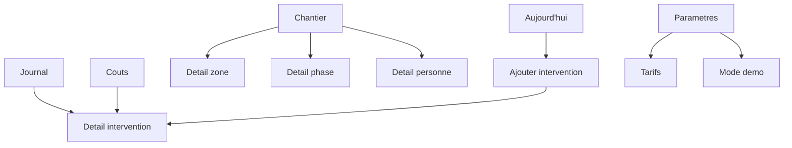

# Analyse des screens MTC pour Clarus

## Verdict

Oui, Clarus est presque pret pour demarrer le developpement.

Le socle produit, data mock-first, architecture et inspiration visuelle sont maintenant suffisamment clairs pour lancer une V0. Il manque seulement une derniere decision courte avant de coder : figer le **design system Clarus V0** et la **spec d'ecrans V0** en version executable.

En pratique :

- on peut demarrer le scaffold Next + mock data ;
- on ne devrait pas encore improviser l'UI ecran par ecran ;
- il faut transformer les choix de docs en composants/primitives nommes avant de construire les pages.

## Screens analyses

Captures source :

```txt
clarus/assets/mtc-screens/IMG_2605.png
clarus/assets/mtc-screens/IMG_2606.png
clarus/assets/mtc-screens/IMG_2607.png
clarus/assets/mtc-screens/IMG_2608.png
clarus/assets/mtc-screens/IMG_2609.png
clarus/assets/mtc-screens/IMG_2610.png
clarus/assets/mtc-screens/IMG_2611.png
clarus/assets/mtc-screens/IMG_2612.png
clarus/assets/mtc-screens/IMG_2613.png
clarus/assets/mtc-screens/IMG_2614.png
clarus/assets/mtc-screens/IMG_2616.png
clarus/assets/mtc-screens/IMG_2619.png
clarus/assets/mtc-screens/IMG_2620.png
```

Les captures confirment une direction forte : mobile dark, tres lisible, avec grandes zones tactiles, images fortes, CTA sticky et navigation inferieure claire.

Pour Clarus, il faut garder la qualite de finition, mais rendre l'ensemble plus operationnel et moins editorial.

## Ce qu'il faut reprendre

### 1. Le shell mobile

MTC gere tres bien :

- fond noir profond ;
- safe-area mobile ;
- bottom nav stable ;
- icones lisibles ;
- etat actif tres visible ;
- CTA sticky au-dessus de la zone navigateur ;
- grands espacements verticaux ;
- titres massifs pour les ecrans de premier niveau.

Application Clarus :

```txt
Tabs V0:
Aujourd'hui | Journal | Chantier | Couts

Action globale:
+ Ajouter intervention
```

Le bouton d'ajout doit vivre comme le CTA sticky de MTC : visible, gros, impossible a manquer.

### 2. Les ecrans niveau 1

Les tabs `Projets`, `Avantages`, `Profil` montrent trois familles utiles pour Clarus :

- liste visuelle avec cartes fortes ;
- liste fonctionnelle avec blocs de contenu ;
- dashboard personnel avec metriques.

Application Clarus :

```txt
Aujourd'hui:
dashboard rapide + prochaines actions + dernieres interventions

Journal:
liste chronologique des interventions

Chantier:
vue structuree zones/phases/personnes

Couts:
dashboard financier simple
```

Il faut eviter de faire chaque tab comme une page marketing. `Aujourd'hui` peut etre plus expressif, mais `Journal` et `Couts` doivent rester rapides a scanner.

### 3. Les details en full screen

Les details projet/produit/species utilisent une bonne logique :

- back visible ;
- titre dans header apres scroll ;
- hero ou contenu principal en haut ;
- tabs internes quand il y a plusieurs dimensions ;
- CTA sticky quand une action principale existe ;
- sections longues separees clairement.

Application Clarus :

```txt
Detail intervention:
Apercu | Heures | Couts | Photos

Detail chantier:
Zones | Phases | Personnes | Synthese

Detail personne:
Heures | Interventions | Montants
```

Le detail intervention doit etre le centre de gravite de Clarus. Taches, materiaux, depenses et photos y vivent en V0/V1 avant de devenir des modules complets.

### 4. Les settings

Les ecrans `Parametres` et `Mon Compte` sont parmi les plus directement reutilisables :

- header simple ;
- groupes de lignes ;
- icones colorees ;
- labels grands ;
- chevrons ;
- sections uppercase ;
- cartes sombres arrondies ;
- fields niveau 2 tres lisibles ;
- bouton sticky en bas.

Application Clarus :

```txt
Parametres V0/V1:
Chantier
Equipe
Tarifs
Exports
Preferences
Donnees mock / mode demo
```

Meme si les settings ne sont pas prioritaires en V0, le pattern visuel est excellent pour les futurs ecrans de configuration.

### 5. Les metriques

Le profil MTC montre des cartes metriques efficaces :

- chiffre tres grand ;
- label uppercase ;
- icone couleur ;
- grille 2 colonnes ;
- contraste fort.

Application Clarus :

```txt
Aujourd'hui:
3 interventions
24h30 notees
1 a verifier
1 102,50 EUR estimes

Couts:
Heures
Main d'oeuvre
Materiaux
Depenses
```

Ce pattern est meilleur que des tableaux pour la V0 mobile.

### 6. Les listes a lignes hautes

MTC utilise des lignes de settings et des blocs detail avec hauteur confortable. C'est parfait pour chantier.

Application Clarus :

```txt
Personne: Bartosz - 8h30 - 382,50 EUR
Zone: Cuisine - 4 interventions - 32h
Phase: Demolition - en cours
Materiel: Plaques OSB - 6 pcs
```

Chaque ligne doit pouvoir etre touchee facilement et contenir l'information critique sans ouvrir un detail.

## Ce qu'il faut adapter

### Images

MTC laisse beaucoup de place aux images. Pour Clarus, les photos doivent etre informatives :

- photo de chantier ;
- plan ;
- preuve d'avancement ;
- probleme a corriger ;
- materiau livre ;
- zone terminee.

Pas d'image decorative dans les ecrans operationnels.

### Titres

Les gros titres MTC donnent une vraie personnalite, mais Clarus ne doit pas devenir lourd.

Regle recommandee :

```txt
Ecran niveau 1: titre fort
Detail intervention: titre moyen + metadonnees
Formulaire: titre court et direct
Cartes/listes: titres compacts
```

### CTA sticky

Excellent pour :

- Ajouter intervention ;
- Enregistrer ;
- Valider une intervention ;
- Generer un export ;
- Marquer comme verifie.

A eviter pour :

- actions secondaires ;
- navigation ;
- ouvrir une photo ;
- petits filtres.

## Nombre d'ecrans necessaires

### V0 minimum montrable

```txt
1. Aujourd'hui
2. Journal
3. Chantier
4. Couts
5. Ajouter intervention
6. Detail intervention
7. Detail chantier ou synthese chantier
8. Parametres leger / mode demo
```

Ce nombre est suffisant pour valider l'UX.

### V1 raisonnable

```txt
9. Detail personne
10. Detail zone
11. Detail phase
12. Edition intervention
13. Galerie photos intervention
14. Export / recap
15. Parametres tarifs
```

### A repousser

```txt
Module materiaux complet
Module photos complet
Module taches complet
Offline complet
Auth
Supabase
Multi-chantier visible
```

## Navigation recommandee



## Architecture UI conseillee

```txt
src/components/ui
  app-shell.tsx
  bottom-nav.tsx
  sticky-action-bar.tsx
  screen-header.tsx
  fullscreen-slide.tsx
  metric-card.tsx
  settings-list.tsx
  info-row.tsx
  status-chip.tsx
  segmented-tabs.tsx

src/features/interventions
  components/intervention-card.tsx
  components/intervention-detail.tsx
  components/add-intervention-flow.tsx

src/features/dashboard
  components/today-summary.tsx

src/features/project
  components/project-overview.tsx
  components/zone-list.tsx
  components/phase-list.tsx

src/features/costs
  components/cost-summary.tsx
```

## Decisions a figer juste avant le dev

### 1. Accent color

Recommandation : garder le lime MTC comme accent principal pour la V0.

Pourquoi :

- il marche tres bien en dark ;
- il donne une identite immediate ;
- il est deja associe dans ton esprit a une app mobile moderne ;
- il rend les CTA tres visibles.

Adapter avec des statuts chantier :

```txt
primary: lime
warning/to-check: amber
danger: red
success: green
info: blue
neutral: slate
```

### 2. Dark theme

Recommandation : commencer dark-only en V0, mais coder light-ready.

Le dark theme est coherent avec les screens MTC. Le light theme pourra venir apres, quand les vrais usages dehors/sur chantier auront ete observes.

### 3. Style Clarus

Direction :

```txt
MTC mobile premium
+ lisibilite chantier
+ densite raisonnable
+ actions rapides
- storytelling decoratif
- gamification visible
```

## Sommes-nous bons pour developper ?

Oui, a condition de faire la prochaine etape dans cet ordre :

```txt
1. Rediger une spec V0 executable courte.
2. Figer les tokens design.
3. Scaffold Clarus standalone.
4. Creer les primitives UI.
5. Creer les mocks Sparrenlaan.
6. Implementer les calculs heures/couts avec tests.
7. Implementer les 4 tabs.
8. Implementer Ajouter intervention + Detail intervention.
```

Le risque principal maintenant n'est plus le manque d'idees. Le risque est de coder trop d'ecrans trop vite sans primitives communes.

La bonne strategie est donc : construire peu d'ecrans, mais avec un shell et des composants solides.

