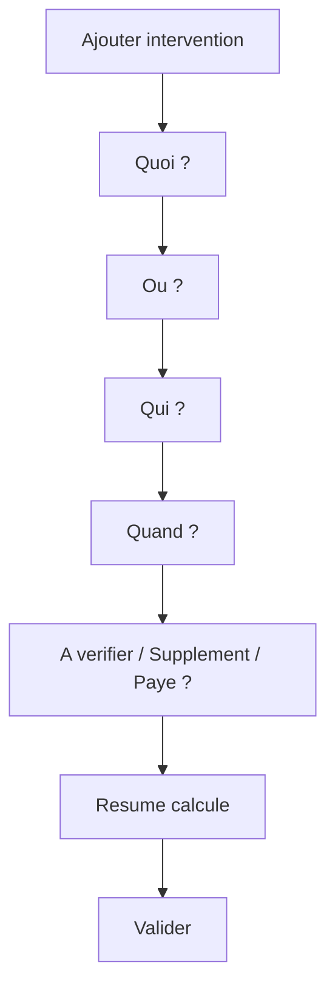

# UX mobile V0/V1

## Role du document

Ce document priorise l'experience mobile Clarus pour le prototype.

Il reprend le principe des canvases existants : l'utilisateur ne doit pas avoir l'impression de remplir une base de donnees. Il doit repondre a quelques questions simples.

## Navigation V0

La V0 peut demarrer avec 4 entrees principales :

```txt
Aujourd'hui | Journal | Chantier | Couts
```

`Ajouter intervention` n'est pas une tab. C'est une action globale visible depuis les ecrans principaux.

La V1 pourra ajouter des modules de niveau 2, sans changer les tabs principales :

```txt
Detail zone | Detail phase | Materiaux | Photos / Plans
```

## Ecran 1 - Aujourd'hui

Objectif :

- comprendre l'etat du jour ;
- ajouter une intervention rapidement ;
- voir ce qui reste a verifier.

Contenu V0 :

- titre : Sparrenlaan ;
- date du jour ;
- bouton principal : Ajouter intervention ;
- total heures du jour ;
- total main-d'oeuvre du jour ;
- personnes presentes ;
- dernieres interventions ;
- alertes "A verifier".

Structure :

```txt
Sparrenlaan
Aujourd'hui - [date]

[+ Ajouter intervention]

Resume du jour
- 3 interventions
- 2 personnes
- 18h30 encodees
- 832,50 EUR

A verifier
- 1 intervention sans statut supplement
- 1 depense sans montant

Derniers ajouts
- Demolition beton de sol
- Protection sols escalier
```

## Action globale - Ajouter intervention

Objectif :

Encoder une intervention simple en moins de 30 secondes.

Flow V0 :



Etapes V0 :

1. **Quoi ?**
   - Demolition
   - Evacuation
   - Protection
   - Structure
   - Achat
   - Tache
   - Autre

2. **Ou ?**
   - Garage
   - Sol beton
   - Exterieur
   - Extension arriere
   - Structure
   - Sous-sol
   - Escalier / premier etage
   - Conteneur / dechets
   - A definir

3. **Qui ?**
   - Hubert
   - Chris
   - Bartosz
   - Gregory
   - Autre

4. **Quand ?**
   - horaires rapides ;
   - date par defaut aujourd'hui ;
   - taux par defaut 45 EUR/h ;
   - nombre de jours ;
   - pause.

5. **Statut**
   - inclus chantier ;
   - supplement ;
   - a verifier ;
   - a facturer ;
   - paye ;
   - non concerne.

6. **Resume**
   - zone ;
   - phase ;
   - personnes ;
   - heures ;
   - montant ;
   - statut.

## Ecran 2 - Journal

Objectif :

Retrouver ce qui a ete encode.

Contenu V0 :

- liste chronologique ;
- filtre rapide : aujourd'hui / semaine / tout ;
- badges zone, phase, statut ;
- total heures et montant par intervention ;
- detail intervention.

Exemple carte :

```txt
Demolition beton de sol
Sol beton - Demolition - A verifier

Hubert 21h - 945 EUR
Chris 21h - 945 EUR
Total 42h - 1 890 EUR
```

## Ecran 3 - Chantier

Objectif :

Comprendre le chantier par zones, phases et elements lies aux interventions.

Contenu V0 :

- zones principales ;
- phases principales ;
- personnes ;
- blocs legers taches, materiaux, depenses et photos ;
- liens vers les interventions associees.

Structure :

```txt
Chantier

Zones
- Garage
- Sous-sol
- Extension arriere

Phases
- Demolition
- Structure
- Finitions

A verifier
- Materiau sans montant
- Zone a confirmer
```

## Ecran 4 - Couts

Objectif :

Comprendre rapidement les couts du chantier.

Contenu V0 :

- total main-d'oeuvre ;
- total a verifier ;
- total supplement ;
- total a payer ;
- couts par personne ;
- couts par phase ;
- couts par zone.

Structure :

```txt
Couts

Main-d'oeuvre totale
4 050 EUR

A verifier
1 245 EUR

Par personne
- Hubert: 42h / 1 890 EUR
- Chris: 35h / 1 575 EUR

Par phase
- Demolition: 3 420 EUR
- Protection: 337,50 EUR
```

## V1 - Modules ajoutes progressivement

Materiaux :

- d'abord lies a une intervention ;
- ensuite vue dediee avec statuts ;
- pas de stock complexe.

Photos :

- d'abord lien optionnel a l'intervention ;
- ensuite galerie par zone ou phase ;
- upload reel plus tard.

Taches :

- d'abord creees depuis une intervention ;
- ensuite vue dediee ;
- les taches heritent zone et phase.

Etapes :

- phases avec progression simple ;
- interventions et couts lies ;
- pas de Gantt.

## Design mobile

Reprendre de `web-client` :

- bottom nav fixe ;
- safe-area iPhone ;
- headers simples ;
- sheets mobiles ;
- bottom action bar ;
- icones lucide ;
- ecrans scrollables.

Adapter a Clarus :

- interface plus claire que decorative ;
- gros boutons ;
- contrastes forts ;
- libelles courts ;
- actions directes ;
- cartes compactes ;
- aucune surcharge administrative.

## Critere UX

Si un utilisateur doit reflechir plus de quelques secondes a "ou cliquer", l'ecran est trop complexe.

La priorite absolue reste :

```txt
Ajouter intervention plus vite que Notes
```
