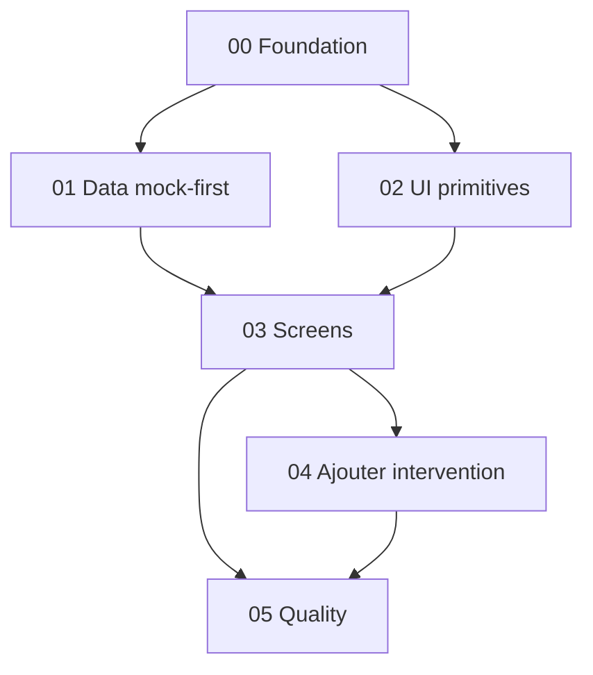

# Backlog V0 Clarus

## Role

Ce document organise le developpement V0 en epics et issues atomiques.

Il sert de table des matieres avant la creation du dossier `issues/`.

## Regles de decoupage

Une bonne issue V0 doit :

- tenir dans un objectif clair ;
- avoir un resultat visible ou testable ;
- eviter les choix produit majeurs ;
- indiquer ses dependances ;
- limiter les fichiers touches ;
- inclure criteres d'acceptation et verification.

Une mauvaise issue :

- "faire l'app" ;
- "faire toute l'UI" ;
- "brancher data + ecrans + design" ;
- "ameliorer Clarus" ;
- "faire Supabase plus tard".

## Vue globale



## Epics V0

### 00 - Foundation

Objectif :

Creer un projet Next standalone pret a recevoir Clarus.

Issues prevues :

```txt
CLARUS-V0-001 Scaffold Next standalone
CLARUS-V0-002 Config TypeScript/Biome/Vitest
CLARUS-V0-003 Structure dossiers app/features/lib/components
CLARUS-V0-004 Theme tokens dark-first light-ready
```

Dependances :

- aucune.

Sortie attendue :

- app lancable ;
- tooling strict ;
- architecture de dossiers en place.

### 01 - Data mock-first

Objectif :

Creer les types, schemas, mocks et calculs metier.

Issues prevues :

```txt
CLARUS-V0-010 Types metier Clarus
CLARUS-V0-011 Schemas Zod des mocks et inputs
CLARUS-V0-012 Mocks Sparrenlaan referentiel
CLARUS-V0-013 Mocks interventions/work entries
CLARUS-V0-014 Calculs heures et montants
CLARUS-V0-015 Selectors et summaries Aujourd'hui
CLARUS-V0-016 Selectors et summaries Couts
CLARUS-V0-017 Repository mock-first
```

Dependances :

- foundation minimale.

Sortie attendue :

- donnees demo realistes ;
- calculs testes ;
- composants UI capables de consommer des repositories.

### 02 - UI primitives

Objectif :

Construire une petite bibliotheque locale de composants UI Clarus.

Issues prevues :

```txt
CLARUS-V0-020 App shell mobile
CLARUS-V0-021 Bottom navigation
CLARUS-V0-022 Sticky action bar
CLARUS-V0-023 Full screen slide modal
CLARUS-V0-024 Buttons, cards, badges, chips
CLARUS-V0-025 Inputs et controls formulaire
CLARUS-V0-026 MetricCard et InfoRow
CLARUS-V0-027 SegmentedControl et filters
```

Dependances :

- foundation ;
- design tokens.

Sortie attendue :

- composants stables pour les agents ecrans ;
- aucun composant metier lourd dans `components/ui`.

### 03 - Screens V0

Objectif :

Implementer les 4 tabs et le detail intervention.

Issues prevues :

```txt
CLARUS-V0-030 Route tabs et redirection racine
CLARUS-V0-031 Ecran Aujourd'hui
CLARUS-V0-032 Ecran Journal
CLARUS-V0-033 Ecran Chantier
CLARUS-V0-034 Ecran Couts
CLARUS-V0-035 Detail intervention
CLARUS-V0-036 Etats empty/loading/demo
```

Dependances :

- data mock-first ;
- UI primitives.

Sortie attendue :

- navigation complete ;
- lecture des donnees demo ;
- ouverture du detail intervention.

### 04 - Ajouter intervention

Objectif :

Creer le flow principal de saisie rapide.

Issues prevues :

```txt
CLARUS-V0-040 Route modale Ajouter intervention
CLARUS-V0-041 Step Quoi
CLARUS-V0-042 Step Ou
CLARUS-V0-043 Step Qui
CLARUS-V0-044 Step Quand
CLARUS-V0-045 Step Statut
CLARUS-V0-046 Step Resume et sauvegarde mock draft
CLARUS-V0-047 Validation progressive to_check
```

Dependances :

- UI primitives ;
- repositories ;
- schemas input ;
- calculs heures/montants.

Sortie attendue :

- flow utilisable en demo ;
- sauvegarde mock/draft possible ;
- intervention incomplete visible en `to_check`.

### 05 - Quality

Objectif :

Verifier que la V0 est utilisable, coherente et stable.

Issues prevues :

```txt
CLARUS-V0-050 Tests calculs metier
CLARUS-V0-051 Tests selectors summaries
CLARUS-V0-052 Tests repository mock
CLARUS-V0-053 Type-check/lint/build
CLARUS-V0-054 Verification mobile screenshots
CLARUS-V0-055 Accessibility pass V0
CLARUS-V0-056 Review finale documentation vs implementation
```

Dependances :

- toutes les epics precedentes selon le test.

Sortie attendue :

- V0 verifiee ;
- captures mobile ;
- dette visible ;
- pret pour feedback terrain.

## Ordre de lancement recommande

### Phase A - Socle

```txt
CLARUS-V0-001
CLARUS-V0-002
CLARUS-V0-003
CLARUS-V0-004
```

Un seul agent, car ces issues touchent les fichiers partages.

### Phase B - Travail parallele controle

```txt
Agent Data:
CLARUS-V0-010 -> 017

Agent UI:
CLARUS-V0-020 -> 027
```

Ces deux agents peuvent travailler en parallele si les dossiers sont bien separes.

### Phase C - Ecrans

```txt
Agent Screens:
CLARUS-V0-030 -> 036

Agent Add Flow:
CLARUS-V0-040 -> 047
```

Possible en parallele seulement quand UI primitives et repositories sont stables.

### Phase D - Verification

```txt
Agent QA:
CLARUS-V0-050 -> 056
```

QA peut commencer tot sur les calculs, mais la verification visuelle arrive apres les ecrans.

## Issues a ne pas creer en V0

```txt
Supabase setup
Auth
Upload photo reel obligatoire
Offline complet
OCR ticket
IA assistant
Export PDF
Multi-chantier
Role admin
Facturation officielle
TVA
```

Ces sujets peuvent avoir des notes V1/V2, mais pas d'issues V0 actives.

## Definition d'une issue prete

Une issue est prete si elle contient :

- id ;
- titre ;
- agent recommande ;
- objectif ;
- contexte docs ;
- scope ;
- hors scope ;
- dependances ;
- fichiers probables ;
- criteres d'acceptation ;
- tests/verifications.

## Definition d'une issue terminee

Une issue est terminee si :

- le scope est livre ;
- les criteres d'acceptation passent ;
- les tests/verifications indiques ont ete executes ou explicitement justifies ;
- aucun fichier hors scope n'a ete modifie sans raison ;
- le resultat est resumable en 3 lignes.