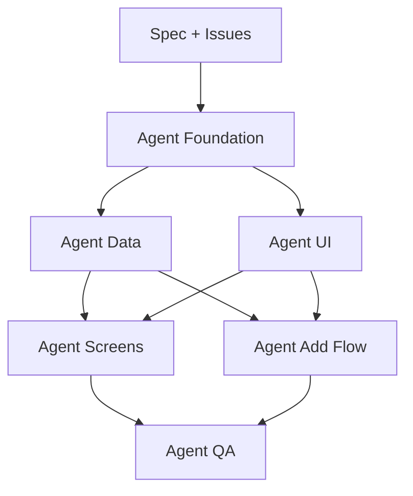

# Workflow agents Clarus V0

## Role

Ce document explique comment utiliser plusieurs agents pour developper Clarus V0 sans se marcher dessus.

Il definit :

- les roles agents ;
- l'ordre de lancement ;
- les frontieres de fichiers ;
- les regles de verification ;
- le format de handoff.

## Principe central

Ne pas parallelliser par enthousiasme.

Parallelliser seulement quand les agents travaillent sur des dossiers differents avec des contrats clairs.

```txt
Foundation d'abord.
Data et UI ensuite en parallele.
Screens et Add Flow apres stabilisation.
QA en continu puis final.
```

## Agents recommandes

### Agent Foundation

Mission :

- scaffold ;
- tooling ;
- structure dossiers ;
- tokens initiaux.

Dossiers principaux :

```txt
clarus-app/
package.json
tsconfig.json
biome.json
vitest.config.ts
src/app/
src/styles/
```

Regle :

Cet agent passe en premier. Aucun autre agent ne doit modifier le scaffold pendant son travail.

### Agent Data

Mission :

- types ;
- zod ;
- mocks ;
- repositories ;
- calculations ;
- selectors ;
- tests metier.

Dossiers principaux :

```txt
src/lib/mock/
src/lib/repositories/
src/lib/calculations/
src/lib/schemas/
src/features/*/selectors.ts
src/features/*/view-models.ts
```

Ne touche pas :

```txt
src/components/ui/
src/app/(tabs)/*
src/app/@modal/*
```

Exception :

petites exports barrel si necessaire.

### Agent UI

Mission :

- primitives ;
- shell mobile ;
- navigation ;
- modal/sheet ;
- composants generiques.

Dossiers principaux :

```txt
src/components/ui/
src/app/(tabs)/_components/
src/app/(screens)/_components/
src/app/@modal/_components/
```

Ne touche pas :

```txt
src/lib/mock/
src/lib/calculations/
src/features/interventions/
```

Exception :

types props locaux strictement necessaires.

### Agent Screens

Mission :

- 4 tabs V0 ;
- detail intervention ;
- etats vides/demo.

Dossiers principaux :

```txt
src/app/(tabs)/aujourd-hui/
src/app/(tabs)/journal/
src/app/(tabs)/chantier/
src/app/(tabs)/couts/
src/app/(screens)/interventions/[id]/
src/features/dashboard/
src/features/interventions/components/
src/features/project/
src/features/costs/
```

Depend de :

- Agent Data ;
- Agent UI.

### Agent Add Flow

Mission :

- route modale ajouter intervention ;
- wizard ;
- validation progressive ;
- resume calcule ;
- draft mock.

Dossiers principaux :

```txt
src/app/@modal/(.)interventions/new/
src/features/interventions/add-flow/
src/features/interventions/components/
```

Depend de :

- Agent UI ;
- schemas input ;
- repositories ;
- calculations.

### Agent QA

Mission :

- tests ;
- type-check ;
- lint ;
- build ;
- screenshots mobile ;
- accessibility pass ;
- review finale scope vs spec.

Dossiers principaux :

```txt
tests/
src/**/*.test.ts
docs/40-implementation/
```

Peut toucher :

- tests ;
- petits correctifs bug ;
- docs de verification.

Ne doit pas :

- redefinir la navigation ;
- changer le design system ;
- ajouter un scope V1.

## Ordre de lancement



## Contrats entre agents

### Contrat Data -> UI/Screens

Data expose :

```txt
repository functions
typed mock data
calculation helpers
selectors/view-models
```

Screens consomme ces fonctions, mais ne lit pas les fichiers mock directement.

### Contrat UI -> Screens/Add Flow

UI expose :

```txt
TabScreen
Screen
BottomNav
StickyActionBar
FullScreenSlideModal
Button
IconButton
Card
Badge
StatusChip
MetricCard
SegmentedControl
Input
Textarea
Select
ChoiceGrid
```

Screens ne recree pas ses propres boutons ou shells.

### Contrat Add Flow -> Data

Add Flow envoie un `CreateInterventionDraftInput`.

Data decide :

- validation zod ;
- valeurs par defaut ;
- marquage `to_check` ;
- calculs heures/montants.

## Regles anti-conflits

1. Un seul agent modifie `src/components/ui` a la fois.
2. Un seul agent modifie `src/app/layout.tsx` ou config projet a la fois.
3. Les agents ecrans n'ecrivent pas de calculs metier.
4. Les agents data n'ecrivent pas de CSS ou layout UI.
5. Les agents ne corrigent pas une issue hors scope sans le signaler.
6. Les fichiers partages doivent etre stabilises avant parallellisation.

## Format d'une issue pour agent

Chaque issue doit contenir :

```md
# CLARUS-V0-000 - Titre

## Agent recommande

## Objectif

## Contexte a lire

## Dependances

## Scope

## Hors scope

## Fichiers probables

## Criteres d'acceptation

## Tests / verification

## Notes implementation
```

## Format de handoff agent

Chaque agent doit terminer avec :

```txt
Issue: CLARUS-V0-000
Status: complete | blocked | partial
Fichiers modifies:
- ...
Verification:
- commande: resultat
Notes:
- ...
Risques/restes:
- ...
```

## Verification minimale par type d'issue

### Foundation

```txt
pnpm install si necessaire
pnpm type-check
pnpm lint
pnpm test si configure
```

### Data

```txt
pnpm test -- calculations/selectors/repositories
pnpm type-check
```

### UI

```txt
pnpm type-check
pnpm lint
verification visuelle mobile si rendu disponible
```

### Screens / Add Flow

```txt
pnpm type-check
pnpm lint
ouvrir mobile viewport
capture screenshot
tester navigation ou flow principal
```

### QA

```txt
pnpm test
pnpm type-check
pnpm lint
pnpm build
screenshots mobile
```

## Quand utiliser plusieurs agents

Oui :

- Data et UI apres Foundation ;
- Screens et Add Flow apres contrats stables ;
- QA pendant et apres.

Non :

- avant scaffold ;
- pendant refonte des tokens ;
- si deux issues touchent le meme composant shell ;
- si une decision produit est encore ouverte.

## Gestion des branches/worktrees

Recommandation :

```txt
branche principale travail: codex/clarus-doc-pack ou branche implementation dediee
branches agents: codex/clarus-v0-foundation, codex/clarus-v0-data, etc.
```

Chaque agent doit pouvoir travailler dans un worktree separe si le volume de code devient important.

Ordre de merge recommande :

```txt
foundation
ui-primitives
data
screens
add-flow
qa-fixes
```

Si Data et UI sont vraiment independants, leur ordre de merge peut etre inverse.

## Definition de "pret a lancer les agents"

Les agents peuvent commencer quand :

- `10-spec-v0-executable.md` existe ;
- `11-backlog-v0.md` existe ;
- les issues atomiques existent ;
- chaque issue a une dependance claire ;
- les decisions couleur/navigation/scope sont fermees ;
- le repo cible de l'app est choisi.

## Note finale

Le meilleur usage des agents n'est pas de coder plus vite n'importe quoi.

C'est de reduire la charge mentale :

- un agent tient le data model ;
- un agent tient les primitives ;
- un agent tient un flow ;
- un agent verifie.

Clarus doit rester petit, lisible et robuste.
