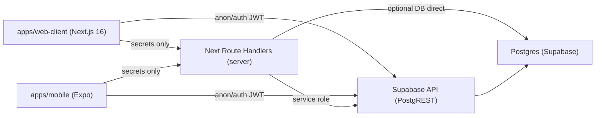

# Plan de sécurisation & refactorisation — Web Client + Mobile

**Référence** : 4 février 2026 (analyse)  
**Dernière mise à jour** : 5 février 2026  
**Scope** : monorepo `apps/web` (admin/partner), `apps/web-client` (public + dashboard), `apps/mobile` (Expo), `packages/core` (schema/types).

Ce document synthétise :
1) les problèmes de sécurité/architecture identifiés dans `docs/ANALYSE_WEB_CLIENT_SECURITY.md`,  
2) les décisions validées,  
3) une architecture cible “best practice 2026” (Next.js 16 + Supabase + Expo),  
4) un plan d’implémentation **ultra détaillé** (MVP → V2).

---

## 0) TL;DR

- **Le problème critique** : `apps/web-client` utilise **Drizzle + connexion Postgres directe** (via `@make-the-change/core/db`) alors que la doc affirme “RLS-only”. Cela crée une incohérence et, surtout, des **risques de fuite** (overfetch).
- **La fuite la plus grave** : des pages publiques chargent `producer: true` (Drizzle relations) et sérialisent en client des champs sensibles (email/téléphone/adresse) du producteur.
- **La cible 2026 choisie** :  
  - `apps/web-client` + `apps/mobile` = **Supabase direct + RLS** (aucun `DATABASE_URL`, aucun Drizzle runtime).  
  - `apps/web` = backoffice (admin + producteurs) avec **RBAC**, Drizzle autorisé côté serveur + Supabase (service role) pour opérations admin.
- **Public data** : contrat via **SQL Views `public_*`** (colonnes explicitement safe) + caching Next.js (`revalidate: 60`).

---

## 1) Décisions validées (verrouillées)

| Sujet | Décision | Notes / motivation |
|---|---|---|
| Mobile data access | **A** : Supabase direct (RLS) | Pas de “BFF obligatoire” pour tout. Les `/api/*` Next servent uniquement aux secrets (Stripe/email/webhooks). |
| Contact producteur | **A** : login requis | Réduit le spam, simplifie le rate limiting, et permet un historique. Email/téléphone **non publics**. |
| Données publiques | **A** : SQL Views `public_*` | Évite les `select *`, empêche les sur-fuites, unifie web + mobile, facilite le caching. |
| Comptes producteur (V1) | **Oui** | Dashboard producteur **web-only V1** dans `apps/web` (role `producer`). |
| Adresse de livraison | **A** : JSON dans `commerce.orders.shipping_address` | Déjà dans le schéma Drizzle. MVP-friendly (normalisation possible plus tard). |
| Déploiement | Vercel | Confirmé. |
| Paiements | Points + € (pas de mix dans la même commande) | Paiement mobile requis (Stripe mobile). Abonnements “peut-être V2”. |
| Push notifications (V1) | Non | À reconsidérer V2. |
| Données publiques profil user | Prénom + initiale, ville/pays, liens sociaux/site, **montant d’impact biodiversité** | Pas d’email, pas de téléphone, pas d’adresse précise. |

> Déféré explicitement : rotation de `SUPABASE_SERVICE_ROLE_KEY` (une clé a été affichée dans des logs précédents). À faire plus tard, mais **à considérer comme prioritaire sécurité** quand tu es prêt.

---

## 2) Constats (sécurité/architecture) — preuves dans le repo

### 2.1 Documentation trompeuse (incohérence critique)
- `apps/web-client/README.md:35` annonce “no DB direct / RLS-only”.
- Réalité : `apps/web-client` importe `@make-the-change/core/db` dans de nombreux fichiers, et `packages/core/src/shared/db/client.ts:15` force `DATABASE_URL`.

**Impact**
- Les développeurs pensent être RLS-only, mais le runtime effectue des requêtes DB directes.
- Risque de bypass RLS selon le user/role de `DATABASE_URL`.
- Complexité + surface d’attaque augmentées.

### 2.2 Fuite PII producteur via overfetch Drizzle (critique)
Des pages publiques font des requêtes avec relations “full object” :
- `apps/web-client/src/app/[locale]/products/page.tsx:38` → `with: { producer: true }`
- `apps/web-client/src/app/[locale]/products/[slug]/page.tsx:43` → `producer: true`
- `apps/web-client/src/app/[locale]/projects/page.tsx:33` → `producer: true`

Or `investment.producers` contient :
- `contact_email`, `contact_phone`, `address_street`, `address_postal_code`, `address_coordinates`, etc. (`packages/core/src/shared/db/schema.ts:207`)

**Pourquoi c’est grave ?**
- Sur App Router, les props passées à un Client Component (`'use client'`) sont sérialisées côté navigateur.
- Exemple concret : `apps/web-client/src/app/[locale]/products/[slug]/product-detail-client.tsx` consomme `producer.*` (et recevrait donc potentiellement des champs sensibles).

### 2.3 API publique qui expose un email (critique)
- `apps/web-client/src/app/api/partners/route.ts:10` renvoie `contact_email`.

**Impact**
- Harvesting d’emails (spam).
- Contradiction avec l’exigence : email/téléphone non publics.

### 2.4 `.select('*')` sur endpoints/pages publiques (risque élevé)
- `apps/web-client/src/app/api/projects/featured/route.ts:5` fait `.select('*')`
- `apps/web-client/src/app/[locale]/projects/[slug]/page.tsx:45` fait `.select('*')`
- `apps/web-client/src/app/[locale]/(dashboard)/layout.tsx:22` fait `.select('*')` sur `profiles` (moins grave mais inutilement large)

**Impact**
- Fuite de futures colonnes (quand le schéma évolue).
- Payloads inutiles → coût/perf.

### 2.5 Session Supabase non rafraîchie côté `web-client`
- `apps/web-client/src/middleware.ts:1` = middleware `next-intl` uniquement.
- Pattern recommandé déjà présent dans `apps/web/src/supabase/middleware.ts` (refresh session via `@supabase/ssr`).

**Impact**
- Sessions SSR instables (cookies non refreshables depuis Server Components).
- Bugs intermittents en prod.

### 2.6 Mobile : variables “server-only” dans `.env.example` (risque)
- `apps/mobile/.env.example:8` mentionne `SUPABASE_SERVICE_ROLE_KEY` (même si “pour parité doc”).

**Règle** : aucune clé service role sur mobile, jamais.

---

## 3) Architecture cible 2026 (best practice)

### 3.1 Principe directeur

**Untrusted clients (web-client + mobile) → Supabase + RLS**  
**Trusted server (admin/partner + webhooks) → service role / DB direct**

Concrètement :
- `apps/web-client` et `apps/mobile` ne doivent **pas** dépendre de `DATABASE_URL`.
- Les accès “public” passent par des **views `public_*`**.
- Les accès “privés” passent par les tables “réelles” avec **RLS**.
- Les opérations “secrets” passent par des **Route Handlers Next** (Node runtime) :
  - création PaymentIntent / EphemeralKey,
  - webhooks Stripe,
  - emails transactionnels (optionnel),
  - tâches admin.

### 3.2 Diagramme (haut niveau)



### 3.3 Positionnement Drizzle (le “mieux” en 2026 pour ton monorepo)

- **Drizzle = source de vérité schéma + types** dans `packages/core/src/shared/db/schema.ts`.
- **Drizzle runtime DB direct** :
  - ✅ autorisé dans `apps/web` (admin/partner) et scripts/migrations,
  - ❌ interdit dans `apps/web-client` et `apps/mobile`.

> Ça répond à ton objectif “utiliser un maximum Drizzle” : tu mutualises le schéma/types pour 3 apps, sans exposer une connexion Postgres dans les apps publiques.

---

## 4) Modèle “Public via Views” (contrat de données)

### 4.1 Pourquoi des views `public_*` ?
- Empêche `select *` et “sur-fuite” quand on fait des joins/relations.
- Stable contract côté client (web + mobile).
- Permet de cacher des colonnes définitivement (email/téléphone/adresse).
- Facilite le caching Next.js (pas de cookies → pages statiques + `revalidate`).

### 4.2 Nommage recommandé

Créer des views dans le schéma `public` (PostgREST friendly) :
- `public.public_products`
- `public.public_product_details` (si besoin)
- `public.public_categories`
- `public.public_projects`
- `public.public_featured_projects`
- `public.public_producers`
- `public.public_user_profiles` (leaderboard + profils publics)

### 4.3 SQL (proposition MVP) — à adapter selon la DB réelle

> Objectif MVP : exposer uniquement ce qui est nécessaire au front.  
> **Toujours filtrer** `deleted_at is null` et `status/is_active`.

#### `public.public_producers` (safe)
```sql
create or replace view public.public_producers
with (security_invoker = true) as
select
  p.id,
  p.slug,
  p.type,
  p.name_default,
  p.description_default,
  p.story_default,
  p.location,
  p.address_city,
  p.address_country_code,
  p.contact_website,
  p.social_media,
  p.certifications,
  p.specialties,
  p.images,
  p.metadata
from investment.producers p
where p.deleted_at is null
  and p.status = 'active';
```

#### `public.public_categories`
```sql
create or replace view public.public_categories
with (security_invoker = true) as
select
  c.id,
  c.slug,
  c.name_default,
  c.description_default,
  c.metadata,
  c.sort_order
from commerce.categories c
where c.is_active is true;
```

#### `public.public_products` (listing)
```sql
create or replace view public.public_products
with (security_invoker = true) as
select
  pr.id,
  pr.slug,
  pr.name_default,
  pr.short_description_default,
  pr.description_default,
  pr.price_points,
  pr.origin_country,
  pr.tags,
  pr.certifications,
  pr.allergens,
  pr.stock_quantity,
  pr.featured,
  pr.is_active,
  pr.created_at,
  pr.category_id,
  pr.producer_id
from commerce.products pr
where pr.deleted_at is null
  and pr.is_active is true;
```

#### `public.public_projects` (listing)
```sql
create or replace view public.public_projects
with (security_invoker = true) as
select
  pj.id,
  pj.slug,
  pj.type,
  pj.name_default,
  pj.description_default,
  pj.long_description_default,
  pj.status,
  pj.featured,
  pj.target_budget,
  pj.current_funding,
  pj.impact_metrics,
  pj.hero_image_url,
  pj.avatar_image_url,
  pj.gallery_image_urls,
  pj.address_city,
  pj.address_country_code,
  pj.producer_id,
  pj.created_at
from investment.projects pj
where pj.deleted_at is null
  and pj.status in ('active', 'completed');
```

#### `public.public_featured_projects`
```sql
create or replace view public.public_featured_projects
with (security_invoker = true) as
select *
from public.public_projects
where featured is true
  and status = 'active';
```

> Notes importantes :
> - `security_invoker` (Postgres 15+) est recommandé pour éviter des surprises de sécurité.  
> - Si non supporté, on doit s’assurer que le propriétaire de la view ne bypass pas RLS.
> - On ajoute ensuite des **GRANT** explicites (voir section 4.4).

### 4.4 Grants (MVP)

But : autoriser `anon` à lire les views publiques, sans accès aux tables sensibles.

Exemple :
```sql
grant select on public.public_products to anon, authenticated;
grant select on public.public_projects to anon, authenticated;
grant select on public.public_producers to anon, authenticated;
grant select on public.public_categories to anon, authenticated;
grant select on public.public_featured_projects to anon, authenticated;
```

---

## 5) RLS (privé, user-scoped, producer-scoped)

### 5.1 Tables “user-owned” (V1)

Tables concernées (selon schéma Drizzle) :
- `public.profiles` (profil utilisateur)
- `investment.investments` (investissements)
- `commerce.orders` + `commerce.order_items` (commandes boutique)
- `commerce.subscriptions` (si utilisé en V1)

**Règles**
- Utilisateur authentifié peut :  
  - `select/update` son propre `profiles.id = auth.uid()`
  - `select/insert` ses `investments.user_id = auth.uid()`
  - `select/insert` ses `orders.user_id = auth.uid()` (en pratique, insert souvent via server pour paiements)
  - `select` ses `order_items` via join sur `orders.user_id`
- Admin/service role : accès complet.

### 5.2 Producer dashboard (V1, web-only dans `apps/web`)

Règle métier validée : un producteur doit voir les commandes contenant **ses produits**, et accéder aux infos nécessaires à l’expédition.

**Meilleure pratique (recommandée)** : ne pas donner accès direct à `commerce.orders` aux producteurs.  
Créer une view “partner” dédiée (ex: `public.partner_order_items`) qui expose :
- order_id, created_at, status,
- shipping_address,
- product_snapshot / product name,
- quantity,
- éventuellement buyer name (si autorisé), mais pas email/téléphone.

On filtre par `producer.owner_user_id = auth.uid()` (ou via role `producer` + mapping).

---

## 6) Plan de refactorisation / implémentation (ultra complet)

> Format : chaque phase inclut **objectifs**, **tâches**, **acceptance criteria**, **fichiers impactés**, et **risques**.

### Phase P0 — Stopper les fuites & remettre la sécurité “au vert” (urgent)

**Objectifs**
- Aucune donnée sensible producteur ne doit fuiter côté public.
- Aucune route publique ne doit exposer email/téléphone.
- Réduire `select('*')`.
- Préparer la transition vers views `public_*`.

**Tâches**
1. **Bloquer l’overfetch Drizzle** (patch immédiat si Drizzle reste temporairement) :
   - Remplacer `producer: true` par `producer: { columns: { ... } }` en ne gardant que :
     - `id, slug, name_default, description_default, address_city, address_country_code, location, contact_website, social_media, images, metadata`
   - Idem pour `projects.page.tsx`.
2. **Sécuriser `/api/partners`** :
   - Supprimer `contact_email` de la réponse.
   - Rebaser sur la view `public.public_producers` dès qu’elle existe.
3. **Réduire les `select('*')`** :
   - `apps/web-client/src/app/api/projects/featured/route.ts` : utiliser `public.public_featured_projects` ou `.select('id, slug, name_default, ...')`.
   - `apps/web-client/src/app/[locale]/projects/[slug]/page.tsx` : remplacer par une sélection stricte.
   - `apps/web-client/src/app/[locale]/(dashboard)/layout.tsx` : remplacer `.select('*')` par les champs strictement nécessaires au sidebar.
4. **Mobile env** :
   - Retirer `SUPABASE_SERVICE_ROLE_KEY` de `apps/mobile/.env.example` (risque de copier-coller).
5. **Middleware Supabase session** :
   - Composer `next-intl` middleware avec `@supabase/ssr` session refresh dans `apps/web-client/src/middleware.ts`.

**Acceptance criteria**
- Impossible de récupérer `contact_email` via une route publique.
- Sur une page produit/projet publique, aucun champ sensible du producteur n’apparaît dans le HTML/JSON hydraté.
- Les pages publiques principales n’ont plus de `select('*')`.
- `apps/mobile/.env.example` ne contient pas de service role.

**Fichiers principalement impactés**
- `apps/web-client/src/app/[locale]/products/page.tsx`
- `apps/web-client/src/app/[locale]/products/[slug]/page.tsx`
- `apps/web-client/src/app/[locale]/projects/page.tsx`
- `apps/web-client/src/app/api/partners/route.ts`
- `apps/web-client/src/app/api/projects/featured/route.ts`
- `apps/web-client/src/app/[locale]/projects/[slug]/page.tsx`
- `apps/web-client/src/app/[locale]/(dashboard)/layout.tsx`
- `apps/web-client/src/middleware.ts`
- `apps/mobile/.env.example`

**Risques**
- Patch Drizzle “columns only” est transitoire : la vraie cible est `public_*` + Supabase RLS-only.

---

### Phase P1 — “Public via Views” (contrat stable + caching)

**Objectifs**
- Créer les views `public_*` (produits, projets, producteurs, catégories, featured).
- Mettre `apps/web-client` et `apps/mobile` sur ces views pour toute donnée publique.
- Préparer caching `revalidate: 60` côté Next.

**Tâches DB (SQL Editor Supabase au début, migration plus tard)**
1. Créer views :
   - `public.public_producers`
   - `public.public_categories`
   - `public.public_products`
   - `public.public_projects`
   - `public.public_featured_projects`
2. Ajouter grants `anon/authenticated`.
3. Ajouter indexes utiles sur tables sources (si manquants) :
   - `commerce.products (slug)`, `(category_id)`, `(producer_id)`, `GIN(tags)` si recherche tags.
   - `investment.projects (slug)`, `(status)`, `(featured)`.
   - `investment.producers (slug)`, `(status)`.

**Tâches App**
1. `apps/web-client` : rebaser pages publiques sur Supabase **public client** (sans cookies) :
   - `/products`, `/products/[slug]`, `/projects`, `/api/projects/featured` (ou supprimer l’API au profit du direct).
2. `apps/mobile` : rebaser `fetchFeaturedProjects()` sur Supabase direct (view `public_featured_projects`) au lieu de l’API Next.
3. Caching Next :
   - Pour les pages publiques, éviter `cookies()`/`headers()` et utiliser fetch avec `next: { revalidate: 60 }` (ou `unstable_cache`).

**Acceptance criteria**
- Les pages publiques ne dépendent plus de Drizzle.
- Les pages publiques supportent un revalidate stable (60s).
- Mobile n’appelle plus `/api/projects/featured` si on choisit le direct.

---

### Phase P2 — Web-client “RLS-only” (dashboard + data privée)

**Objectifs**
- Remplacer toutes les requêtes Drizzle du dashboard par Supabase (RLS).
- Supprimer le besoin de `DATABASE_URL` dans `apps/web-client`.

**Tâches**
1. Remplacer Drizzle par Supabase pour :
   - `dashboard/investments` (table `investment.investments` + join project via select)
   - `dashboard/orders` (table `commerce.orders` + join items/products)
   - `dashboard/points` (stop déduction depuis orders ; voir P5)
   - `dashboard/profile` (profil + stats)
2. Séparer clients Supabase :
   - `createServerClient` (avec cookies) pour pages SSR auth.
   - `createBrowserClient` pour actions client (upload, etc.).
   - `publicServerClient` (sans cookies) pour pages publiques.
3. Réparer les types : créer des “DTO” de page (types TS) pour éviter de sérialiser des colonnes inutiles.
4. Mettre à jour `apps/web-client/README.md` (aligner doc sur la réalité/cible).

**Acceptance criteria**
- `apps/web-client` ne contient plus d’import `@make-the-change/core/db`.
- En production, `apps/web-client` ne requiert pas `DATABASE_URL`.

---

### Phase P3 — Auth & UX mobile (Expo) + parité fonctionnelle web-client

**Objectifs**
- Auth Supabase dans Expo (session persistée via SecureStore).
- CRUD via Supabase direct (RLS).

**Tâches**
1. Implémenter un client Supabase mobile :
   - stocker refresh token dans `expo-secure-store`.
2. Ecrans V1 :
   - login/register/forgot password (parité web-client),
   - liste projets/produits (views `public_*`),
   - profil user (public + privé),
   - historique investissements/commandes (RLS).
3. Ne pas embarquer de secrets (service role, stripe secret) dans l’app.

---

### Phase P4 — Contact producteur (login requis) — sans exposer email/téléphone

**Objectifs**
- “Contacter le producteur” sans publier `contact_email`.

**Tâches DB**
1. Créer `public.producer_messages` (ou `commerce.producer_messages`) :
   - `id`, `producer_id`, `sender_user_id`, `message`, `created_at`, `status`, `metadata`.
2. RLS :
   - authenticated insert si `sender_user_id = auth.uid()`
   - producer select si le producer est lié au user (via `investment.producers.owner_user_id = auth.uid()`)
   - admin select all

**Tâches App**
- Web-client + mobile : form “envoyer message” (requires auth).
- `apps/web` (producer dashboard) : inbox messages (liste + détail + statut).

**Option V2**
- Email notifications (Resend) via Route Handler server (service role).

---

### Phase P5 — Paiements (Stripe) + points

**Objectifs**
- Support € sur web et mobile (Stripe).
- Support points (ledger) sans hack.
- Pas de mix points+€ dans une commande.

**Tâches**
1. Modéliser une table ledger :
   - `commerce.points_ledger` (id, user_id, delta, reason, ref_type/ref_id, created_at)
   - Un solde “materialized” dans `profiles.metadata.points_balance` ou colonne dédiée (à décider).
2. Web :
   - Route Handler : create PaymentIntent (Node runtime).
   - Webhook Stripe : valider event + marquer `orders/investments` + créditer points.
3. Mobile :
   - PaymentSheet : endpoint server pour ephemeral key + customer + PaymentIntent.
4. Sécurité :
   - toutes les écritures “argent” passent par server + webhooks (pas direct client).

---

### Phase P6 — Leaderboard + profils publics

**Objectifs**
- Profil public “prénom + initiale”, avatar/cover, ville/pays, **impact biodiversité**.
- Leaderboard public (top N + rang user).

**Tâches DB**
1. Définir l’“impact biodiversité” :
   - MVP : score calculé à partir du ledger points + nb projets + métriques projet (à figer).
   - Prévoir une colonne `impact_biodiversity` (numeric) ou view calculée.
2. Créer `public.public_user_profiles` :
   - `id`, `display_name`, `avatar_url`, `cover_url`, `city`, `country`, `impact_biodiversity`, `impact_score`, `rank`.

**Tâches App**
- `apps/web-client/src/app/[locale]/leaderboard/page.tsx` : remplacer mock par view.
- `apps/web-client/src/app/[locale]/profile/[id]/page.tsx` : remplacer mock + Drizzle par view.

---

### Phase P7 — Durcissement & ops (après MVP)

1. Rotation des clés Supabase (service role) + audit des logs.
2. Versionner SQL (views + RLS + indexes) :
   - `supabase/migrations/*` (Supabase CLI) **ou**
   - `packages/core/db/migrations/*` (Drizzle) + doc d’exécution.
3. Rate limiting sur endpoints server (Stripe, emails).
4. Observabilité : Sentry / logs structurés / alerting.

---

## 7) Checklist de validation (avant prod)

- [ ] Aucune page publique ne sérialise des champs sensibles producteur.
- [ ] Aucune route publique ne contient email/téléphone.
- [ ] `apps/web-client` build sur Vercel sans `DATABASE_URL`.
- [ ] RLS actif sur tables privées + tests manuels (anon vs authenticated).
- [ ] Mobile build : aucune clé secrète dans le bundle.
- [ ] Stripe webhooks vérifiés (signature) + idempotence.

---

## 8) Questions restantes (à décider plus tard)

1. Définition finale “impact biodiversité” (formule + unité).
2. Leaderboard : fréquence de recalcul (view vs materialized view + cron).
3. Normalisation adresses (V2) et multi-producer shipping (V2).
4. Notifications email/push (V2).

