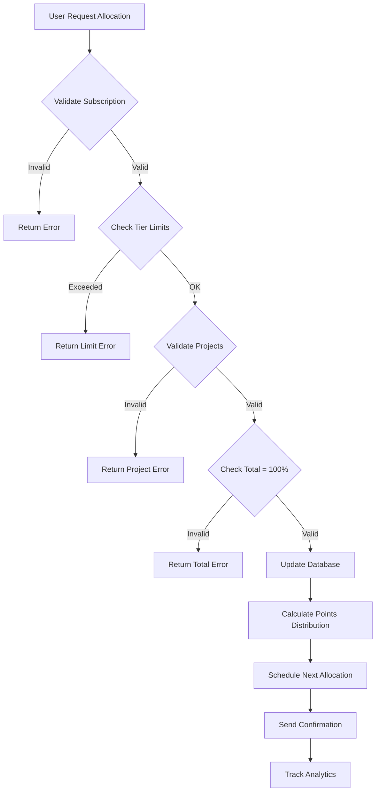

# Workflow: Allocation Flexible Ambassadeur - Make the CHANGE

> Historique 2024/2025 — à revalider en 2026.

## Objective
Enable Ambassadeur users to flexibly allocate their monthly subscription points across multiple projects with validation and limits based on tier.

## Steps
1) **Validation Phase**
   - Verify user has active Ambassadeur subscription
   - Check subscription tier limits (Standard: 10 projects, Premium: unlimited)
   - Validate all target projects exist and are active
   - Ensure total allocation equals 100% (if validateTotal=true)

2) **Allocation Update**
   - Update project_allocation JSONB in subscriptions table
   - Calculate points distribution for next billing cycle
   - Store allocation metadata (lastModified, priority levels)

3) **Points Distribution**
   - Calculate monthly points based on tier and billing frequency
   - Distribute points according to percentages
   - Schedule points allocation for next billing cycle
   - Update user's allocation preferences

4) **Notification & Analytics**
   - Send confirmation to user about allocation changes
   - Track allocation patterns for analytics
   - Log allocation history for audit trail

## Failure Paths
- **Invalid subscription** → Return SUBSCRIPTION_INACTIVE error
- **Project not found** → Return PROJECT_NOT_FOUND with specific project ID
- **Allocation limit exceeded** → Return ALLOCATION_LIMIT_EXCEEDED with tier limits
- **Invalid total** → Return INVALID_ALLOCATION_TOTAL with current percentage

## Business Rules

### Tier Limits
```typescript
const ALLOCATION_LIMITS = {
  ambassadeur_standard: {
    maxProjects: 10,
    minAllocationPerProject: 5, // 5% minimum
  },
  ambassadeur_premium: {
    maxProjects: 999, // Unlimited
    minAllocationPerProject: 1, // 1% minimum
  }
} as const
```

### Points Calculation
```typescript
// Monthly points based on tier and frequency
const MONTHLY_POINTS = {
  ambassadeur_standard: {
    monthly: 24, // €18 * 1.33 bonus
    annual: 21,  // €180/12 * 1.4 bonus
  },
  ambassadeur_premium: {
    monthly: 40, // €32 * 1.25 bonus  
    annual: 40,  // €320/12 * 1.5 bonus
  }
} as const
```

### Validation Rules
```typescript
interface AllocationValidation {
  totalMustEqual100: boolean
  maxProjectsPerTier: number
  minPercentagePerProject: number
  onlyActiveProjects: boolean
  preventDuplicateProjects: boolean
}
```

## Security
- **User ownership** : Verify subscription belongs to authenticated user
- **Project access** : Ensure all target projects are publicly available
- **Rate limiting** : Max 10 allocation updates per hour per user
- **Audit trail** : Log all allocation changes with timestamps

## Diagram


## Implementation Details

### Database Operations
```sql
-- Update allocation in subscriptions table
UPDATE subscriptions 
SET project_allocation = '{
  "allocations": [
    {"projectId": "proj_1", "percentage": 40, "priority": "high"},
    {"projectId": "proj_2", "percentage": 35, "priority": "medium"},
    {"projectId": "proj_3", "percentage": 25, "priority": "low"}
  ],
  "lastModified": "2025-01-15T10:30:00Z",
  "totalAllocated": 100,
  "maxProjects": 10
}'
WHERE id = $1 AND user_id = $2;

-- Create allocation history record
INSERT INTO subscription_allocation_history (
  subscription_id, allocation_data, changed_by, change_reason
) VALUES ($1, $2, $3, $4);
```

### Points Distribution Logic
```typescript
export function calculatePointsDistribution(
  allocations: ProjectAllocation[],
  monthlyPoints: number
): AllocationResult[] {
  return allocations.map(allocation => ({
    projectId: allocation.projectId,
    percentage: allocation.percentage,
    pointsAllocated: Math.round((monthlyPoints * allocation.percentage) / 100),
    priority: allocation.priority,
    effectiveDate: getNextBillingDate(),
  }))
}
```

## Error Recovery
- **Partial failure** : Rollback all changes if any validation fails
- **Database timeout** : Retry with exponential backoff (max 3 attempts)
- **Points calculation error** : Use safe defaults and log for manual review

## Performance Considerations
- **Query optimization** : Use indexes on (user_id, status) for subscriptions
- **JSONB operations** : Efficient updates using PostgreSQL JSONB operators
- **Caching** : Cache allocation data for 5 minutes to reduce DB load

## Monitoring & Observability
```typescript
// Metrics to track
interface AllocationMetrics {
  allocationUpdatesPerDay: number
  averageProjectsPerUser: number
  allocationDistribution: Record<number, number> // percentage -> user_count
  tierUsagePatterns: {
    standard: AllocationPattern
    premium: AllocationPattern
  }
  conversionToAnnual: number // After allocation feature usage
}

// Events to log
const ALLOCATION_EVENTS = [
  'allocation_updated',
  'allocation_validation_failed', 
  'tier_limit_reached',
  'project_allocation_optimized',
  'annual_conversion_after_allocation'
] as const
```

## Success Metrics
- **Allocation adoption** : >60% of Ambassadeurs use flexible allocation within 30 days
- **Engagement increase** : +25% project engagement after allocation setup
- **Conversion boost** : +15% monthly→annual conversion after allocation usage
- **User satisfaction** : >4.5/5 rating for allocation feature

---

**⚡ Implementation Priority:** HIGH - Core Ambassadeur feature
**🧪 Test Coverage Target:** 95% - Financial logic critical
**📈 Performance Target:** <200ms allocation updates
**💰 Business Impact:** Direct correlation with subscription retention
