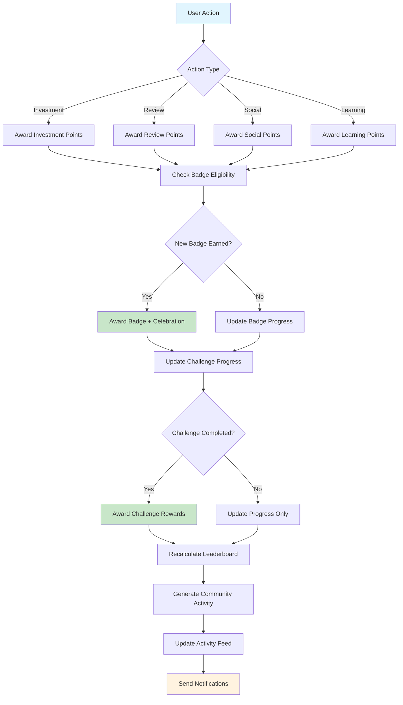

# Workflow: Gamification Flow - Make the CHANGE

## Objective
Orchestrate the complete gamification experience from user actions to rewards, badges, and community recognition to maximize engagement and retention.

## Steps

### 1) **User Action Detection**
   - Monitor user activities across all touchpoints
   - Classify actions by type (investment, review, social, learning)
   - Validate action authenticity and eligibility
   - Queue actions for gamification processing

### 2) **Points & Rewards Calculation**
   - Calculate base points for action type
   - Apply streak bonuses and multipliers
   - Check daily/weekly limits
   - Award points with proper expiration (18 months)

### 3) **Badge Eligibility Check**
   - Evaluate user against all badge criteria
   - Identify newly eligible badges
   - Auto-award badges when criteria met
   - Generate celebration notifications

### 4) **Challenge Progress Update**
   - Update active challenge progress
   - Validate challenge completion evidence
   - Award challenge rewards
   - Generate completion celebrations

### 5) **Leaderboard Update**
   - Recalculate user impact score
   - Update leaderboard rankings
   - Cache updated positions
   - Notify significant rank changes

### 6) **Community Activity Generation**
   - Auto-generate activity posts for achievements
   - Apply privacy settings
   - Feature high-impact activities
   - Update activity feed

## Failure Paths
- **Action validation fails** → Log for manual review, continue processing
- **Points award fails** → Queue for retry, notify admin
- **Badge award fails** → Queue for retry, maintain user experience
- **Challenge update fails** → Rollback progress, retry later
- **Leaderboard calculation fails** → Use cached data, schedule refresh

## Business Rules

### Action Points Matrix
```typescript
const ACTION_POINTS = {
  investment: {
    ruche: 100,
    olivier: 150, 
    parcelle_familiale: 300,
  },
  review: {
    standard: 5,
    quality: 15, // 50+ words + photo
  },
  social: {
    share: 5,
    share_with_conversion: 25,
    referral_conversion: 100,
    activity_like_received: 1,
  },
  learning: {
    quiz_completion: 5, // min 80% score
    content_engagement: 1, // min 30s
    project_check_in: 2,
  }
} as const
```

### Badge Categories & Progression
```typescript
const BADGE_PROGRESSION = {
  investment: [
    { threshold: 1, name: 'Premier Pas', points: 50, rarity: 'common' },
    { threshold: 5, name: 'Protecteur des Abeilles', points: 200, rarity: 'rare' },
    { threshold: 10, name: 'Champion Biodiversité', points: 500, rarity: 'epic' },
    { threshold: 25, name: 'Gardien des Écosystèmes', points: 1000, rarity: 'legendary' },
  ],
  social: [
    { threshold: 1, name: 'Premier Avis', points: 25, rarity: 'common' },
    { threshold: 10, name: 'Critique de Qualité', points: 150, rarity: 'rare' },
    { threshold: 5, name: 'Bâtisseur de Communauté', points: 500, rarity: 'epic' },
  ],
  engagement: [
    { threshold: 7, name: 'Apprenant Assidu', points: 100, rarity: 'rare' },
    { threshold: 30, name: 'Expert Biodiversité', points: 300, rarity: 'epic' },
  ]
} as const
```

### Challenge Generation Rules
```typescript
const CHALLENGE_RULES = {
  weekly: {
    maxActive: 3,
    categories: ['discovery', 'engagement', 'community'],
    difficultyDistribution: { easy: 0.5, medium: 0.3, hard: 0.2 },
    personalizedRatio: 0.4, // 40% personalized challenges
  },
  monthly: {
    maxActive: 2,
    categories: ['milestone', 'social'],
    requiresHigherCommitment: true,
    rewardMultiplier: 2.0,
  }
} as const
```

## Security & Privacy

### Data Protection
- **User privacy** : Only show first name + last initial in public contexts
- **Content moderation** : Auto-moderate reviews and activity posts
- **Referral fraud prevention** : IP tracking, device fingerprinting, velocity limits
- **Points manipulation** : Validate all point-earning actions, audit trail

### Rate Limiting
```typescript
const RATE_LIMITS = {
  review_creation: { limit: 5, window: '24h' },
  share_generation: { limit: 10, window: '24h' },
  referral_uses: { limit: 50, window: '24h' },
  activity_likes: { limit: 100, window: '1h' },
  badge_checks: { limit: 20, window: '1h' },
} as const
```

## Diagram


## Implementation Details

### Action Processing Pipeline
```typescript
export class GamificationFlowProcessor {
  async processUserAction(action: UserAction): Promise<GamificationResult> {
    const processingId = generateUUID()
    
    try {
      // 1. Validate action
      const validatedAction = await this.validateAction(action)
      
      // 2. Calculate and award points
      const pointsResult = await this.processPointsReward(validatedAction)
      
      // 3. Check and award badges
      const badgeResult = await this.processBadgeChecks(action.userId)
      
      // 4. Update challenge progress
      const challengeResult = await this.processChallengeUpdates(action.userId, validatedAction)
      
      // 5. Update leaderboard
      const leaderboardResult = await this.updateLeaderboardPosition(action.userId)
      
      // 6. Generate community activity
      const activityResult = await this.generateCommunityActivity(validatedAction, {
        pointsEarned: pointsResult.amount,
        badgesEarned: badgeResult.newBadges,
        challengesCompleted: challengeResult.completedChallenges,
      })
      
      // 7. Send notifications
      await this.sendGamificationNotifications(action.userId, {
        points: pointsResult,
        badges: badgeResult,
        challenges: challengeResult,
        leaderboard: leaderboardResult,
      })
      
      return {
        success: true,
        processingId,
        results: {
          points: pointsResult,
          badges: badgeResult,
          challenges: challengeResult,
          leaderboard: leaderboardResult,
          activity: activityResult,
        }
      }
      
    } catch (error) {
      await this.handleProcessingFailure(processingId, action, error)
      throw error
    }
  }

  private async validateAction(action: UserAction): Promise<ValidatedAction> {
    switch (action.type) {
      case 'investment':
        return await this.validateInvestmentAction(action)
      case 'review':
        return await this.validateReviewAction(action)
      case 'social_share':
        return await this.validateShareAction(action)
      case 'quiz_completion':
        return await this.validateQuizAction(action)
      default:
        throw new Error(`Unknown action type: ${action.type}`)
    }
  }
}
```

### Background Processing
```typescript
export class GamificationBackgroundProcessor {
  async processDailyGamificationTasks(): Promise<void> {
    // Process badge eligibility for all users
    await this.batchProcessBadgeEligibility()
    
    // Update challenge statuses
    await this.updateChallengeStatuses()
    
    // Refresh leaderboard cache
    await this.refreshLeaderboardCache()
    
    // Clean up expired data
    await this.cleanupExpiredGamificationData()
  }

  private async batchProcessBadgeEligibility(): Promise<void> {
    const batchSize = 100
    let offset = 0
    
    while (true) {
      const users = await this.db.user.findMany({
        where: { userLevel: { not: 'admin' } },
        select: { id: true },
        take: batchSize,
        skip: offset,
      })
      
      if (users.length === 0) break
      
      await Promise.all(
        users.map(user => this.gamificationService.badges.checkEligibility(user.id))
      )
      
      offset += batchSize
      
      // Rate limiting to avoid DB overload
      await new Promise(resolve => setTimeout(resolve, 100))
    }
  }
}
```

## Error Recovery & Resilience

### Compensation Strategies
```typescript
export class GamificationErrorRecovery {
  async compensateFailedRewards(userId: string, failedAction: UserAction): Promise<void> {
    // Award makeup points for failed processing
    const makeupPoints = this.calculateMakeupPoints(failedAction)
    
    await this.pointsService.awardGamificationPoints(
      userId,
      'compensation',
      makeupPoints,
      `Compensation for processing error: ${failedAction.type}`,
      failedAction.id
    )
    
    // Send apology notification with bonus
    await this.notificationService.sendCompensationNotification(userId, {
      points: makeupPoints,
      reason: 'technical_error',
      bonusGift: 'exclusive_badge_progress',
    })
  }

  async recoverFromBadgeAwardFailure(userId: string, badgeId: string): Promise<void> {
    // Check if badge was actually awarded despite error
    const existingBadge = await this.db.userBadge.findUnique({
      where: {
        userId_badgeId: { userId, badgeId }
      }
    })
    
    if (!existingBadge) {
      // Re-attempt badge award
      await this.gamificationService.badges.awardBadge(userId, badgeId)
    }
    
    // Ensure celebration was triggered
    await this.ensureBadgeCelebrationDelivered(userId, badgeId)
  }
}
```

## Performance Monitoring

### Real-time Metrics
```typescript
interface GamificationPerformanceMetrics {
  processing: {
    averageActionProcessingTime: number // ms
    actionProcessingThroughput: number // actions/second
    failureRate: number // %
    retrySuccessRate: number // %
  }
  
  database: {
    badgeQueryPerformance: number // ms
    leaderboardQueryPerformance: number // ms
    challengeQueryPerformance: number // ms
    cacheHitRate: number // %
  }
  
  user_experience: {
    badgeCelebrationDeliveryRate: number // %
    notificationDeliveryTime: number // ms
    leaderboardFreshness: number // minutes
    challengeUpdateLatency: number // ms
  }
}
```

---

**⚡ Implementation Priority:** HIGH (V1) - Core engagement system
**🧪 Test Coverage Target:** 95% - User experience critical
**📈 Performance Target:** <200ms action processing
**🎮 Engagement Goal:** +40% user retention through gamification
