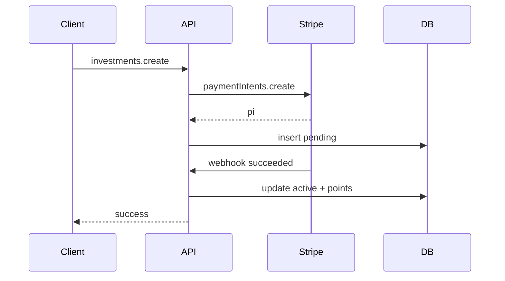

# Workflow: Investment Flow - Make the CHANGE

## Objective
User invests in a specific project; payment via Stripe Payment Intent; award points and tracking IDs.

## Steps
1) Client requests `investments.create` with projectId, type, amount, paymentMethodId.
2) API validates price/type; create Stripe PI (idempotent).
3) Persist pending investment with PI id.
4) Stripe webhook `payment_intent.succeeded` confirms → mark active, generate points, update funding, send confirmation.

## Failure Paths
- Payment fails → mark failed; inform user.
- Webhook retry → idempotent check on eventId.

## Diagrams

