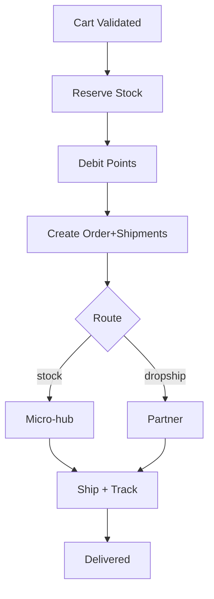

# Workflow: Order Fulfillment (Hybrid) - Make the CHANGE

## Objective
Create an order paid with points; route items between micro-hub stock and partner dropship; ship and track.
Status: Planned (inventory/shipments tables not yet in Drizzle schema).

## Steps
1) Validate cart; compute totals and shipping.
2) Txn: reserve micro-stock; debit points; create order+items; create shipments.
3) Notify warehouse/partner; generate shipping labels as needed.
4) Update shipment status; on delivered → close order.

## Failure Paths
- Stock race → release reservations; refund points; inform user.
- Partner API fail → retry with backoff; manual intervention flag.

## Diagram

## Shipping Policy (MVP)
- Ambassadeur actif: livraison gratuite (0 points) par défaut.
- MVP: livraison gratuite pour tous (peut évoluer via feature flag / config).
