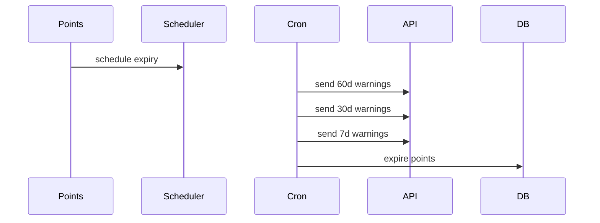

# Workflow: Points Expiry - Make the CHANGE

## Objective
Manage 18-month expiry with proactive warnings and automatic expiration.
Status: Planned (requires points tables not yet in Drizzle schema).

## Steps
1) On points earn: compute `expires_at`; insert expiry schedule record.
2) Cron jobs: send warnings at 60/30/7 days; mark flags to avoid duplicates.
3) Expiry job: on/after `expires_at` → create `expired` transaction; recalc balance.

## Failure Paths
- Notification provider down → retry next run; record failures.

## Data (planned)
- Tables: points_transactions, points_expiry_schedule; view: user_points_summary.

## Diagram

