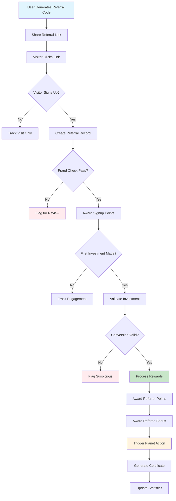

# Workflow: Referral Conversion Flow - Make the CHANGE

## Objective
Process complete referral journey from code sharing to conversion rewards, including planet action triggers and fraud prevention.

## Steps

### 1) **Referral Code Generation**
   - Generate unique 8-character code (MTC + 8 alphanumeric)
   - Validate uniqueness across all existing codes
   - Store in user_referral_codes table
   - Create tracking URL with embedded analytics

### 2) **Referral Link Sharing**
   - User shares referral link via social media, email, or direct
   - Track sharing method and platform
   - Generate personalized share cards with referral code
   - Monitor share performance and click-through rates

### 3) **Visitor Tracking**
   - Track referral link visits with anonymous analytics
   - Store visitor metadata (user agent, IP, timestamp)
   - Create referral tracking record
   - Set 30-day conversion window cookie

### 4) **Signup Conversion**
   - New user signs up using referral link
   - Link new user account to referral code
   - Create referral record with 'signup' status
   - Award initial tracking points to referrer

### 5) **Investment Conversion**
   - New user makes first investment or subscription
   - Validate conversion authenticity (fraud checks)
   - Process referral rewards for both parties
   - Trigger planet action (tree planting)

### 6) **Reward Distribution**
   - Award 100 points to referrer
   - Award 10% bonus to referee on first investment
   - Generate tree planting certificate
   - Update referral statistics and leaderboard

## Failure Paths
- **Code generation collision** → Regenerate with different algorithm
- **Fraud detection triggered** → Flag for manual review, hold rewards
- **Payment processing fails** → Queue for retry, notify admin
- **Planet action fails** → Use backup action, generate manual certificate

## Business Rules

### Referral Rewards Structure
```typescript
const REFERRAL_REWARDS = {
  referrer: {
    signup: 10, // points when referee signs up
    firstInvestment: 100, // points when referee invests
    subscription: 150, // points when referee subscribes
    maxRewardsPerMonth: 1000, // anti-abuse limit
  },
  referee: {
    signupBonus: 20, // welcome points
    firstInvestmentBonus: 0.1, // 10% of investment amount
    subscriptionBonus: 0.05, // 5% of first subscription
    maxBonusAmount: 50, // €50 max bonus
  },
  planetAction: {
    triggerThreshold: 1, // 1 conversion = 1 tree
    partnerOrganization: 'ILANGA Madagascar',
    certificateGeneration: true,
    realTreePlanting: true,
  }
} as const
```

### Fraud Prevention Rules
```typescript
const FRAUD_PREVENTION = {
  ipLimits: {
    maxConversionsPerIP: 3,
    maxSignupsPerIP: 5,
    timeWindow: 24 * 60 * 60 * 1000, // 24 hours
  },
  deviceLimits: {
    maxConversionsPerDevice: 2,
    fingerprintTracking: true,
    behaviorAnalysis: true,
  },
  velocityLimits: {
    maxReferralsPerUser: 50, // per month
    maxConversionsPerUser: 10, // per month
    suspiciousPatternDetection: true,
  },
  validation: {
    requireEmailVerification: true,
    requirePhoneVerification: false, // MVP
    minimumAccountAge: 0, // No minimum for MVP
    minimumInvestmentAmount: 25, // €25 minimum for rewards
  }
} as const
```

## Security Measures

### Data Protection
- **PII handling** : Anonymize visitor data after 90 days
- **Referral codes** : Non-sequential generation, collision detection
- **Conversion tracking** : GDPR-compliant analytics, user consent
- **Fraud detection** : ML-based pattern recognition, manual review queue

### Rate Limiting
```typescript
const RATE_LIMITS = {
  codeGeneration: { limit: 1, window: '24h' }, // One code per day
  linkSharing: { limit: 50, window: '1h' },
  conversionProcessing: { limit: 10, window: '1h' },
  planetActions: { limit: 5, window: '1h' }, // Prevent abuse
} as const
```

## Diagram


## Implementation Details

### Referral Code Algorithm
```typescript
export class ReferralCodeGenerator {
  private readonly ALPHABET = 'ABCDEFGHIJKLMNOPQRSTUVWXYZ0123456789'
  private readonly CODE_LENGTH = 8
  private readonly PREFIX = 'MTC'

  async generateUniqueCode(): Promise<string> {
    let attempts = 0
    const maxAttempts = 100
    
    while (attempts < maxAttempts) {
      const code = this.generateCode()
      const exists = await this.checkCodeExists(code)
      
      if (!exists) {
        return code
      }
      
      attempts++
    }
    
    throw new Error('Failed to generate unique referral code after 100 attempts')
  }

  private generateCode(): string {
    let code = this.PREFIX
    
    for (let i = 0; i < this.CODE_LENGTH; i++) {
      const randomIndex = Math.floor(Math.random() * this.ALPHABET.length)
      code += this.ALPHABET[randomIndex]
    }
    
    return code
  }

  private async checkCodeExists(code: string): Promise<boolean> {
    const existing = await this.db.userReferralCode.findUnique({
      where: { referralCode: code }
    })
    return !!existing
  }
}
```

### Planet Action Integration
```typescript
export class PlanetActionProcessor {
  private readonly ILANGA_API_CONFIG = {
    baseUrl: 'https://api.ilanga-madagascar.org',
    apiKey: process.env.ILANGA_API_KEY,
    projectId: 'make-the-change-reforestation',
  } as const

  async triggerTreePlanting(referralId: string): Promise<PlanetAction> {
    // Call ILANGA API to plant tree
    const treePlantingResult = await this.callIlangaAPI({
      action: 'plant_tree',
      project: this.ILANGA_API_CONFIG.projectId,
      sponsor: 'Make the CHANGE',
      referenceId: referralId,
    })
    
    // Generate certificate
    const certificate = await this.generateTreeCertificate({
      treeId: treePlantingResult.treeId,
      location: treePlantingResult.location,
      plantedDate: new Date(),
      sponsoredBy: 'Make the CHANGE Community',
    })
    
    // Store planet action record
    const planetAction = await this.db.planetAction.create({
      data: {
        referralId,
        type: 'tree_planted',
        description: `Arbre planté à ${treePlantingResult.location.region}, Madagascar`,
        location: treePlantingResult.location,
        certificateId: certificate.id,
        certificateUrl: certificate.url,
        status: 'completed',
        completedAt: new Date(),
        partnerData: treePlantingResult,
      }
    })
    
    return planetAction
  }

  private async generateTreeCertificate(data: TreeCertificateData): Promise<Certificate> {
    // Generate PDF certificate with tree details
    const certificateBuffer = await this.generateCertificatePDF({
      template: 'tree_planting',
      data: {
        treeId: data.treeId,
        location: `${data.location.region}, Madagascar`,
        plantedDate: data.plantedDate.toLocaleDateString('fr-FR'),
        sponsoredBy: data.sponsoredBy,
        coordinates: `${data.location.lat}, ${data.location.lng}`,
      }
    })
    
    // Upload to secure storage
    const certificateUrl = await this.uploadCertificate(certificateBuffer, data.treeId)
    
    return {
      id: generateUUID(),
      url: certificateUrl,
      treeId: data.treeId,
      generatedAt: new Date(),
    }
  }
}
```

## Analytics & Insights

### Conversion Funnel Analysis
```typescript
export class ReferralAnalytics {
  async calculateConversionFunnel(period: TimePeriod): Promise<ConversionFunnel> {
    const dateRange = this.calculatePeriodRange(period)
    
    // Funnel stages
    const visits = await this.countReferralVisits(dateRange)
    const signups = await this.countReferralSignups(dateRange)
    const firstInvestments = await this.countReferralInvestments(dateRange)
    const subscriptions = await this.countReferralSubscriptions(dateRange)
    
    return {
      stages: {
        visits: { count: visits, percentage: 100 },
        signups: { count: signups, percentage: (signups / visits) * 100 },
        firstInvestments: { count: firstInvestments, percentage: (firstInvestments / signups) * 100 },
        subscriptions: { count: subscriptions, percentage: (subscriptions / signups) * 100 },
      },
      overallConversionRate: (firstInvestments / visits) * 100,
      viralCoefficient: await this.calculateViralCoefficient(dateRange),
      averageTimeToConversion: await this.calculateAverageTimeToConversion(dateRange),
    }
  }

  async identifyTopReferrers(period: TimePeriod, limit: number = 10): Promise<TopReferrer[]> {
    return await this.db.user.findMany({
      where: {
        referrals: {
          some: {
            status: 'converted',
            convertedAt: { gte: this.calculatePeriodRange(period).start }
          }
        }
      },
      include: {
        referrals: {
          where: { status: 'converted' },
          include: { referee: { select: { firstName: true, createdAt: true } } }
        }
      },
      orderBy: {
        referrals: { _count: 'desc' }
      },
      take: limit,
    })
  }
}
```

---

**⚡ Implementation Priority:** HIGH (V1) - Core viral growth
**🧪 Test Coverage Target:** 95% - Revenue impact critical
**📈 Performance Target:** <200ms referral processing
**🌱 Impact Goal:** 1 tree planted per 5 conversions, sustainable viral growth
