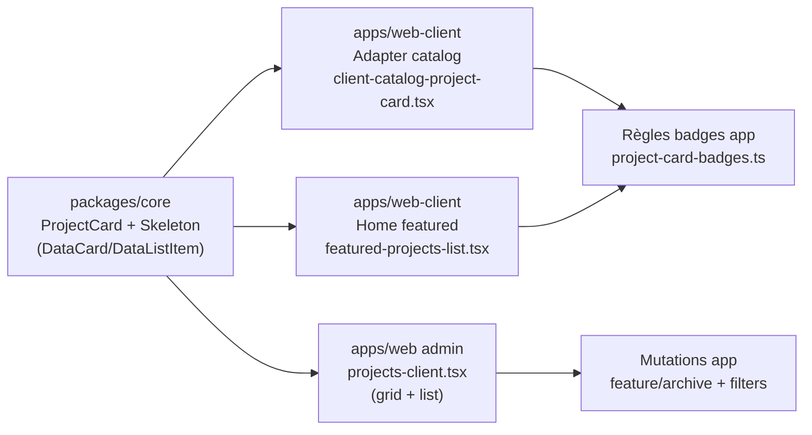
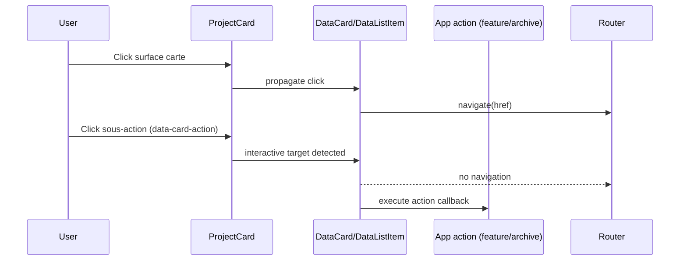

# Review — ProjectCard V1 (Core + Web Admin + Web-client)

Date: 2026-02-12
Reviewer: Codex
Scope: Implémentation V1 ProjectCard (core shared + migrations web/web-client + tests unitaires/e2e)

## Findings (priorisés)

### [P2] Duplication visuelle de la localisation dans le catalog web-client

Impact:
- La localisation est affichée 2 fois sur la même carte (subtitle + meta chip), ce qui surcharge l’UI et peut être perçu comme une régression de lisibilité.

Preuve:
- `/Users/bartoszkrynski/Downloads/Development/make-the-change/apps/web-client/src/app/[locale]/(marketing)/projects/components/client-catalog-project-card.tsx:85`
- `/Users/bartoszkrynski/Downloads/Development/make-the-change/apps/web-client/src/app/[locale]/(marketing)/projects/components/client-catalog-project-card.tsx:95`

Recommandation:
- Garder la localisation à un seul endroit pour `clientCatalog`.
- Option recommandée: conserver `locationLabel` (meta) et supprimer `subtitle` pour ce contexte.

---

### [P2] Libellés admin non localisés (hardcodés FR) dans la nouvelle couche ProjectCard

Impact:
- En locale `en`/`nl`, les badges/métriques ajoutés par la migration restent en français (incohérence i18n et UX).

Preuve:
- Mapping statuts FR: `/Users/bartoszkrynski/Downloads/Development/make-the-change/apps/web/src/app/[locale]/admin/(dashboard)/projects/projects-client.tsx:107`
- Badge "Vedette": `/Users/bartoszkrynski/Downloads/Development/make-the-change/apps/web/src/app/[locale]/admin/(dashboard)/projects/projects-client.tsx:159`
- Labels ProjectCard hardcodés FR (grid): `/Users/bartoszkrynski/Downloads/Development/make-the-change/apps/web/src/app/[locale]/admin/(dashboard)/projects/projects-client.tsx:617`
- Labels ProjectCard hardcodés FR (list): `/Users/bartoszkrynski/Downloads/Development/make-the-change/apps/web/src/app/[locale]/admin/(dashboard)/projects/projects-client.tsx:708`

Recommandation:
- Injecter tous les labels via `useTranslations('admin.projects')`.
- Garder le composant core présentational (déjà le cas), mais déplacer entièrement les chaînes dans i18n app.

---

### [P3] Chaînes non localisées et fallback home partiellement hardcodés

Impact:
- Fallback `Project` et empty-state FR hardcodés dans `FeaturedProjectsList`.
- Incohérence de traduction possible selon locale.

Preuve:
- Fallback title: `/Users/bartoszkrynski/Downloads/Development/make-the-change/apps/web-client/src/components/featured-projects-list.tsx:34`
- Empty state FR: `/Users/bartoszkrynski/Downloads/Development/make-the-change/apps/web-client/src/components/featured-projects-list.tsx:88`
- Empty state FR (desktop DataList): `/Users/bartoszkrynski/Downloads/Development/make-the-change/apps/web-client/src/components/featured-projects-list.tsx:114`

Recommandation:
- Passer ces textes via props traduites depuis `HomeFeaturedProjectsSection` (ou `useTranslations` local).

---

### [P3] Couverture de tests encore incomplète sur interaction ProjectCard + slots

Impact:
- Les tests ajoutés couvrent badges/progress/fallback media.
- Le cas critique « sous-actions injectées via slots n’activent pas la navigation » n’est pas testé directement au niveau `ProjectCard`.

Preuve:
- Tests présents: badges/progress/media
  - `/Users/bartoszkrynski/Downloads/Development/make-the-change/packages/core/src/shared/ui/next/__tests__/project-card.badges.test.tsx:1`
  - `/Users/bartoszkrynski/Downloads/Development/make-the-change/packages/core/src/shared/ui/next/__tests__/project-card.progress.test.tsx:1`
  - `/Users/bartoszkrynski/Downloads/Development/make-the-change/packages/core/src/shared/ui/next/__tests__/project-card.media-fallback.test.tsx:1`

Recommandation:
- Ajouter un test RTL dédié `project-card.interaction.test.tsx` avec `slots.footerActions` + `data-card-action`.

## Points solides (validés)

- Architecture core présentational + logique métier dans les apps respectée.
- API `ProjectCard` non-breaking avec fallback legacy badges quand `model.badges` absent.
- Migration admin map laissée intacte (hors scope) et grid/list unifiés via `ProjectCard`.
- Suppression de la duplication structurelle list admin (anciens `project-list-*` retirés).
- Tests unitaires core ajoutés et passants sur le scope ProjectCard.
- Smoke Playwright ajoutés pour admin + web-client (gated via env).

## Schéma d’architecture

## Schéma de flux d’interaction (carte)

## Validation exécutée

- `pnpm --filter @make-the-change/core type-check` ✅
- `pnpm --filter @make-the-change/core test` ✅
- `biome check` ciblé sur fichiers modifiés (`core/web/web-client`) ✅
- `pnpm playwright test -c playwright.project-card.config.ts` ✅ (3 tests skip sans `RUN_PROJECT_CARD_E2E=1`)

## Risque résiduel

- Le monorepo reste rouge globalement sur des erreurs préexistantes hors périmètre ProjectCard (type-check/lint globaux).
- Cela n’invalide pas la migration ProjectCard V1, mais bloque une validation CI « parfaite » tant que ces dettes restent ouvertes.

## Plan d’ajustement rapide recommandé

1. Corriger la duplication localisation catalog (`subtitle` vs `locationLabel`).
2. Externaliser tous les labels FR hardcodés admin/home vers i18n.
3. Ajouter `project-card.interaction.test.tsx` (slots + non-navigation).
4. Relancer validation ciblée + smoke e2e avec `RUN_PROJECT_CARD_E2E=1`.
